# Adaptation of Agentic AI

Pengcheng Jiang1∗ , Jiacheng Lin1∗ , Zhiyi Shi1,4∗ , Zifeng Wang13, Luxi He3 , Yichen Wu4 , Ming Zhong1 , Peiyang Song5,6, Qizheng Zhang2 , Heng Wang1 , Xueqiang Xu1 , Hanwen Xu7 , Pengrui Han1 , Dylan Zhang1 , Jiashuo Sun1 , Chaoqi Yang1 , Kun Qian14, Tian Wang14, Changran Hu5 , Manling Li10, Quanzheng Li4,12 , Hao Peng1 , Sheng Wang7 , Jingbo Shang8 , Chao Zhang9 , Jiaxuan You1 , Liyuan Liu1 , Pan Lu2 , Yu Zhang11 , Heng Ji1 , Yejin Choi2 , Dawn Song5 , Jimeng Sun1,13, Jiawei Han1†

1 UIUC 2 Stanford 3 Princeton 4 Harvard 5 UC Berkeley 6 Caltech 7 UW 8 UCSD 9 Georgia Tech 10 Northwestern 11 TAMU 12MGH 13Keiji AI 14Unity

Cutting-edge agentic AI systems are built on foundation models that can be adapted to plan, reason, and interact with external tools to perform increasingly complex and specialized tasks. As these systems grow in capability and scope, adaptation becomes a central mechanism for improving performance, reliability, and generalization. In this paper, we unify the rapidly expanding research landscape into a systematic framework that spans both agent adaptations and tool adaptations. We further decompose these into toolexecution–signaled and agent-output–signaled forms of agent adaptation, as well as agent-agnostic and agent-supervised forms of tool adaptation. We demonstrate that this framework helps clarify the design space of adaptation strategies in agentic AI, makes their trade-offs explicit, and provides practical guidance for selecting or switching among strategies during system design. We then review the representative approaches in each category, analyze their strengths and limitations, and highlight key open challenges and future opportunities. Overall, this paper aims to offer a conceptual foundation and practical roadmap for researchers and practitioners seeking to build more capable, efficient, and reliable agentic AI systems.

Github Repository: <https://github.com/pat-jj/Awesome-Adaptation-of-Agentic-AI>

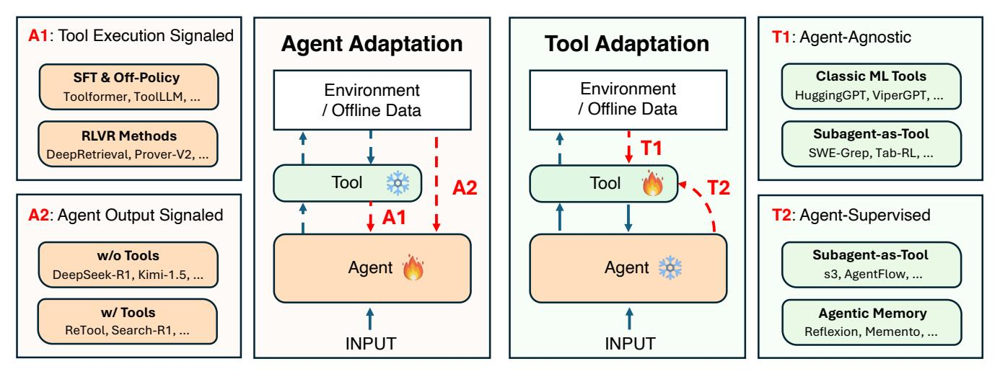

Figure 1 Overview of adaptations in agentic AI. *Agent*: the foundation models serving as orchestration and reasoning modules; *Tool*: callable components other than the agent model that operate independently, e.g., APIs, ML models, subagents, or memory. We categorize these adaptations into two: agent adaptation (A1 & A2): adapting agent models, and tool adaptation (T1 & T2): adapting tools for agents. See more details in [§3.](#page-5-0)

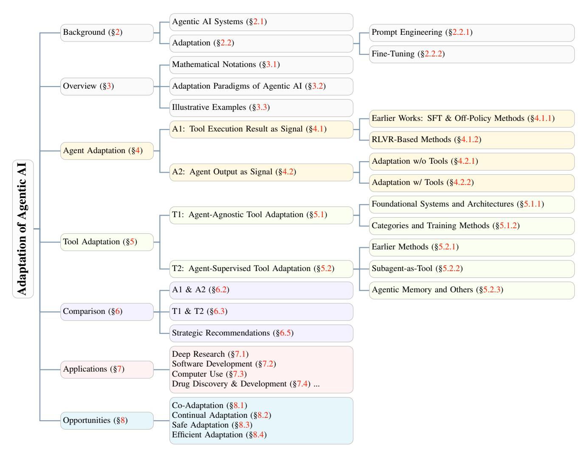

Figure 2 The structure of this paper.

## 1 Introduction

The rapid progress of foundation models, such as large language models (LLMs), has catalyzed the rise of agentic AI systems: autonomous AI systems capable of perceiving their environment, invoking external tools, managing memory, and executing multi-step plans toward completing complex tasks [\[1–](#page-50-0)[4\]](#page-50-1). Agentic AI demonstrates remarkable potential in applications ranging from scientific discovery [\[5,](#page-51-0) [6\]](#page-51-1) to software development and clinical research [\[7–](#page-51-2)[9\]](#page-51-3). However, current agentic AI systems still struggle with challenges such as unreliable tool use, limited long-horizon planning, domain-specific reasoning gaps, robustness issues in real-world environments, and poor generalization to unexplored environments where the agent lacks prior interaction experience [\[10](#page-51-4)[–13\]](#page-51-5). These limitations reveal that even highly capable foundation models often require additional adaptation to specialize for particular tasks or real-world scenarios. This motivates the need for *adaptation in agentic AI systems*, whereby the components of an agentic system are modified or optimized so that the agent achieves higher task performance, improved reliability, and better generalization across diverse scenarios.

Building on this motivation, we conduct a comprehensive survey on the adaptation in agentic AI systems, aiming to systematically analyze how components in agentic AI systems are modified to overcome current limitations. Compared with existing surveys on modern AI agents [\[1,](#page-50-0) [14–](#page-51-6)[18\]](#page-51-7), this paper centers specifically on adaptation in agentic AI. To structure this rapidly expanding literature, we introduce a unified framework that organizes adaptation in agentic AI into four core paradigms spanning both agent adaptation and tool adaptation, as shown in Figure [1.](#page-0-0) This framework clarifies the underlying design space, highlights the trade-offs between different

adaptation strategies, and provides practical guidance for choosing or transitioning between paradigms based on supervision signals, task requirements, and system-level constraints.

In our framework, we conclude adaptation strategies for agentic AI into two dimensions according to which component is optimized ([§3\)](#page-5-0). The first dimension, which we term Agent Adaptation, focuses on modifying the agent's internal parameters, representations, or behavioral policies to better align with task requirements. This includes both traditional fine-tuning approaches [\[19\]](#page-51-8) and modern reinforcement learning methods that leverage environment feedback [\[20,](#page-51-9) [21\]](#page-51-10). The second dimension, Tool Adaptation, shifts the optimization target from the agent to its external tools, e.g., retrievers, planners, memory modules, and specialized models, enabling frozen agents to benefit from an adaptive operational environment [\[22,](#page-51-11) [11,](#page-51-12) [23\]](#page-51-13). Within these two broad paradigms, we further identify four distinct adaptation strategies, forming a comprehensive taxonomy that organizes the rapidly evolving landscape of agentic AI research:

- A1: Tool Execution Signaled Agent Adaptation ([§3.2.1,](#page-6-2) [§4.1\)](#page-12-0): The agent is optimized using verifiable outcomes produced by external tools it invokes. This paradigm captures settings where correctness signals arise directly from tool execution, such as code sandbox results, retrieval relevance scores, or API call outcomes.
- A2: Agent Output Signaled Agent Adaptation ([§3.2.2,](#page-7-0) [§4.2\)](#page-20-0): The agent is optimized using evaluations of its own outputs, e.g., final answers, plans, or reasoning traces, possibly after incorporating tool results. This paradigm includes both tool-free outcome-based learning and tool-augmented adaptation driven by answer correctness or preference scores.
- T1: Agent-Agnostic Tool Adaptation ([§3.2.3,](#page-8-0) [§5.1\)](#page-25-1): Tools are trained independently of the frozen agent. These tools include retrievers, domain-specific models, and other pretrained components that can be used as plug-and-play modules orchestrated by the frozen agent.
- T2: Agent-Supervised Tool Adaptation ([§3.2.4,](#page-9-0) [§5.2\)](#page-27-1): The agent remains fixed while its tools are adapted using signals derived from the agent's outputs. This paradigm includes reward-driven retriever tuning, adaptive rerankers, search subagents, and memory-update modules trained to better support the frozen agent.

It is worth noting that these four strategies are not mutually exclusive: state-of-the-art systems increasingly combine multiple adaptation paradigms to achieve optimal performance [\[24](#page-52-0)[–26\]](#page-52-1). For instance, a deep research system might employ T1-style retrieval tools (pre-trained dense retrievers), T2-style adaptive search agents (trained via frozen LLM feedback), and A1-style reasoning agents (fine-tuned with execution feedback) in a cascaded architecture [\[6\]](#page-51-1).

In [§6,](#page-36-0) we further emphasize that the choice among these paradigms involves fundamental trade-offs along several dimensions. (1) Cost and flexibility: Agent adaptation (A1/A2) typically requires substantial computational resources for training billion-parameter models but offers maximal flexibility, while tool adaptation (T1/T2) optimizes external components at lower cost but may be constrained by the frozen agent's capabilities [\[27,](#page-52-2) [22\]](#page-51-11). (2) Generalization: T1 tools trained on broad data distributions often generalize well across agents and tasks [\[23,](#page-51-13) [28\]](#page-52-3), whereas A1 methods may overfit to specific environments unless carefully regularized [\[20\]](#page-51-9). (3) Modularity: T2 approaches enable independent tool upgrades without agent retraining [\[29,](#page-52-4) [22\]](#page-51-11), facilitating continuous system improvement, while A1/A2 methods may suffer from catastrophic forgetting when adapting to new tasks.

Scope and contributions. This paper provides the first comprehensive taxonomy of adaptation strategies for agentic AI, systematically organizing recent advances across agent adaptation (A1, A2) and tool adaptation (T1, T2). We offer several key contributions:

- A unified conceptual framework that clarifies the associations and distinctions between adaptation paradigms and their underlying principles (Figure [2\)](#page-1-0).
- Detailed technical surveys of representative methods within each category, documenting their training objectives, architectural choices, and empirical performance across diverse benchmarks.
- Systematic comparison of adaptation strategies along dimensions of cost, flexibility, generalization capability, and modularity.

- Demonstrating how adaptation strategies are tailored to domain applications, spanning deep research, software development, computer use, and drug discovery ([§7\)](#page-41-0).
- Identification of open challenges and future research directions, including unified agent-tool co-adaptation frameworks, theoretical understanding of adaptation dynamics, and standardized evaluation protocols ([§8\)](#page-45-0).

Organization. The remainder of this paper is organized as follows. Section [2](#page-3-0) provides foundational concepts, introducing the core components of agentic AI systems and the two primary forms of adaptation (prompt engineering and fine-tuning). Section [3](#page-5-0) presents an overview of adaptation paradigms under our proposed framework, formalizing the four paradigms (A1, A2, T1, T2) and illustrating them with concrete examples. Sections [4](#page-11-0) and [5](#page-25-0) present our main taxonomy, systematically reviewing agent adaptation (A1, A2) and tool adaptation (T1, T2) methods respectively. Section [6](#page-36-0) compares these paradigms along key dimensions. Section [7](#page-41-0) examines real-world applications across multiple domains. Finally, Section [8](#page-45-0) discusses open challenges and future research directions. Throughout, we emphasize the complementary nature of agent and tool adaptation, arguing that the most effective agentic systems will strategically combine both paradigms to achieve robust, efficient, and generalizable performance across diverse tasks and environments.

## 2 Background

In this section, we provide the background to facilitate a better understanding of the concepts discussed throughout this survey. Specifically, we first introduce the fundamental components of *Agentic AI Systems* ([§2.1\)](#page-3-1). We then discuss different forms of *Adaptation* ([§2.2\)](#page-4-0), which enable agentic AI systems to better adjust their behaviors and capabilities to specific tasks or application scenarios.

#### 2.1 Agentic AI Systems

Agentic AI systems refer to autonomous artificial intelligence systems capable of perceiving, reasoning, acting, and continuously improving through interaction with their environment. Such systems are designed to perform complex, open-ended tasks that require adaptive decision-making, contextual understanding, and iterative problem solving. In this survey, we primarily focus on *single-agent systems*, which provide a controlled yet expressive framework to study how an individual agent perceives, plans, and acts within an environment. Single-agent settings serve as the foundational building blocks of more complex *multi-agent systems*, in which multiple agents coordinate, cooperate, or compete to achieve shared or opposing goals. Comprehensive overviews of AI agent architectures and their extensions to multi-agent scenarios can be found in recent surveys such as [\[1,](#page-50-0) [2,](#page-50-2) [30\]](#page-52-5).

At the core of an agentic AI system lies a foundation model, typically implemented as a large language model (LLM) or multimodal model that functions as the agent's reasoning and control center. This foundation model provides the fundamental abilities for understanding, reasoning, planning, and interaction. Complementing this core are several additional components that extend the agent's autonomy and enable it to operate effectively in complex and dynamic environments:

- Planning Module: Decomposes complex goals into actionable steps and organizes their sequential or hierarchical execution. Depending on the degree of feedback integration, planning can be conducted in two main modes. *Static planning* methods, such as Chain-of-Thought [\[31\]](#page-52-6) and Tree-of-Thought [\[32\]](#page-52-7), enable structured reasoning through single-path or multi-path task decomposition. In contrast, *dynamic planning* approaches, such as ReAct [\[33\]](#page-52-8) and Reflexion [\[34\]](#page-52-9), incorporate feedback from the environment or past actions, allowing the agent to iteratively refine its plans and improve performance in long-horizon or partially observable scenarios.
- Tool Use: Enables the agent to interact with external resources and computational systems, extending its capabilities beyond the limitations of its internal knowledge. Typical tools include web search engines, APIs, code execution environments, Model Context Protocols (MCPs), and browser automation frameworks [\[35,](#page-52-10) [3\]](#page-50-3). Effective tool use involves selecting appropriate tools, constructing task-specific inputs, invoking external functions, and integrating their outputs into the agent's reasoning and decision-making process, thereby enhancing performance in real-world and computationally intensive scenarios.

• Memory Module: Allows the agent to retain, retrieve, and utilize past information for context-aware reasoning and long-term consistency. Memory is typically divided into *short-term memory*, which stores contextual information generated during the current task, and *long-term memory*, which persists across sessions to accumulate reusable knowledge and experience [\[1,](#page-50-0) [36\]](#page-52-11). To access relevant information from long-term memory, many systems employ retrieval-augmented generation (RAG) mechanisms that retrieve and integrate stored knowledge into the agent's reasoning process. Designing an effective memory module involves challenges such as how to structure stored information, when and what to retain, how to retrieve relevant knowledge efficiently, and how to seamlessly integrate it into ongoing reasoning and decision-making.[1](#page-4-3)

#### 2.2 Adaptation

Adaptation is a crucial aspect of agentic AI systems, enabling them to operate effectively across diverse and complex tasks. It allows an agent to adjust its behaviors, decision strategies, and internal representations to better align with the requirements of a specific domain, task, or operational environment. Without such adaptive mechanisms, agents may struggle to generalize beyond their initial design or handle dynamic, real-world conditions. These mechanisms can be broadly categorized into prompt-based adaptation ([§2.2.1\)](#page-4-1) and fine-tuning-based adaptation ([§2.2.2\)](#page-4-2).

#### 2.2.1 Prompt Engineering

Prompt engineering serves as a lightweight form of adaptation that guides the behavior of an agentic AI system without modifying its underlying model parameters. Instead of retraining the core model, the agent's behavior is shaped by carefully crafted input prompts that define goals, constraints, and contextual instructions. Through prompt design, an agent can be steered toward specific reasoning patterns, task formulations, or action strategies, enabling rapid adaptation across diverse tasks and environments.

A *prompt* refers to the input context provided to the agent's core model, typically consisting of instructions, examples, or task descriptions that specify the desired behavior. By modifying or composing prompts, an agent can be adapted to new goals or environments without any additional model training, making this approach highly efficient and easily transferable across tasks. Such prompt-based adaptation has been widely adopted in recent agentic systems, such as CAMEL [\[37\]](#page-52-12), AutoGen [\[38\]](#page-52-13), MetaGen [\[39\]](#page-52-14) and ChatDev [\[40\]](#page-52-15). For a comprehensive overview of prompt engineering techniques and their design principles, we refer readers to the survey by Sahoo et al. [\[41\]](#page-53-0).

#### 2.2.2 Fine-Tuning

In contrast to prompt engineering, *fine-tuning* achieves adaptation by updating the internal parameters of the core model. Through exposure to task-specific data, fine-tuning enables the model to internalize new knowledge, reasoning patterns, or behavioral tendencies that better align with the target domain or task objectives.

Fine-tuning can be performed at different granularities depending on data availability, computational cost, and the desired degree of adaptation. *Full fine-tuning* updates all model parameters using labeled data, providing maximal flexibility but often requiring substantial resources. Alternatively, *parameter-efficient fine-tuning* (PEFT) methods, such as low-rank adaptation (LoRA) [\[19\]](#page-51-8), update only a small subset of parameters. These approaches offer a practical balance between efficiency and performance, enabling large agentic systems to be specialized for particular tasks or environments without extensive retraining. For a comprehensive overview of PEFT methods, we refer readers to the survey by Han et al. [\[42\]](#page-53-1).

Fine-tuning for adapting agents encompasses several major training paradigms. Supervised Fine-Tuning (SFT) [\[43\]](#page-53-2) performs imitation learning on curated demonstrations. Preference-based methods, such as Direct Preference Optimization (DPO) [\[44\]](#page-53-3) and its extensions [\[45\]](#page-53-4), align the model with human or automated preference signals. Reinforcement-learning-based approaches, including algorithms such as Proximal Policy Optimization (PPO) [\[46\]](#page-53-5) and Group Relative Policy Optimization (GRPO) [\[47\]](#page-53-6), further adapt agents by optimizing their behavior

1While memory is a fundamental component of an agent, this survey classifies *adaptive memory systems* under the Tool Adaptation paradigm (specifically T2, discussed in [§5.2.3\)](#page-34-0). We frame them as external, optimizable tools, such as retrievers or reflective databases, that are "tuned" using the frozen agent's outputs as supervision.

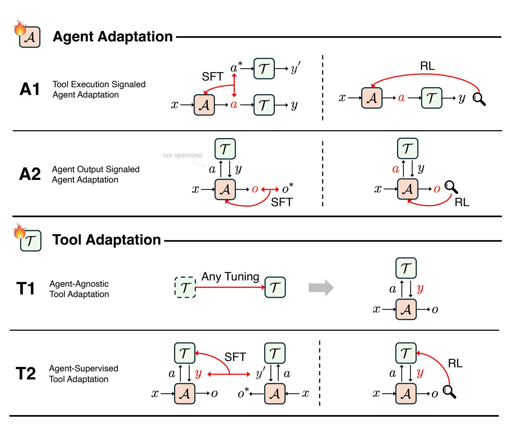

Figure 3 Illustration of Four Adaptation Paradigms (A1, A2, T1, and T2). In all the panels, letters highlighted in Red denote the components directly being optimized during adaptation. The red arrows show the sources of adaptation signals. The dotted black lines separate the cases of supervised fine-tuning (SFT) and reinforcement learning (RL).

through interaction with evaluative environments. These families of methods form the core techniques for adapting foundation-model-based agents to specialized tasks and deployment settings. For a more comprehensive review of these approaches, see the survey by Zhang et al. [\[48\]](#page-53-7).

We next introduce a general framework that categorizes existing agentic AI adaptation approaches. This framework, presented in the following section, forms the conceptual foundation for the rest of this survey.

## 3 Overview of Adaptation Paradigms of Agentic AI

In this section, we provide an overview of the adaptation paradigms that form the analytical basis of this paper. Our objective is to establish a unified framework for categorizing existing studies on agentic AI systems according to what is adapted (the agent or the tool) and how the adaptation signal is obtained. We summarize these perspectives into four canonical paradigms, which together capture the major directions of adaptation explored in recent literature.

To facilitate a clear understanding of these paradigms, this section proceeds in three parts. We first introduce the

mathematical notations that are used throughout this paper ([§3.1\)](#page-6-0). We then provide formal expressions for the four paradigms ([§3.2\)](#page-6-1). Finally, we present illustrative examples that help clarify how each paradigm operates and how they differ in adaptation mechanisms ([§3.3\)](#page-10-0).

#### 3.1 Mathematical Notations

To ensure consistency in the subsequent formalization, here, we introduce the key mathematical notations used throughout this paper. We organize the notations into three conceptual categories that together define the adaptation process of agentic AI systems: the *adaptation targets*, the *adaptation data sources*, and the *adaptation objectives*.

Adaptation Targets. This category specifies the entities that undergo adaptation within an agentic AI system.

- Agent (A): The foundation model that serves as the core reasoning and decision-making component of the system, parameterized by *θ*. Adaptation of the agent can occur through *parameter updates*, *prompt refinement*, or other modifications to its internal policy.
- Tool (T ): The set of external callable components that extend the agent's capabilities beyond its internal parameters. Tools can include retrievers, planners, executors, simulators, or other computational modules. In this paper, we also categorize the memory module within T , since memory can be viewed as a dynamic and updatable database that interacts with and learns from the agent's outputs. Typically, the retrieval process for accessing stored information is performed through a dedicated retriever or search tool, which allows the agent to query and integrate relevant past knowledge into its reasoning process.

Adaptation Data Sources. This category describes the sources from which the adaptation signals are obtained.

- Offline Data (D): Offline data that serve as alignment references or supervision sources for improving either the agent or the tool. These data may include human-labeled demonstrations, synthetic trajectories, or logs of prior interactions.
- Environment (E): The external environment in which the agent or tool interacts and receives feedback. It provides online experience signals that reflect task performance or execution quality.

Adaptation Objectives. Having defined the adaptation targets and data sources, we next describe the objective that guides the adaptation process, which quantifies performance or alignment quality.

• Objective Function O(·): The objective function optimized during adaptation, which evaluates how effectively the agent–tool system performs according to the designated evaluation protocol. For example, the objective for offline data D may correspond to supervised or imitation learning losses such as supervised fine-tuning (SFT) or behavior cloning. When adaptation relies on interactions with the environment E, the objective is typically defined by outcome-based metrics such as task success rate.

These notations provide a unified foundation for expressing how adaptation operates at both the agent and tool levels, which we formalize in the subsequent subsection.

#### 3.2 Four Adaptation Paradigms of Agentic AI

Building upon the mathematical notations introduced earlier, we now present the four adaptation paradigms proposed in this paper, which together form a unified framework for classifying existing approaches to agentic AI adaptation. In this framework, adaptation is first categorized by the optimization target, namely the *agent* or the *tool*. For *agent adaptation*, we further differentiate paradigms based on the type of optimization signal used, which may originate from tool-execution feedback (A1) or from evaluations of the agent's own final output (A2). For *tool adaptation*, the distinction instead concerns whether the adaptation process involves the agent, where tools may be optimized independently of any agent (T1) or adapted under the supervision of a fixed agent (T2). Taken together, these considerations give rise to four paradigms, A1, A2, T1, and T2, which collectively characterize the principal modes of adaptation explored in agentic AI research.

## 3.2.1 A1: Tool Execution Signaled Agent Adaptation

This paradigm focuses on improving the agent A through feedback signals derived from the execution results of external tools T . It captures scenarios where the agent interacts with tools in a verifiable manner, allowing the tool outcomes to serve as a measurable basis for optimization.

Agent–Tool Interaction Process. The agent receives an input *x* (e.g., a user query or task description) and generates a structured tool call or action *a* = A(*x*), which may include the tool name, arguments, and calling context. The tool set T then executes this call to produce a result *y* = T (*a*). The pair (*a*, *y*) represents a single agent–tool interaction, and the overall process can be summarized as

$$x \xrightarrow{\mathcal{A}} a \xrightarrow{\mathcal{T}} y$$
.

This pipeline captures how the agent leverages tools to complete tasks. For simplicity and without loss of generality, we describe the interaction using a single tool invocation; multi-turn tool use follows as a direct extension of the formulation.

Optimization Objective. Given this interaction process, the general optimization goal is to adjust the agent A to generate high-quality tool call action *a* such that the tool-executed outcomes achieve better performance. Formally,

(A1) 
$$A^* = \arg \max_{A} \mathcal{O}_{tool}(A, T),$$
 (1)

where Otool measures the quality or correctness of the outputs obtained from invoking T , such as tool execution success rate or retrieval scores. This optimization can be instantiated in two primary forms: (1) by imitating collected successful tool-call trajectories, or (2) by generating actions interactively and using the resulting tool feedback to optimize A via Reinforcement Learning.

• Supervised Fine-Tuning (SFT). When explicit target actions are available, the agent learns to imitate successful tool-using behaviors from recorded trajectories without performing online interaction. Let Dsucc = {(*x*, *a* ∗ )} denote a dataset of input *x* and reference action *a* ∗ that is known to lead to a correct or desirable tool outcome (*y* ′ ). The supervised objective is formulated as:

$$\mathcal{A}^* = \arg\min_{\mathcal{A}} \ \mathbb{E}_{(x,a^*) \sim \mathcal{D}_{\text{succ}}} \left[ \ell(\mathcal{A}(x), a^*) \right] \ \equiv \ \arg\max_{\mathcal{A}} \ \mathbb{E}_{(x,a^*)} \left[ \log p_{\mathcal{A}}(a^*|x) \right], \tag{2}$$

where ℓ denotes the cross-entropy loss used for next-token prediction in language models.

• Reinforcement Learning (RL). Alternatively, the agent can acquire adaptation signals through interactions with the environment, where it executes tool calls and receives evaluative feedback from the resulting outcomes. The process follows:

$$x \xrightarrow{A} a \xrightarrow{T} y$$
, with reward  $R = \mathcal{O}_{\text{tool}}(y)$ .

Here, the agent A generates an action or tool call *a* based on input *x*, the tool T executes *a* to produce a result *y*, and the evaluation function Otool assigns a scalar feedback *R* indicating task success or quality. The optimization objective can be expressed as:

$$J(\mathcal{A}) = \mathbb{E}_{x \sim \mathcal{D}_0, \, a \sim \mathcal{A}(\cdot | x), \, y = \mathcal{T}(a)}[\mathcal{O}_{\text{tool}}(y)], \tag{3}$$

where D0 denotes the input distribution.

#### 3.2.2 A2: Agent Output Signaled Agent Adaptation

Unlike the A1 paradigm, where the adaptation signal is derived from tool-execution outcomes, the A2 paradigm obtains its optimization signal from the agent's own final output. For simplicity and without loss of generality, the following description focuses on a single-turn interaction; multi-turn tool use, where the agent invokes multiple tool calls and integrates multiple intermediate results, extends naturally from the formulation.

Agent–Tool Interaction Process. In the A2 paradigm, the agent first generates a tool call *a* from the input *x*, the tool T executes this call and returns an executed result *y*, and the agent then integrates *x* and *y* to produce the final output *o*:

$$x \xrightarrow{\mathcal{A}} a \xrightarrow{\mathcal{T}} y \xrightarrow{\mathcal{A}} o$$
,

where *o* = A(*x*, *a*, *y*). This formulation naturally includes the special case where the agent produces *o* directly without calling any tools.

Optimization Objective. The goal of A2 adaptation is to optimize the agent such that its final output aligns with correctness, quality, or alignment criteria. Formally:

(A2) 
$$\mathcal{A}^* = \arg \max_{\mathcal{A}} \mathcal{O}_{\text{agent}}(\mathcal{A}, \mathcal{T}),$$
 (4)

where Oagent evaluates the final output *o* generated by the agent. Similarly, A2 paradigm optimization also includes two main forms:

• Supervised Fine-Tuning (SFT). Let Dans = {(*x*, *y*, *a* ∗ , *o* ∗ )} denote a dataset consisting of the input *x*, optional intermediate tool outputs *y*, the reference tool call *a* ∗ , and the corresponding target final output *o* ∗ . A key characteristic of the A2 paradigm is that its adaptation signal comes solely from the final agent output. However, *supervising only the final output o* ∗ , i.e., optimizing

$$\mathcal{A}^* = \arg\min_{\mathcal{A}} \mathbb{E}_{(x,y,a^*,o^*) \sim \mathcal{D}_{ans}} \left[ \ell \left( \mathcal{A}(x,a^*,y), o^* \right) \right] \equiv \arg\max_{\mathcal{A}} \mathbb{E}_{(x,y,a^*,o^*)} \left[ \log p_{\mathcal{A}}(o^*|x,a^*,y) \right], \quad (5)$$

is insufficient for learning tool-use behavior: the agent could improve its final-answer likelihood without ever invoking tools, since the supervision provides no incentive to produce the correct tool call. Therefore, for A2-style SFT to effectively support tool-using agents, it must *combine* final-output supervision with tool-call supervision, effectively integrating A2-style supervision with the A1-style imitation of tool-use trajectories. The supervised objective then becomes:

$$\mathcal{A}^* = \arg\min_{\mathcal{A}} \mathbb{E}_{(x,y,a^*,o^*) \sim \mathcal{D}_{ans}} \Big[ \ell \big( \mathcal{A}(x), a^* \big) + \ell \big( \mathcal{A}(x,a^*,y), o^* \big) \Big],$$

which is equivalently written as:

$$\arg\max_{\mathcal{A}} \mathbb{E}_{(x,y,a^*,o^*)} \Big[ \log p_{\mathcal{A}}(a^*|x) + \log p_{\mathcal{A}}(o^*|x,a^*,y) \Big]. \tag{6}$$

Here, ℓ denotes the cross-entropy loss used in next-token prediction for LLMs. The first term teaches the agent to make correct tool calls (A1-style imitation), while the second term supervises the agent's final answer generation (A2-style imitation). This formulation naturally includes the special case where no tools are invoked, in which case *a* ∗ and *y* are empty.

• Reinforcement Learning (RL). When explicit target outputs are unavailable, the agent learns from feedback assigned to its final response. The interaction follows:

$$x \xrightarrow{A} a \xrightarrow{T} y \xrightarrow{A} o$$
, with reward  $R = \mathcal{O}_{\text{agent}}(o)$ .

The optimization objective becomes:

$$J(\mathcal{A}) = \mathbb{E}_{x \sim \mathcal{D}_0, \ a \sim \mathcal{A}(\cdot \mid x), \ y = \mathcal{T}(a), \ o = \mathcal{A}(x, a, y)} [\mathcal{O}_{\text{agent}}(o)],$$

where D0 is the distribution of task inputs. Here, the agent receives rewards based solely on the quality of its final output, irrespective of how many intermediate tool calls were invoked.

### 3.2.3 T1: Agent-Agnostic Tool Adaptation

In the T1 paradigm, the agent A is kept fixed, and adaptation is applied to only the external tool set T . This setting arises naturally when the agent is a powerful and robust closed-source API (such as GPT, Claude, or Gemini) that usually cannot be fine-tuned, or when the goal is to enhance the fixed agent by training specialized tools to complement the frozen agent, such as retrievers, rerankers, planners, simulators, or additional foundation models. In this sense, a "tool" in T1 primarily refers to a trainable model, regardless of whether it is a traditional machine-learning model or a large-scale foundation model.

Optimization Objective. The goal of T1 is to optimize the tool in an agent-agnostic manner:

(T1) 
$$\mathcal{T}^* = \arg \max_{\mathcal{T}} \mathcal{O}_{tool}(\mathcal{T}),$$

where Otool(T ) evaluates the quality of tool-produced results, often through metrics such as retrieval accuracy, ranking quality, simulation fidelity, or downstream task success. Since the agent is fixed and only T is trainable, T1 reduces to standard model training under various learning paradigms, such as supervised learning, contrastive learning, or reinforcement learning.

#### 3.2.4 T2: Agent-Supervised Tool Adaptation

In the T2 paradigm, tool adaptation is guided by the frozen agent A. Unlike T1, where tools are trained independently of any agent, T2 explicitly aims to adapt or construct a tool that complements the fixed agent and enhances its overall capability. This setting reflects a practical motivation: when the main agent is a powerful closed-source foundation model, it is often preferable to train auxiliary tools around it rather than modifying the agent itself.

Agent–Tool Interaction Process. Without loss of generality, we describe the interaction using a single-turn example, noting that multi-turn processes can be extended naturally from this. The agent receives input *x* and produces a tool call *a* = A(*x*). The tool T executes this call to return a result *y* = T (*a*), and the agent integrates (*x*, *a*, *y*) or (*x*, *y*) to produce the final output *o*:

$$x \xrightarrow{\mathcal{A}} a \xrightarrow{\mathcal{T}} y \xrightarrow{\mathcal{A}} o.$$

Optimization Objective. The tool is optimized to improve the performance of the fixed agent–tool system:

(T2) 
$$\mathcal{T}^* = \arg \max_{\mathcal{T}} \, \mathcal{O}_{\text{agent}}(\mathcal{A}, \mathcal{T}),$$

where Oagent evaluates how effectively the agent performs when equipped with tool T . This objective emphasizes that T2 adapts the tool specifically to the needs of the given agent. Tool adaptation in T2 generally takes two forms:

- Supervised Learning. In the supervised setting, the frozen agent provides signals that indicate how the tool should improve. The core idea is to adjust the tool so that its future outputs T (*a*) become more helpful for the agent's downstream reasoning. This can be instantiated in several ways. For example:
  - Quality-Weighted Training. The agent's final output *o* induces a quality score *w* = *ω*(*o*) that reflects the desirability or correctness of the agent's behavior. The tool is trained by weighting each trajectory according to this score:

$$\mathcal{T}^* = \arg\min_{\mathcal{T}} \mathbb{E}_{(a,y,o)} [w(o) \ell(\mathcal{T}(a), y)],$$

where ℓ is a task-specific loss encouraging the tool's output to improve. If *w*(*o*) takes binary values {0, 1}, this reduces to a data-selection scheme where only trajectories associated with desirable agent outputs *o* are used to train the tool.

– Output-Consistency Training. The agent's final output *o* induces an implicit supervision target *τ* = *ϕ*(*a*, *y*, *o*), which prescribes how the tool output should change to better support the agent. The tool is updated by:

$$\mathcal{T}^* = \arg\min_{\mathcal{T}} \mathbb{E}_{(a,y,o)} \Big[ \ell \big( \mathcal{T}(a), \, \tau \big) \Big],$$

where the mapping *ϕ*(*a*, *y*, *o*) extracts a learning target from the relationship between *y* and *o*. This encourages the tool to produce outputs that more effectively align with the agent's downstream reasoning.

• Reinforcement Learning (RL). The tool is updated using a scalar reward based on the final quality of the agent's output. Let *R* = Oagent(*o*) denote the reward assigned to the final output *o* = A(*x*, *a*, *y*). The RL objective becomes:

$$J(\mathcal{T}) = \mathbb{E}_{x \sim \mathcal{D}_0, \ a = \mathcal{A}(x), \ y = \mathcal{T}(a), \ o = \mathcal{A}(x, a, y)} [\mathcal{O}_{\text{agent}}(o)],$$

where D0 is the distribution of task inputs.

Memory as a Special Case of T2. In this paper, the memory module storing long-term memory is treated as a tool within the T2 paradigm. Although memory serves a conceptual role distinct from conventional executable tools, its update mechanism aligns precisely with the agent-driven tool adaptation view. During interaction, the frozen agent produces a final output *o* that reflects its reasoning over both the input and retrieved memory contents. This final output *o* is then used to update the memory module through a fixed or learnable write function: M ← Update(M, *o*), where M denotes the memory store. This process corresponds directly to T2: the agent remains fixed, the adaptation signal originates from the agent's own output, and the memory module is optimized to better support future agent reasoning.

Thus, adaptive memory systems naturally fall under the T2 paradigm: the tool T being optimized is the memory module, and the supervision signal arises entirely from the behavior of a fixed agent A interacting with and benefiting from that memory.

## 3.3 Illustrative Examples

To make the above adaptation paradigms more concrete, this section provides illustrative examples drawn from two representative application settings: retrieval-augmented generation (RAG) and code-execution-based tasks. These two settings are chosen because they highlight the central role of tool use in agentic AI systems, while exhibiting distinct tool–agent interaction patterns and evaluation protocols.

For each application, we present a pair of examples that correspond to the A1 and A2 paradigms. The paired examples share the same form of tool-call action, i.e., document retrieval or executing code, respectively. This allows us to clearly contrast tool-feedback–based agent adaptation (A1) with agent-output–based agent adaptation (A2). Finally, we provide a T2 example in the RAG setting. By examining these examples side by side, readers can develop an intuitive understanding of how these paradigms differ in objectives, update signals, and learning dynamics.

#### 3.3.1 Agent Adaptation Examples Across Two Applications

We now illustrate the A1 and A2 paradigms through two representative tool-use settings: retrieval-augmented generation (RAG) and code-execution-based question answering. For each application, we begin by describing the underlying problem setup, followed by a pair of examples that instantiate A1 and A2 under the same form of tool-call action. This allows a clean comparison between adaptation driven by tool-execution feedback (A1) and adaptation driven by agent final outputs (A2).

Retrieval-Augmented Generation (RAG) Setting. In the RAG setting, the agent receives a query and performs a retrieval action to obtain relevant documents from a database. Formally, the agent produces a retrieval query *a*, the retriever returns a set of documents *y*, and the agent synthesizes these documents together with the original query to generate a final answer *o*.

- A1 example. DeepRetrieval [\[21\]](#page-51-10) optimizes the agent using feedback signals computed directly from retrieval quality. After generating a retrieval query *a*, the retriever returns documents *y*, and metrics such as recall or nDCG are computed from *y* and used as the reward for updating the agent. Since the adaptation signal depends solely on the tool-execution outcome, this represents the A1 paradigm.
- A2 example. Search-R1 [\[49\]](#page-53-8) follows the full RAG pipeline, where the agent first retrieves documents and then integrates them into its context to produce a final answer *o*. The adaptation signal is computed from the correctness or quality of this final answer by calculating exact matching accuracy. Because the optimization is guided by the agent's final output rather than the retrieval result alone, this falls under the A2 paradigm.

Code-Execution-Based Task Setting. In code-execution-based tasks, the agent receives a problem description and produces executable code as the tool-call action. The sandbox executes the code and returns an execution result *y*, which the agent may optionally use to generate a final answer *o*.

- A1 example: DeepSeek-R1 (code) [\[24\]](#page-52-0). During reinforcement learning, DeepSeek-R1 generates code that is executed inside a sandbox. The execution output, such as test-case pass rate or numerical correctness, is used directly as the reward for policy optimization. Since adaptation is based entirely on the tool's execution result, this example fits the A1 paradigm.
- A2 example: ReTool [\[50\]](#page-53-9) also generates executable code, but the sandbox result is fed back into the agent as additional context. The agent then produces a final answer *o*, whose correctness determines the reward. Because the adaptation signal depends only on the final output of the agent after integrating tool feedback, this corresponds to the A2 paradigm.

#### 3.3.2 Tool Adaptation Examples in the RAG Setting

In many practical systems, the central agent is instantiated as a powerful closed-source API model (such as GPT-, Claude-, or Gemini-style models) that already exhibits strong performance and robustness across a wide range of tasks. Training from an open-source model to match this level of robustness is extremely challenging: the data quality must be carefully curated, scaling laws suggest that much larger models and much more data are required for competitive performance, and such models demand substantial training infrastructure. As a result, a convenient and often more feasible strategy is to treat the closed-source API model as a fixed agent and instead adapt auxiliary tools around it. In the RAG setting, this motivates tool adaptation for components such as retrievers, which can be optimized to complement the fixed agent.

T1 examples. (1) Classic Dense Retrievers. Under the T1 paradigm, tools are trained independently of any specific agent and can be plugged into frozen LLM agents without further co-adaptation. A canonical example is a standard dense retriever, such as a bi-encoder trained with contrastive learning to map queries and documents into a shared embedding space for vector similarity search. Once trained, such a retriever can be used as a standalone retrieval tool: given a tool call action *a* (a retrieval query), the dense retriever returns a ranked document set *y* = T (*a*) optimized for recall or semantic relevance. A closed-source agent (e.g., GPT-, Claude-, or Geministyle) can then consume *y* to perform downstream reasoning and answer synthesis, despite the agent itself never participating in the retriever's training. (2) Learned Subagents as Agent-Agnostic Tools. Beyond classic dense retrievers, once agent adaptation has produced strong retrieval-oriented models, these learned models can themselves be reused as tools under the T1 paradigm. For example, a model trained in the DeepRetrieval [\[21\]](#page-51-10) style can be deployed purely as a high-quality subagent that rewrites queries for improved retrieval over specific document databases. Given a tool call action *a* (a retrieval query), the subagent returns a reformulated query or a curated document set *y* = T (*a*) with enhanced recall or relevance, which is then consumed by a fixed closed-source agent that performs the final reasoning and answer synthesis.

T2 examples: Under the T2 paradigm, the tool is adapted using supervision signals derived directly from a fixed agent's final outputs. In the RAG setting, both S3 [\[27\]](#page-52-2) and AgentFlow [\[51\]](#page-53-10) provide representative examples. The tool (a learnable search subagent) is updated based on the fixed agent's output signal so that its behavior becomes increasingly aligned with what the fixed agent needs for successful downstream reasoning.

Concretely, in S3 [\[27\]](#page-52-2), given a question *x*, the learnable subagent T takes *x* as input and internally generates a retrieval query *a* ′ = T (*x*). This query is executed on a static search engine to retrieve a document set *y*, which is then inserted into the frozen agent's context. The fixed agent consumes (*x*, *y*) and produces a final answer *o* = A(*x*, *y*). An evaluation function Oagent(*o*) (e.g., answer correctness) assigns a scalar reward, which is then used to update the tool so that its future retrieval behaviors yield document sets that more effectively support the agent's downstream reasoning. Thus, S3 directly realizes the T2 objective with the agent-output signaled tool adaptation specifically for the fixed agent's downstream performance. AgentFlow [\[51\]](#page-53-10) further extends this idea by training a more expressive planning-oriented subagent capable of multi-tool decision-making, applying T2 supervision signal to align a richer planning policy with the fixed agent's final-output preferences.

With these illustrative examples in place, we next move on to systematically review the literature associated with each of the four adaptation paradigms.

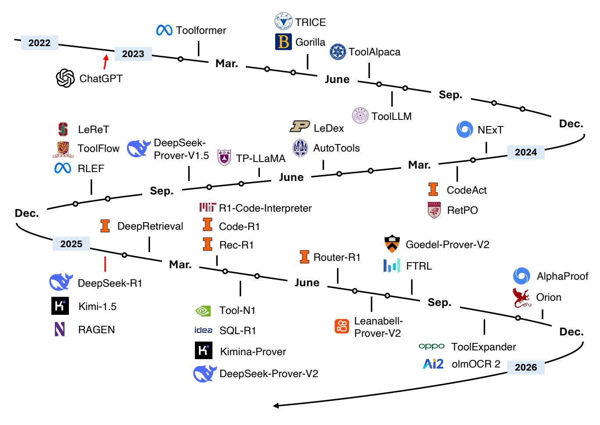

Figure 4 Development timeline of A1 methods (agent adaptation with tool-execution result as signal).

## 4 Agent Adaptation

Agent adaptation refers to the mechanisms through which agents refine their behavior and decision-making capabilities based on feedback from their interactions with tools, environments, or their own outputs. This process is pivotal for enhancing the autonomy, reasoning, and generalization abilities of agents across diverse tasks. Broadly, agent adaptation can be categorized into two paradigms: A1, which leverages tool execution results as feedback signals, and A2, which focuses on evaluating the agent's own outputs.

Formally, let A denote an agent, parameterized by its internal configuration or policy (which includes prompt templates or model weights), and let T represent the set of tools accessible to the agent. The agent's performance under a given configuration is evaluated by an objective function O(·), which provides feedback based on either tool performance or agent output quality. Accordingly, the two adaptation paradigms can be formalized as optimization objectives:

$$\textbf{(A1)} \quad \mathcal{A}^* = \arg\max_{\mathcal{A}} \mathcal{O}_{tool}(\mathcal{A}, \mathcal{T}), \qquad \textbf{(A2)} \quad \mathcal{A}^* = \arg\max_{\mathcal{A}} \mathcal{O}_{agent}(\mathcal{A}, \mathcal{T}),$$

where Otool quantifies the correctness or utility of outcomes derived from tool execution, such as successful code compilation or retrieval precision, and Oagent measures the quality of the agent's generated outputs, including reasoning validity, factual accuracy, or alignment with human preferences. Here, A∗ denotes the optimized agent configuration that maximizes the corresponding feedback objective.

#### 4.1 A1: Tool Execution Result as Signal

Tool execution result as signal refers to a class of adaptation mechanisms where an agent leverages the actual outcomes of external tool invocations (such as execution correctness, functional success, or numerical improvement) as feedback to refine its behavior. Here, the tool or environment serves as an objective source of feedback, forming a verifiable signal that can drive both supervised and reinforcement-based learning.

Table 1 A1 Methods (Tool Execution Signaled): Earlier Methods (SFT & DPO) and Recent RLVR-based Methods

| Time                     | Method                        | Venue            | Task(s)                                                   | Tool(s)                                                                        | Agent Backbone             | Tuning                          | Links  |  |  |
|--------------------------|-------------------------------|------------------|-----------------------------------------------------------|--------------------------------------------------------------------------------|----------------------------|---------------------------------|--------|--|--|
| SFT & Off-Policy Methods |                               |                  |                                                           |                                                                                |                            |                                 |        |  |  |
| 2023.02                  | Toolformer                    | NeurIPS'23       | QA, Math                                                  | Calculator, QA system, Search Engine, Translation System, Calendar | GPT-J                      | SFT                             | P § |  |  |
| 2023.05                  | TRICE                         | NAACL'24         | Math Reasoning, QA                                     | Calculator, WikiSearch, Atlas QA Model, NLLB Translator               | ChatGLM, Alpaca, Vicuna | SFT, Contrastive Learning | P § |  |  |
| 2023.05                  | Gorilla                       | NeurIPS'24       | Tool-Calling, API Retrieval                            | APIs                                                                           | LLaMA                      | SFT                             | P § |  |  |
| 2023.06                  | ToolAlpaca                    | arXiv            | Multi-Turn Tool-Use                                    | Simulated APIs                                                                 | Vicuna                     | SFT                             | P § |  |  |
| 2023.07                  | ToolLLM                       | ICLR'24          | Tool-Calling, API Planning, Multi-Tool Reasoning | Real-World APIs                                                                | LLaMA, Vicuna              | SFT                             | P § |  |  |
| 2024.01                  | NExT                          | ICML'24          | Program Repair                                            | Code Executor                                                                  | PaLM2                      | SFT                             | P      |  |  |
| 2024.02                  | CodeAct                       | ICML'24          | Coding                                                    | Code Executor                                                                  | LLaMA2, Mistral            | SFT                             | P § |  |  |
| 2024.02                  | RetPO                         | NAACL'25         | IR                                                        | Retriever                                                                      | LLaMA2-7B                  | SFT, DPO                        | P § |  |  |
| 2024.03                  | CYCLE                         | OOPSLA'24 Coding |                                                           | Code Executor                                                                  | CodeGen, StarCoder      | SFT                             | P      |  |  |
| 2024.05                  | AutoTools                     | WWW'25           | Tool-Calling                                              | APIs                                                                           | GPT4, LLaMA3, Mistral   | SFT                             | P § |  |  |
| 2024.06                  | TP-LLaMA                      | NeurIPS'24       | Tool-Calling                                              | APIs                                                                           | LLaMA2                     | SFT, DPO                        | P      |  |  |
| 2024.10                  | ToolFlow                      | NAACL'25         | Tool-Calling                                              | APIs                                                                           | LLaMA3.1                   | SFT                             | P      |  |  |
| 2024.10                  | LeReT                         | ICLR'25          | IR                                                        | Dense Retriever                                                                | LLaMA3, Gemma2          | DPO-like (IPO)               | P § |  |  |
|                          |                               |                  |                                                           | RLVR Methods                                                                   |                            |                                 |        |  |  |
| 2024.05                  | LeDex                         | NeurIPS'24       | Coding                                                    | Code Executor                                                                  | StarCoder & CodeLlaMA   | SFT, PPO                        | P      |  |  |
| 2024.08                  | DeepSeek Prover-V1.5       | ICLR'25          | Formal Theorem Proving                                 | Lean 4 Prover                                                                  | DeepSeek Prover-V1.5-RL | SFT, GRPO                       | P § |  |  |
| 2024.10                  | RLEF                          | ICML'25          | Coding                                                    | Code Executor                                                                  | LLaMA3.1                   | PPO                             | P      |  |  |
| 2025.01                  | DeepSeek R1-Zero (Code) | Nature           | Coding                                                    | Code Executor                                                                  | DeepSeek-V3- Base       | GRPO                            | P      |  |  |
| 2025.02                  | DeepRetrieval                 | COLM'25          | Web Search, IR, Text2SQL                               | Search Engine, Retrievers, SQL exec.                                     | Qwen2.5, LLaMA3.2       | PPO, GRPO                       | P § |  |  |
| 2025.03                  | Code-R1                       | —                | Coding                                                    | Code Executor                                                                  | Qwen2.5                    | GRPO                            | §      |  |  |
| 2025.03                  | ReZero                        | arXiv            | Web Search, IR                                            | Web Search Engine                                                           | LLaMA3.2                   | GRPO                            | P § |  |  |
| 2025.03                  | Rec-R1                        | TMLR'25          | Recommendation Optimization                            | Recommendation System                                                       | Qwen2.5, LLaMA3.2       | GRPO                            | P § |  |  |
| 2025.04                  | SQL-R1                        | NeurIPS'25       | Text2SQL Search                                        | SQL Engine                                                                     | Qwen2.5, OmniSQL        | SFT, GRPO                       | P § |  |  |
|                          |                               |                  |                                                           |                                                                                |                            |                                 |        |  |  |

*Continued on next page*

Table 1 – Continued from previous page

| Time    | Method                  | Venue      | Task(s)                         | Tool(s)                                   | Agent Backbone           | Tuning                     | Links   |
|---------|-------------------------|------------|---------------------------------|-------------------------------------------|--------------------------|----------------------------|---------|
| 2025.04 | Kimina- Prover       | arXiv      | Formal Theorem Proving       | Lean 4 Compiler, Numina Lean Server | Qwen2.5                  | SFT, GHPO                  | Å 😱     |
| 2025.04 | DeepSeek- Prover-V2  | arXiv      | Formal Theorem Proving          | Lean 4 Compiler                           | DeepSeek-V3              | SFT, GRPO                  | ß 🞧     |
| 2025.05 | Tool-N1                 | arXiv      | Tool-Calling                    | Tool APIs                                 | Qwen2.5                  | GRPO                       | <u></u> |
| 2025.05 | R1-Code- Interpreter | arXiv      | Coding                          | Code Execution Sandbox                    | Qwen2.5                  | GRPO                       | ß 😱     |
| 2025.06 | Router-R1               | NeurIPS'25 | Multi-Round Routing          | LLM Routing Pool                       | Qwen2.5, LLaMA3.2     | PPO                        | ß 🞧     |
| 2025.07 | Leanabell- Prover-V2 | arXiv      | Formal Theorem Proving          | Lean 4 Verifier                           | Kimina, DeepSeek-V2   | SFT, DAPO                  | E 🕠     |
| 2025.08 | Goedel- Prover-V2    | arXiv      | Formal Theorem Proving          | Lean Compiler                             | Qwen3                    | SFT, GRPO                  | ß 🕠     |
| 2025.08 | FTRL                    | arXiv      | Multi-Step Tool-Use          | Simulated APIs                            | Qwen3                    | GRPO                       | ß 🞧     |
| 2025.09 | Tool-R1                 | arXiv      | Tool-Augmented Reasoning, QA | Code Execution, Multimedia Tools       | Qwen2.5                  | GRPO                       | ß 😱     |
| 2025.09 | WebGen- Agent        | arXiv      | Website Generation           | VLM, GUI Agent, Code Executor       | Qwen2.5-Code, Qwen3   | SFT, Step-GRPO          |         |
| 2025.10 | ToolExpander            | arXiv      | Tool-Calling                    | Tool APIs                                 | Qwen2.5                  | SFT, GRPO                  | 片       |
| 2025.10 | AlphaProof              | Nature     | Formal Theorem Proving       | Lean Solver                               | Transformer (3B Enc-Dec) | SFT, AlphaZero, TTRL | À       |
| 2025.10 | olmOCR2                 | arXiv      | Document OCR                    | Synthetic Document Verifier         | Qwen2.5-VL               | SFT, GRPO                  | ß 🞧     |
| 2025.11 | Orion                   | arXiv      | IR                              | Retrievers                                | LFM2                     | GRPO                       | ۲       |

#### 4.1.1 Earlier Works: SFT & Off-Policy Methods

Early A1-type methods typically focus on SFT or DPO, which aim to teach agents using pre-collected data. These methods begin by collecting a set of model responses or trajectories involving tool usage, and then use this data for supervised fine-tuning or DPO. These A1 methods share a common foundation in leveraging objective environment-grounded outcomes, but differ in the form, source, and utilization of their feedback signals. The evolution of these imitation-based A1-type methods primarily centers on the transformation in **how training signal** is obtained and utilized.

The earliest representative, **Toolformer** [4] (NeurIPS 2023), introduced the idea of using tool outcomes as **self-supervised learning signals**. The model automatically inserts candidate API calls into text, executes them, and measures whether the returned result improves token prediction likelihood. A call is retained if it significantly reduces perplexity, formalized as  $L_i^- L_i^+ \ge \tau_f$ , where the reduction quantifies a self-supervised *tool execution result signal*. This implicit signal anchors learning in the correctness of tool usage, enabling the model to autonomously discover when external APIs improve performance.

However, since the training is based on self-supervised feedback, Toolformer remains limited in precision when applied to real executable environments. This limitation motivated a series of subsequent approaches that sought to introduce more reliable, externally grounded learning signals. Building upon this insight, the evolution of A1-type methods can be viewed through three progressively grounded paradigms of learning:

- Alignment with golden answers: supervision comes from correct responses or expert trajectories.
- Alignment with golden formats: correctness is defined structurally or syntactically.

• Alignment with direct tool execution: learn from verifiable outcomes produced by executing tools, allowing supervision to emerge from actual tool behavior rather than predefined labels.

Alignment with golden answers. Early A1-type approaches focused on aligning models with correct final outputs, typically defined by task-specific ground truths or verified expert solutions.

TRICE [\[52\]](#page-53-11) (NAACL 2024) is a two-stage framework designed to teach LLMs when and how to use tools selectively. The first stage uses supervised fine-tuning to provide the model with a preliminary ability to imitate tool-use behavior. The core of the method lies in the second stage, "Reinforcement Learning with Execution Feedback (RLEF)". In this stage, the agent is trained using a reward signal derived directly from tool execution. The system collects a set of candidate responses for a given task, some of which involve tool calls. A reward strategy then scores each response by comparing its execution result against the ground-truth answer. The model is then reinforced, using a ranking loss, to align its preferences with the high-reward responses, effectively learning from the successful or failed outcomes of tool execution to mitigate excessive reliance on tools and improve accuracy. This design provides a clear instance of learning grounded in correctness alignment, where rewards are explicitly tied to whether the tool-executed outcome matches the golden answer.

ToolAlpaca [\[53\]](#page-53-12) represents one of the earliest closed-loop implementations of A1-type adaptation, where the model refines its tool-use capability directly through iterative interaction with executable environments. The model first generates a tool-call candidate, for example an API invocation, which is then executed within the environment. The system records the runtime outcome of each execution, including returned values, errors, or completion states, to determine the correctness of the model's action. This design establishes an automated self-improvement loop consisting of four key stages: *generate*, *execute*, *evaluate*, and *finetune*. Through repeated cycles, ToolAlpaca progressively aligns its internal representation with the actual semantics and behavior of the tools it uses. This closed-loop process embodies the essence of the A1 paradigm, where *tool execution results* themselves serve as the primary adaptation signal. ToolAlpaca demonstrates the ability to generalize across unseen tools and to adapt its calling strategy according to contextual requirements. By grounding updates in correctness relative to observed outcomes, it implicitly aligns its learning with the "golden answer" paradigm.

TP-LLaMA [\[54\]](#page-53-13) (NeurIPS 2024) is an inference trajectory optimization framework designed to improve toolaugmented LLMs by learning from errors. The authors observe that prior models like ToolLLaMA [\[10\]](#page-51-4) are trained via SFT exclusively on successful expert trajectories from the ToolBench dataset, which ignores valuable information contained in failed exploration paths of the decision trees. To address this, their method consists of two stages: first, the model undergoes standard SFT on successful trajectories, similar to the baseline. Second, the framework leverages the "failed paths" by constructing a novel preference dataset called ToolPreference. This dataset is built using a step-wise method: for any decision node along a successful path, the "preferred" output (*yw*) is the expert's correct next step, while the dispreferred output (*yl* ) is any corresponding failed branch originating from that same node. The model is then trained on these preference pairs using DPO. This approach explicitly uses the execution feedback from failed attempts as a training signal, enabling the model to learn from failure and significantly enhancing its decision-making, generalization, and reasoning efficiency. TP-LLaMA therefore transforms failure signals into preference-aligned supervision, reinforcing learning according to correctness with respect to expert trajectories.

Alignment with golden formats. A complementary branch of A1-type evolution shifted from output-based correctness to format-based structural correctness, emphasizing syntactic and logical validity of tool calls rather than explicit task answers.

Gorilla [\[55\]](#page-53-14) (NeurIPS 2024) is a retrieval-augmented LLaMA-based language model fine-tuned to generate correct API calls across a large and changing set of machine learning APIs. During training, it leverages self-instructed instruction–API pairs and, optionally, a document retriever to adapt to test-time documentation changes. A crucial component of Gorilla's evaluation and feedback loop is the use of Abstract Syntax Trees (ASTs). Both the modelgenerated API calls and reference API calls are converted into ASTs, and correctness is determined by checking whether the reference API forms a subtree of the generated AST. Compared to direct text matching, AST-based evaluation is more robust: differences in parameter order or optional arguments do not lead to false negatives, as ASTs focus on the logical structure of the API call. In the context of A1-type adaptation, this serves as a form of

*tool execution result signal*, providing the model with structured feedback on whether its API call was functionally correct, which can then be used to guide learning and improve tool-use performance. Gorilla therefore exemplifies the golden-format paradigm, where correctness is defined by adherence to canonical structural representations rather than output values.

ToolFlow [\[56\]](#page-53-15) (NAACL 2025) is a data synthesis pipeline designed to enhance the tool-calling capabilities of LLMs through the generation of natural and coherent dialogues. Traditional SFT approaches rely on synthetically generated tool-call data. However, previous methods often suffer from low diversity and limited coherence because tools are sampled randomly and dialogues are synthesized as single-turn interactions, ignoring multi-turn dependencies. ToolFlow addresses these limitations by introducing two key strategies: *Graph-based Sampling* and *Planned Generation*. The Graph-based Sampling strategy constructs a tool graph based on parameter and return-value similarities between tools. Nodes represent tools, and edges indicate their relevance, allowing the selection of tool subsets that are likely to interact effectively. This facilitates the generation of complex user requirements involving multiple interconnected tools. The Planned Generation strategy enables the LLM to first create a high-level dialogue plan that organizes user requests across multiple turns, including both tool-call tasks and non-tool interactions. This ensures logical consistency and natural flow throughout the dialogue, resulting in more realistic training data. Overall, ToolFlow provides a systematic approach for generating high-quality multi-turn tool-call dialogues that closely reflect real-world interaction scenarios, and exemplifies structural alignment through graph-based format consistency.

Alignment with direct tool execution. The most advanced stage of A1 evolution centers on learning directly from verifiable environment signals, where tool execution outcomes themselves become the supervision source.

CodeAct [\[57\]](#page-53-16) (ICML 2024) represented a paradigm in which LLMs learn tool use through direct interaction with executable code environments. Instead of producing textual or JSON-based commands, the model generates executable code actions that are run within a sandboxed environment. The environment returns explicit execution feedback—such as success or failure signals and resulting outputs—which are then used as supervision to refine the model. This process grounds the learning objective in the verifiable outcomes of tool execution, rather than in human-annotated correctness or model-predicted preferences. Through this execution-based feedback loop, CodeAct effectively aligns model behavior with the underlying causal mechanisms of tools.

NExT [\[58\]](#page-53-17) (ICML 2024) is a method designed to teach LLMs to reason about code execution, specifically for program repair tasks. The approach utilizes an iterative self-training loop based on a "Sample–Filter–Train" process. The core of this method lies in its filtering step, which uses a tool's execution result as the primary training signal. An external tool, takes the agent's generated code output and validates it by running a set of unit tests. The binary pass-or-fail diagnostic from this execution serves as a reward signal. Only the candidate solutions (both rationale and code) that successfully pass all unit tests are deemed correct and are collected into a new synthetic dataset, which is then used to finetune the agent for the next iteration. This iterative refinement, guided strictly by the tool's verification, progressively improves the model's ability to generate accurate fixes and high-quality, execution-aware rationales.

ToolLLM [\[10\]](#page-51-4) and AutoTools [\[59\]](#page-54-0) (WWW 2025) push this paradigm toward autonomous tool learning. Specifically, AutoTools consists of two core stages: *tool encapsulation* and *tool programming*. In the tool encapsulation stage, the LLM automatically parses raw API documentation and transforms each tool into a callable function, including structured docstrings, argument specifications, and usage examples. Syntax and runtime correctness are verified through an integration verification procedure, which checks not only individual functions but also input–output dependencies among related tools. Verified functions are aggregated into a function library for subsequent use. In the tool programming stage, the LLM directly generates executable programs that sequentially call these functions, resolve intermediate outputs, and ultimately solve user queries. This design allows the model to flexibly integrate multiple tools using a unified programming language, instead of relying on specialized tokens or handcrafted formats. To further enhance model expertise, AutoTools introduces *AutoTools-Learning*, a multi-task learning approach that trains the LLM on three synthetic tasks: (1) documentation understanding, (2) relevance learning for selecting appropriate tools, and (3) function learning for generating correct multi-step tool programs. The training dataset comprises 34k high-quality examples synthesized from public sources and existing benchmarks, providing

fine-grained supervision for both tool understanding and programmatic reasoning. Through this combination of automated tool encapsulation, programmatic integration, and multi-task training, AutoTools represents a significant step towards fully autonomous A1-type adaptation. Execution outcomes of each tool call serve as direct feedback for iterative self-improvement, enabling LLMs to handle complex, multi-step tool-use tasks without explicit human intervention.

**LeReT** [60] (ICLR 2025) is a reinforcement learning framework for improving multi-hop retrieval in LLM pipelines. A query-generating LLM  $\pi_r$  produces diverse search queries using few-shot prompt ensembles, and retrieved documents are scored with a reward function R. Queries are converted into preference pairs  $(y_i, y_j)$ , where the higher-reward query is preferred. The model is then fine-tuned using preference-based reinforcement learning, specifically *Identity Policy Optimization* (IPO). IPO is a method for directly optimizing a model to reflect human or reward-based preferences. Instead of modeling the probability of a preferred output as in DPO, IPO explicitly enforces that the model's implicit reward difference between preferred and dispreferred outputs matches a target margin. Formally, it minimizes the squared deviation of the reward difference from a fixed margin:

$$\mathcal{L}_{\text{IPO}} = \mathbb{E}_{(x, y_w, y_l) \sim D_p} \left[ \left( \tilde{r}_{\phi}(x, y_w) - \tilde{r}_{\phi}(x, y_l) - 0.5\tau^{-1} \right)^2 \right],$$

where  $\tilde{r}_{\phi}(x,y) = \log \frac{\pi_{\phi}(y|x)}{\pi_{ref}(y|x)}$ ,  $y_w$  and  $y_l$  denote the preferred and dispreferred queries, x is the context, and  $\tau$  is a margin hyperparameter controlling the target difference between rewards. Intuitively, IPO encourages the model to assign higher scores to better outputs and ensures the difference reaches a predefined magnitude, providing a direct and stable training signal. LeReT can be applied iteratively, using the fine-tuned model to generate better exploration data in subsequent iterations. This method improves both retrieval accuracy and downstream generation quality, and can adapt to arbitrary off-the-shelf retrievers without modifying the generator model. As such, it represents the culmination of environment-grounded A1 learning, where reward optimization is explicitly tied to real-world, verifiable signals. Similarly, **RetPO** [61] (NAACL 2025) trains a query reformulation model to translate LLM-generated queries into retriever-optimal queries. The training signal is ingenious in its simplicity: GPT-4 generates multiple candidate rewrites, each is evaluated by running it through an off-the-shelf retriever (e.g., BM25), and the retrieval performance (measured by how well the retrieved documents support the correct answer) serves as the reward. A smaller, open-source LM is then trained via DPO to produce high-reward rewrites.

Overall, the evolution of A1-type methods reflects a gradual shift from implicit, self-supervised feedback to explicit, execution-grounded learning signals. Early methods such as Toolformer demonstrated the feasibility of using tool execution as a self-supervised signal, but their reliance on internal likelihood metrics limited their external validity. Subsequent approaches strengthened the supervision source by grounding model optimization in correctness relative to golden answers or expert trajectories, allowing models to learn more directly from verified outcomes. The next wave of methods, such as Gorilla and ToolFlow, advanced this idea by emphasizing structural and syntactic alignment, ensuring that generated tool calls conform to canonical formats even under distributional shifts. Finally, environment-grounded methods fully integrated external feedback loops, enabling models to learn directly from verifiable execution signals and real-world rewards. This progression illustrates a clear trend toward deeper coupling between model reasoning and environment interaction, where feedback transitions from probabilistic imitation to causally grounded supervision. Such grounding not only enhances tool reliability and adaptability but also marks a key step toward autonomous, self-improving LLM agents capable of operating robustly in open, dynamic environments.

Despite these advances, these methods rely on SFT or DPO, where model updates are derived from pre-collected trajectories or candidate responses. While effective for exploiting existing data, these approaches are inherently constrained in exploration and may fail to fully capture the dynamic nature of interactive environments.

#### 4.1.2 RLVR-Based Methods

Reinforcement learning with verifiable reward (RLVR) marks a pivotal stage in the evolution of A1-type adaptation, where models learn directly from online interaction with tools and environments. Unlike SFT or DPO approaches that rely on pre-collected trajectories or candidate responses, RLVR-based methods enable LLMs to iteratively explore, execute, and refine their actions based on immediate environment feedback. This paradigm allows adaptation to be

dynamic, context-aware, and tightly coupled with the specific execution environment, spanning diverse domains such as web search, code generation, multi-tool reasoning, and downstream applications.

Web search and information retrieval tools optimized query generation and retrieval using environment-derived rewards. DeepRetrieval [\[21\]](#page-51-10) (COLM 2025) marked a key turning point in A1-type adaptation, introducing RLVR to train LLMs as search agents that learn directly from retrieval outcomes. It formalizes query reformulation as an MDP where the user query is the state, the rewritten query is the action, and retrieval metrics—such as Recall@K, NDCG, or SQL execution accuracy—serve as the reward. The policy is optimized via KL-regularized PPO:

$$\hat{\pi} = \arg\max_{\pi} \mathbb{E}_{q,q' \sim \pi} \left[ r(q,q') - \beta \log \frac{\pi(q'|q)}{\pi_{\text{ref}}(q'|q)} \right],$$

where *r*(*q*, *q* ′ ) = *r*retrieval(*q*, *q* ′ ) + *r*format(*q* ′ ) jointly captures retrieval effectiveness and syntactic validity. This unified formulation enables the same framework to adapt seamlessly across literature search, QA-style retrieval, local corpus search with dense or BM25 retrievers, and text-to-SQL database querying. Empirically, DeepRetrieval achieved roughly *a threefold improvement* in recall (65.1% vs. previous state-of-the-art 24.7%) on literature search tasks using real-world search engines, while maintaining impressive performance across other retrieval and SQL domains. These results established reinforcement learning on environment rewards as a general, scalable, and cost-efficient paradigm for retrieval-based agent adaptation. ReZero [\[62\]](#page-54-3), a successor to DeepRetrieval, extends this idea with GRPO-based reinforcement learning that rewards adaptive retries after failed searches. By introducing retry-aware reward shaping, it improves agent persistence and robustness in dynamic or partially observable web environments, further validating the effectiveness of DeepRetrieval's reinforcement-driven approach. Orion [\[63\]](#page-54-4) further extends DeepRetrieval by moving from single-step reformulation to *multi-turn* adaptive search. Using GRPO with turn-level rewards based on normalized similarity and rank, Orion trains models to iteratively refine, pivot, or backtrack through structured think-search cycles. This yields strong multi-hop retrieval performance with compact 350M–1.2B models, showing that effective multi-step search strategies can be learned without large controllers.

Code-based tools provided deterministic or sandboxed execution environments for reasoning and task completion. LeDex [\[64\]](#page-54-5) (NeurIPS 2024) applied reinforcement learning using a PPO-based algorithm with a novel reward function that considers both the correctness of the refined code (via unit test results and CodeBLEU) and the quality of the explanation (via semantic similarity). RLEF [\[20\]](#page-51-9) (ICML 2025) framed code synthesis as a multi-turn interactive task, where the LLM generates a solution, receives automatic feedback from executing the code on public test cases, and updates its subsequent generations accordingly. The process is formalized as a partially observable Markov Decision Process (MDP), with actions corresponding to token-level code generation and rewards determined by the success of private test cases, optimized using PPO. Code-R1 [\[65\]](#page-54-6) built a reliable, scalable, and sandboxed reward pipeline to minimize reward false positives caused by faulty tests, unsolvable prompts, or mismatched execution environments. The key finding is that reward quality matters more than data quantity — clean, verified datasets and secure sandboxed execution are essential for effective code RL training. R1-Code-Interpreter [\[66\]](#page-54-7) introduced a general framework for training LLMs to effectively use a Code Interpreter through multi-stage reinforcement learning. Unlike prior works limited to math or retrieval tasks, it identifies a key challenge that task heterogeneity causes sparse and unstable rewards during RL. To address this, the authors propose a multi-stage curriculum learning approach that prioritizes samples based on their improvement potential. Tool-R1 [\[67\]](#page-54-8) proposed a sample-efficient reinforcement learning framework that performs multi-step reasoning through executable Python code. It introduces a *dynamic sample queue* to cache and reuse high-quality trajectories and employs *outcome-driven rewards* based on code execution success and LLM-judged correctness.

Formal theorem proving [\[68–](#page-54-9)[76\]](#page-54-10) has emerged as a canonical domain for RLVR under the A1 paradigm, as proof assistants provide *ground-truth, tool-execution–signaled* feedback at every step. In this setting, the agent proposes one or more tactics (i.e., proof steps), a formal proof checker (the tool) deterministically verifies their validity, and the resulting validated proof-state transition is returned to the agent. This verification outcome—e.g., whether a tactic is accepted, whether it advances the proof state, or whether a complete proof is achieved—serves directly as a verifiable reward signal for policy optimization. Compared to code-execution RLVR, where unit tests may be sparse or incomplete, theorem proving offers step-wise semantic verification with minimal ambiguity, enabling denser rewards and substantially easing long-horizon credit assignment. Recent systems such as AlphaProof [\[77\]](#page-55-0) (Nature 2025), DeepSeek-Prover-V2 [\[78\]](#page-55-1) (ICLR 2025), Kimina-Prover [\[72\]](#page-54-11), and Leanabell-Prover-V2 [\[79\]](#page-55-2) leverage this verifier feedback to train multi-step proof search policies via reinforcement learning, while a complementary line of work augments the native proof checker feedback with auxiliary guidance signals to prioritize trajectories, shape exploration, or stabilize optimization on top of verifier-grounded rewards [\[80–](#page-55-3)[84\]](#page-55-4). While RLVR is well suited for learning proof strategies under a fixed prover snapshot, formal theorem proving also highlights a broader adaptation challenge: formal libraries (e.g., MATHLIB [\[85\]](#page-55-5)) and large, actively evolving formalization projects [\[86\]](#page-55-6) built by the Lean community grow continuously, expanding the available premise space. Addressing this non-stationarity often requires complementary continual or low-resource adaptation mechanisms beyond pure RLVR, which we discuss in *Continual Adaptation* ([§8.2\)](#page-46-0).

Multi-tool reasoning systems incorporated multiple tools in sequential or compositional pipelines, which used environment feedback to guide action selection. Router-R1 [\[87\]](#page-55-7) (NeurIPS 2025) trained a policy language model to coordinate multiple large language models through a RL framework that formulates multi-round routing and aggregation as a sequential decision process. During training, the policy LLM learns to alternate between internal reasoning and external model selection, dynamically invoking different LLMs from a routing pool to solve complex tasks. FTRL [\[88\]](#page-55-8) proposed an automated strategy for constructing tool-use training environments through a multi-stage pipeline, enabling the creation of diverse and comprehensive training settings without external toolsets. Building on these environments, FTRL introduces a feedback-driven training framework that improves a model's tool-use capabilities by leveraging a verifiable reward function, which balances tool invocation accuracy and task completion using only environmental feedback. Nemotron-Research-Tool-N1 (Tool-N1) [\[25\]](#page-52-16) is a series of LLMs trained with R1-style reinforcement learning to enhance tool-calling capabilities in multi-tool reasoning scenarios. At each action step, the model produces explicit reasoning enclosed in <think> tags, followed by structured tool calls in <tool\_call> tags, effectively separating internal reasoning from external tool execution. WebGen-Agent [\[89\]](#page-55-9) introduced a novel framework for interactive website code generation and integrated a visual-language model for assessing website appearance via screenshots and a GUI-agent for testing functional correctness. To enhance smaller open-source models, the authors propose Step-GRPO with Screenshot and GUI-agent Feedback, a step-level reinforcement learning method that uses appearance and functionality scores as dense rewards. ToolExpander [\[90\]](#page-55-10) enhanced GRPO-based RL for single-turn tool tasks, specifically targeting small-scale, resource-constrained LLMs. It introduced Dynamic Multi-Round Hard Sampling to replace difficult samples with high-quality few-shot examples during training, reducing the proportion of hard samples and improving learning stability. Additionally, the Self-Exemplifying Thinking mechanism allows the model to autonomously generate and analyze few-shot examples, receiving a small extra reward to encourage self-guided learning.

More tasks A1-type training is also applied to many other downstream tasks achieving promising results. Rec-R1 [\[91\]](#page-55-11) (TMLR 2025) is a reinforcement learning framework that directly optimizes LLMs for recommendation tasks using feedback from downstream recommendation systems, rather than relying on imitation of other models or synthetic supervised data. By casting LLM generation as a policy and using recommendation metrics (e.g., NDCG, Recall) as reward signals, Rec-R1 enables closed-loop adaptation of LLM outputs, aligning generation with actual recommendation performance. SQL-R1 [\[92\]](#page-55-12) is a recent work that addresses the Natural Language to SQL (NL2SQL) task by leveraging reinforcement learning to enhance reasoning capabilities in complex database scenarios. SQL-R1 introduces a tailored RL reward function comprising format, execution, result, and length rewards to guide the model toward generating SQL queries that accurately reflect user intent. olmOCR 2 [\[93\]](#page-55-13) is a state-of-the-art open-source OCR system for converting digitized print documents into naturally ordered plain text. This reinforcement learning-based method is a key departure from the project's first version, olmOCR 1 [\[94\]](#page-55-14), which was trained using supervised fine-tuning to mimic the static outputs of a teacher model. Critically, this new approach moves beyond traditional edit distance metrics, which often fail to capture practical correctness or handle layout ambiguities. Instead, the model is trained using a diverse set of binary unit tests as the reward signal, covering text presence/absence, reading order, table accuracy, and math formula rendering.

In summary, RLVR-based A1 methods represent a substantial evolution, directly engaging with interactive environments to iteratively improve performance. RLVR-based A1 methods leverage environment-derived reward signals to guide policy optimization, often integrating advanced techniques such as KL-regularized PPO, GRPO, and dynamic sampling. The unifying principle is that models learn through trial-and-error, receiving immediate feedback from the environment to refine both reasoning and tool-use strategies. Despite their effectiveness, RLVR-based approaches

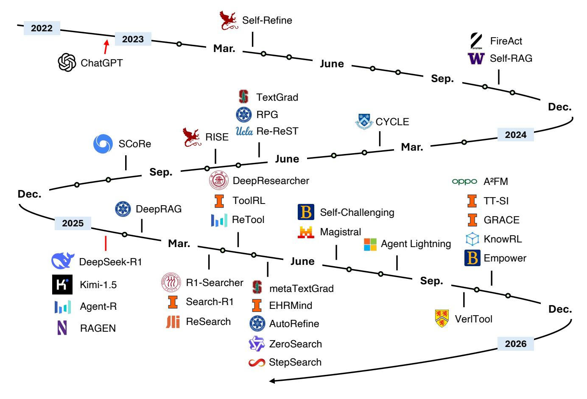

Figure 5 Development timeline of A2 methods (agent adaptation with agent output as signal).

generally require careful reward design, computational resources for interactive training, and mechanisms to stabilize learning.

## 4.2 A2: Agent Output as Signal

Different from A1-type adaptation, which leverages feedback obtained from tool executions or external environments, the A2 paradigm focuses on using evaluations of the agent's own outputs as the optimization signal. In this setting, the learning or adjustment process is driven by assessing the quality of the agent's generated outputs. Such evaluations may come from human judgments, automated metrics, or environment-based rewards, and are used to update or refine the agent policy. Under this paradigm, adaptation can occur in two primary settings:

- Agent Adaptation w/o Tools: The agent relies on the evaluation of its reasoning or problem-solving outputs without involving external tools. This direction mainly focuses on improving intrinsic reasoning abilities, such as mathematical reasoning, coding, or logical inference, by optimizing the model based on evaluations of its generated solutions.
- Agent Adaptation w/ Tools: The agent's generated outputs are assessed in conjunction with tool interactions, providing feedback on how effectively the agent plans, selects, and executes tool usage. This line of adaptation aims to enhance the agent's capability in coordinating and utilizing tools, using evaluation signals derived from task outcomes that depend on tool-mediated actions.

Table 2 A2 Methods: Tool Adaptation w/ Agent Supervision

| Time    | Method                      | Venue      | Task(s)                                                    | Tool(s)                     | Agent Backbone                               | Tuning                 | Links  |
|---------|-----------------------------|------------|------------------------------------------------------------|-----------------------------|----------------------------------------------|------------------------|--------|
|         |                             |            |                                                            | w/o Tools                   |                                              |                        |        |
| 2023.03 | Self-Refine                 | NeurIPS'23 | Dialogue, Math, Coding                                  | —                           | GPT3.5, GPT4, CODEX                       | Prompt Engineering  | P § |
| 2024.06 | TextGrad                    | Nature     | Code Optimization, Molecule Optimization, etc. | —                           | GPT3.5, GPT4o                                | Prompt Engineering  | P § |
| 2024.07 | RISE                        | NeurIPS'24 | Math                                                       | —                           | LLaMA2, LLaMA3, Mistral                   | SFT                    | P § |
| 2024.09 | SCoRe                       | ICLR'25    | Math, Coding, QA                                        | —                           | Gemini1.0 Pro, Gemini1.5 Flash            | REINFORCE              | P § |
| 2025.01 | DeepSeek-R1- Zero (Math) | Nature     | Math                                                       | —                           | DeepSeek-V3                                  | GRPO                   | P      |
| 2025.01 | Kimi k1.5                   | arXiv      | Math, Coding                                               | —                           | Kimi k1.5                                    | GRPO                   | P § |
| 2025.05 | EHRMind                     | arXiv      | EHR-based Reasoning                                     | —                           | LLaMA3                                       | SFT, GRPO              | P      |
| 2025.05 | metaTextGrad                | NeurIPS'25 | QA, Math, Word Sorting                                  | —                           | Qwen3-235B A22B, Claude-3.5- Sonnet | Prompt Engineering  | P § |
| 2025.06 | Magistral                   | arXiv      | Math, Coding                                               | —                           | Magistral                                    | PPO, GRPO              | P      |
| 2025.10 | GRACE                       | arXiv      | Embedding Tasks                                         | —                           | Qwen2.5, Qwen3, LLaMA3.2                  | GRPO                   | P § |
| 2025.10 | KnowRL                      | arXiv      | Knowledge Calibration                                   | —                           | LLaMA3.1, Qwen2.5                         | REINFORCE++ P          | §      |
| 2025.10 | Empower                     | arXiv      | Coding                                                     | —                           | Gemma3                                       | SFT                    | P § |
|         |                             |            |                                                            | w/ Tools                    |                                              |                        |        |
| 2023.10 | FireAct                     | arXiv      | QA                                                         | Search API                  | GPT3.5, LLaMA2, CodeLLaMA              | SFT                    | P § |
| 2023.10 | Self-RAG                    | ICLR'24    | QA, Fact Verification                                   | Retriever                   | LLaMA2                                       | SFT                    | P § |
| 2024.06 | RPG                         | EMNLP'24   | QA, Reasoning                                              | Search Engine, Retriever | LLaMA2, GPT3.5                            | SFT                    | P § |
| 2024.06 | Re-ReST                     | EMNLP'24   | QA, VQA, Sequential Decision, Coding              | Tool APIs                   | Various Models                               | DPO                    | P § |
| 2025.01 | Agent-R                     | arXiv      | Various Tasks                                              | Monte Carlo Tree Search  | Qwen2.5, LLaMA3.2                         | SFT                    | P § |
| 2025.02 | RAS                         | arXiv      | QA                                                         | Retriever                   | LLaMA2, LLaMA3.2                          | SFT                    | P § |
| 2025.03 | R1-Searcher                 | arXiv      | QA                                                         | Retriever                   | LLaMA3.1, Qwen2.5                         | REINFORCE++ P          | §      |
| 2025.03 | Search-R1                   | COLM'25    | QA                                                         | Search Engine, Retriever | Qwen2.5                                      | PPO, GRPO              | P § |
| 2025.03 | ReSearch                    | NeurIPS'25 | QA                                                         | Search Engine, Retriever | Qwen2.5                                      | GRPO                   | P § |
| 2025.04 | ReTool                      | arXiv      | Math                                                       | Code Interpreter            | Qwen2.5                                      | PPO                    | P § |
|         |                             |            |                                                            |                             |                                              | Continued on next page |        |

Table 2 – Continued from previous page

| Time    | Method              | Venue      | Task(s)                                           | Tool(s)                                                                 | Agent Backbone       | Tuning                          | Links  |
|---------|---------------------|------------|---------------------------------------------------|-------------------------------------------------------------------------|----------------------|---------------------------------|--------|
| 2025.04 | DeepResearcher      | arXiv      | QA, Reasoning, Deep Research                   | Web Search API, Web Browser                                       | Qwen2.5              | GRPO                            | P § |
| 2025.04 | ToolRL              | arXiv      | Tool Calling                                      | Tool APIs                                                               | Various Models       | GRPO                            | P § |
| 2025.05 | AutoRefine          | NeurIPS'25 | QA                                                | Retriever                                                               | Qwen2.5              | GRPO                            | P § |
| 2025.05 | ZeroSearch          | arXiv      | QA                                                | Search Engine, Web Search                                            | Qwen2.5, LLaMA3.2 | REINFORCE, GPRO, PPO, SFT | P § |
| 2025.05 | StepSearch          | EMNLP'25   | QA                                                | Search Engine, Retriever                                             | Qwen2.5              | StePPO                          | P § |
| 2025.06 | Self Challenging | arXiv      | Multi-Turn Function Calling, Calculation | Code Interpreter, Web Browser                                     | LLaMA3.1             | REINFORCE, SFT               | P      |
| 2025.06 | MMSearch-R1         | arXiv      | QA, VQA                                           | Image Search, Web Browser, Retriever                              | Qwen2.5              | REINFORCE, SFT               | P § |
| 2025.07 | DynaSearcher        | arXiv      | QA                                                | Document Search, KG Search                                        | Qwen2.5, LLaMA3.1 | GRPO                            | P § |
| 2025.07 | CodePRM             | ACL'25     | Coding                                            | Code Executor                                                           | Qwen2.5-Coder        | SFT                             | P      |
| 2025.08 | Agent Lightning  | arXiv      | Text2SQL, Math                                    | SQL Executor, Retriever, Calculator                               | LLaMA3.2             | LightningRL                     | P § |
| 2025.08 | MedResearcher R1 | arXiv      | Medical QA                                        | Medical Retriever, Web Search API, Document Reader          | MedResearcher R1  | SFT, GRPO                       | P § |
| 2025.09 | VerlTool            | arXiv      | Math, QA, SQL, Visual, Web Search, Coding   | Code Interpreter, Search Engine, SQL Executor, Vision Tools | Qwen2.5, Qwen3       | GRPO                            | P § |
| 2025.10 | 2FM A            | arXiv      | Web Navigation, Math, QA                       | Search Engine, Crawl, Code Executor                               | Qwen2.5              | APO,GRPO                        | P § |
| 2025.10 | TT-SI               | arXiv      | Tool Calling                                      | Tool APIs                                                               | Qwen2.5              | Test-Time Fine-Tuning        | P      |

## 4.2.1 Agent Adaptation w/o Tools

A major breakthrough in the paradigm of output-based agent adaptation emerged with the introduction of the DeepSeek-R1 framework [\[24\]](#page-52-0) (Nature 2025), which demonstrated that *reinforcement learning with verifiable reward (RLVR)* can effectively enhance the reasoning capabilities of large agents. In this framework, a strong base model serves as the core reasoning engine, while reinforcement learning encourages the generation of outputs that are logically consistent and verifiably correct. The training process focuses primarily on reasoning-intensive domains such as mathematics and code generation, where the quality of outputs can be automatically evaluated through deterministic correctness signals. This approach not only improved model reasoning but also revealed a scalable pathway for further enhancing agent intelligence beyond supervised fine-tuning.

Concurrently, Kimi-1.5 [\[95\]](#page-56-0) advanced this paradigm by scaling reinforcement learning for multi-modal agents and introducing simplified yet effective policy optimization strategies. By leveraging large-scale reasoning data and efficient reward modeling, Kimi-1.5 achieved strong performance across a range of reasoning benchmarks, matching or surpassing prior state-of-the-art models. Together, these works sparked a new wave of research into the so-called R1 paradigm, where reinforcement learning is used to refine the reasoning process of agentic systems based on verifiable output evaluations. Following this development, a number of subsequent studies have extended the paradigm to various applications and reasoning settings.

Following the emergence of the R1 paradigm, a series of subsequent works further extended the idea of optimizing agent reasoning through evaluations of model outputs, without relying on external tools. These studies explored diverse learning signals, objectives, and task domains, collectively enriching the landscape of output-based adaptation for reasoning enhancement.

Empower [\[96\]](#page-56-1) proposed a self-supervised fine-tuning framework for assistive language models, where the optimization objective centers on maximizing human empowerment rather than explicit correctness. By using only offline text data, the method aligns agents to assist human users in multi-turn coding tasks, encouraging context-sensitive and cooperative behavior without the need for additional feedback or verifiable rewards.

KnowRL [\[97\]](#page-56-2) introduced a reinforcement-based approach to strengthen self-knowledge calibration. Instead of focusing on task-specific correctness, KnowRL trains agents to assess their own confidence and feasibility in producing reliable answers. Through internally generated rewards derived from self-assessment, the model enhances its awareness of what it knows and what it does not, improving reliability and consistency across reasoning domains.

GRACE [\[98\]](#page-56-3) reimagines contrastive learning as a form of reward-guided optimization, transforming contrastive objectives into policy signals that encourage explicit, interpretable reasoning. By treating positive–negative sample distinctions as reward feedback, GRACE bridges generative reasoning and representation learning, yielding improved embedding alignment and more transparent rationales. A related study, Rec-R1 [\[91\]](#page-55-11), applies reinforcement optimization to product re-ranking tasks, demonstrating that reinforcement signals derived from task-specific output evaluations can improve discriminative performance while preserving general reasoning ability. EHRMind [\[99\]](#page-56-4) extends the reinforcement-with-verifiable-reward framework to clinical reasoning scenarios. Targeting electronic health record (EHR) interpretation, the study highlights the limitations of RLVR alone, noting that domain-specific reasoning often requires prior knowledge alignment through SFT. EHRMind combines a lightweight SFT warm-up phase with subsequent RLVR optimization, effectively stabilizing training and improving interpretability in medical tasks such as clinical calculation, patient-trial matching, and disease diagnosis. This finding underscores a broader insight: while RL-based adaptation enhances reasoning quality, SFT remains a critical foundation for domain grounding and stable agent adaptation.

Before the emergence of the R1 paradigm, several studies had already explored output-based adaptation strategies that optimize reasoning quality through self-generated feedback, without modifying model parameters via traditional supervised signals. These early attempts laid the conceptual foundation for reinforcement-driven reasoning improvement later seen in R1-style frameworks.

Self-Refine [\[100\]](#page-56-5) (NeurIPS 2023) introduced an iterative refinement framework in which the same language model acts as both generator and critic. The model first produces an initial response and then evaluates and revises it based on self-generated textual feedback. This process, inspired by human-style revision, improves output quality across diverse domains such as dialogue, mathematics, and code generation. Notably, Self-Refine requires no supervised data, auxiliary models, or reinforcement learning, which shows that structured self-feedback alone can lead to measurable gains in reasoning accuracy and output preference.

Building upon this direction, SCoRe [\[100\]](#page-56-5) (ICLR 2025) proposed a reinforcement learning approach for enabling language models to self-correct using entirely self-generated data. Unlike conventional SFT, which struggles to teach effective correction behavior, SCoRe employs multi-turn online reinforcement learning to encourage models to iteratively refine their reasoning under their own distribution of responses. By combining reward regularization and self-generated correction traces, the method significantly improves self-correction ability on mathematical and reasoning benchmarks, demonstrating that reinforcement learning can effectively operationalize self-reflection into a stable learning signal.

Backpropagating language-model feedback. TextGrad [\[101\]](#page-56-6) (Nature 2025) introduced a general framework for agent self-improvement through *textual gradient descent (TGD)*. Instead of relying on numerical gradients or verifiable environment rewards, TextGrad propagates *language-model feedback* in the form of natural-language critiques that describe how to improve the model's outputs. These feedback messages act as "textual gradients," allowing optimization across black-box LLM systems without requiring access to their internal parameters. This method formalizes self-refinement as a differentiable-like process and generalizes earlier outcome-based approaches such as DeepSeek-R1. Empirically, TextGrad improves GPT-4o's zero-shot code accuracy on LEETCODE-HARD (from 26% to 36%), raises MMLU-Physics performance from 91.2% to 95.1%, and enhances the multi-tool agent CHAMELEON by 7.7%. Conceptually, TextGrad exemplifies the A2 paradigm, extending reinforcement-style adaptation from scalar rewards to structured linguistic feedback. It unifies prompt tuning, reasoning refinement, and compound-agent optimization under a single abstraction of *backpropagating language feedback*, marking a step toward interpretable and parameter-agnostic agent adaptation. Building on this, metaTextGrad [\[102\]](#page-56-7) (NeurIPS 2025) applies the A2 paradigm recursively to the optimizer itself, using validation feedback to automatically refine the optimizer's prompts and structure for better task alignment.

#### 4.2.2 Agent Adaptation w/ Tools

Following the rise of the R1 paradigm, the idea of using agent outputs as optimization signals has expanded beyond pure reasoning tasks to encompass tool-using agents. These studies extend output-based RL to settings where agents must decide when and how to invoke external tools, integrating real-time feedback from retrieval systems, APIs, or executable environments. This marks a shift from reasoning-centric refinement to *tool-grounded adaptation*, where outcome feedback from the external world provides rich and verifiable learning signals.

Retrieval-based tool learning. Different from earlier work like Self-RAG [\[103\]](#page-56-8) (ICLR 2024) and its successors [\[104](#page-56-9)[–106\]](#page-56-10), which introduces an distillation-SFT-based paradigm to teach models to use retrieval tools for search, a recent major line of work investigates how RL can improve the use of retrieval tools for question answering. R1-Searcher [\[107\]](#page-56-11), Search-R1 [\[49\]](#page-53-8) (COLM 2025), ReSearch [\[108\]](#page-56-12) (NeurIPS 2025), and their successors [\[109–](#page-56-13) [115\]](#page-57-0) all extend the R1 paradigm by enabling LLMs to autonomously generate and refine search queries during multi-turn reasoning. R1-Searcher [\[107\]](#page-56-11) proposes a two-stage RL framework that incentivizes the use of external search APIs, enhancing factual accuracy and reducing hallucinations in open-domain QA. Trained with multi-turn RL, the model learns to balance reasoning and retrieval, achieving up to 24% improvement over strong RAG baselines. Similarly, Search-R1 [\[49\]](#page-53-8) formulates search invocation as a reinforcement optimization problem, where retrieved evidence and final correctness jointly form the outcome-based reward. ReSearch [\[108\]](#page-56-12) trains LLMs to *reason with search* via reinforcement learning, without any supervised data on reasoning steps. It integrates search queries and retrieved results directly into the reasoning chain using tags such as <think>, <search>, and <result> and optimizes the model with GRPO to decide *when* and *how* to search. Trained on multi-hop QA tasks, ReSearch yields 9–22% absolute gains over iterative RAG baselines and exhibits emergent reflection and self-correction behaviors during RL training These works demonstrate that reasoning-oriented RL can naturally extend to retrieval-augmented contexts, allowing LLMs to internalize when external information is needed.

Code- and execution-based tool learning. A parallel direction focuses on code-based environments where tools provide executable feedback. CodePRM [\[116\]](#page-57-1) (ACL 2025) introduces a process reward model that scores reasoning steps based on code execution results, forming a *Generate–Verify–Refine* pipeline that dynamically corrects reasoning errors during inference. ReTool [\[50\]](#page-53-9) advances this idea by integrating real-time code execution into RL rollouts, teaching models when and how to invoke computational tools such as interpreters to optimize mathematical and symbolic reasoning.

General multi-tool and agentic learning. Beyond retrieval, several studies generalize this principle to agents interacting with diverse APIs and environments. Test-Time Self-Improvement (TT-SI) [\[117\]](#page-57-2) introduces on-thefly self-improvement, where the agent identifies uncertain test cases and generates new training data for them, performing fine-tuning directly at inference time. Agent Lightning [\[118\]](#page-57-3) provides a flexible RL framework that decouples agent execution from training, allowing reinforcement optimization to handle complex, multi-agent, and multi-tool workflows with minimal code modification. Re-ReST [\[119\]](#page-57-4) extends self-training with reflection, using environment feedback such as unit test results to refine low-quality trajectories, yielding large gains on HotpotQA and AlfWorld. In a similar spirit, Self-Challenging Agents [\[120\]](#page-57-5) introduce a self-generated curriculum: the model first generates novel tool-use tasks as a challenger, then solves them via RL as an executor, achieving

more than a twofold improvement on multi-turn tool-use benchmarks. Agent-R [\[121\]](#page-57-6) further formalizes iterative self-reflection via model-guided critique construction, continuously correcting failed trajectories using Monte Carlo Tree Search (MCTS) rollouts, which improves performance by 5.6% across interactive environments. Finally, A 2FM [\[122\]](#page-57-7) unifies reasoning and acting within a cost-regularized RL framework, dynamically choosing between internal reasoning, tool invocation, or direct answering, thereby improving both efficiency and accuracy in hybrid reasoning benchmarks. Addressing system-level scalability in a similar vein, VerlTool [\[123\]](#page-57-8) introduces a unified infrastructure for agentic RL. By decoupling the RL workflow from a modular tool server and implementing asynchronous rollouts, it eliminates synchronization bottlenecks, enabling the efficient training of multi-modal agents across disparate tasks ranging from visual reasoning to software engineering.

## 5 Tool Adaptation

Tool adaptation represents another emerging trend for enhancing AI agents' performance on specific tasks, marking a conceptual shift from optimizing the agent itself to optimizing its ecosystem. Instead of modifying the agent's parameters through fine-tuning or reinforcement learning, this paradigm targets the external components—the "tools" that mediate perception, computation, and interaction. These tools may encompass pre-trained models, retrievers, planners, or executors that the agent can invoke through language or code. Consequently, tool adaptation focuses on improving the agent's operational environment rather than its internal cognition. Methods in this category typically (1) employ pre-trained machine learning models—developed via environment feedback or data imitation—as plug-and-play components, ranging from simple classifiers to complex LLM-based sub-agents as discussed in [§4;](#page-11-0) or (2) leverage the agent's outputs as supervision or reinforcement signals to train, align, or refine the tool itself. This perspective re-frames intelligent systems as co-adaptive ecosystems, where frozen agents and adaptive tools evolve symbiotically toward higher task efficiency, modularity, and generalization.

Formally, let A denote an agent, parameterized by its internal configuration or policy (which include prompt templates or model weights) and T denote a tool or a set of tools that can be trained or optimized based on task feedback. The adaptation process can be characterized by two complementary paradigms:

$$(\mathbf{T1}) \quad \mathcal{T}^* = \arg\max_{\mathcal{T}} \mathcal{O}_{tool}(\mathcal{T}), \qquad (\mathbf{T2}) \quad \mathcal{T}^* = \arg\max_{\mathcal{T}} \mathcal{O}_{agent}(\mathcal{A}, \mathcal{T}),$$

where Otool quantifies task-specific or environment-driven improvements that are independent of the agent, such as retrieval accuracy or planning efficiency, while Oagent incorporates agent-derived supervision, where the agent's outputs provide learning signals to refine or align the tool. Here, T ∗ denotes the optimized tool configuration that maximizes the respective objective, illustrating how tool adaptation complements agent-level optimization within the broader agent–tool ecosystem.

## 5.1 T1: Agent-Agnostic Tool Adaptation

The foundational architecture for tool-augmented systems is to use pre-trained models as plug-and-play tools for frozen agents. The agent orchestrates tool usage through prompting alone, never updating its parameters, while leveraging tools that were trained independently on diverse data sources before deployment.

#### 5.1.1 Foundational Systems and Architectures

Early systems exemplifying the tool-adaptation paradigm established the architectural foundations for how frozen agents can effectively orchestrate or invoke external models. These pioneering works demonstrate distinct mechanisms functional, prompt-based, code-based, and graph-based—that together shaped the design space for modern toolaugmented AI systems.

Operator-Learning Tools: Neural Operators [\[124\]](#page-57-9) (JMLR). Before large-scale LLM-based orchestration emerged, Neural Operators represented a seminal example of *agent-agnostic tool learning*: models trained to approximate mappings between infinite-dimensional function spaces, serving as differentiable surrogates for complex simulators. Unlike conventional neural networks tied to discrete grids, Neural Operators are discretization-invariant—they learn

the underlying operator itself, not its finite discretization—and can generalize across resolutions and geometries. The Fourier Neural Operator (FNO) achieves O(*J* log *J*) inference via spectral convolution and outperforms classical solvers on Navier–Stokes, Darcy flow, and elasticity equations by orders of magnitude in speed. Conceptually, FNO and its variants (Graph-, Low-rank-, Multipole-NO) mark the first wave of "frozen tools" that agents can query repeatedly for reasoning, planning, or control without retraining. In modern agentic pipelines, they are used as plug-in surrogates—fast, differentiable black-box functions invoked within decision or inference loops.

HuggingGPT [\[125\]](#page-57-10) (NeurIPS 2023) pioneered the orchestration paradigm by enabling ChatGPT to command 1000+ machine learning models from HuggingFace Hub without any fine-tuning. The frozen LLM executes a four-stage workflow: task planning (decomposing user requests), model selection (choosing from tool descriptions), task execution (invoking models), and response generation (synthesizing outputs). This architecture demonstrates that language serves as a universal interface—tool descriptions in natural language suffice for the frozen agent to coordinate complex multimodal workflows. On composite cross-modal tasks, HuggingGPT enables GPT-3.5 to achieve performance comparable to GPT-4V by orchestrating specialized vision, speech, and language models. The primary limitation lies in latency from sequential LLM calls and token length constraints for tool descriptions. ViperGPT [\[126\]](#page-57-11) (ICCV 2023) introduced code generation as the orchestration mechanism. The frozen GPT-3 Codex generates Python code that composes vision models—GLIP for detection, SAM for segmentation, MiDaS for depth estimation—into executable programs. This code-based approach achieves state-of-the-art zero-shot performance on GQA visual reasoning, outperforming end-to-end models by 10–15% on compositional tasks. The key insight: Python functions provide more flexible tool composition than fixed API calls. Each tool exposes simple functions like find(image, object\_name) or compute\_depth(image), which Codex chains programmatically without learning tool-specific interfaces. SciToolAgent [\[127\]](#page-57-12) (Nature Computational Science 2025) scales tool orchestration to scientific domains through graph-based organization. The frozen GPT-4o accesses 500+ biology, chemistry, and materials science tools via SciToolKG—a knowledge graph encoding tool metadata, dependencies, and safety constraints. Graph-based retrieval for tool selection achieves 94% accuracy on scientific query benchmarks, representing a 15–20% improvement over GPT-4o without tool access. The system successfully automates protein engineering workflows chaining ESMFold for structure prediction, BLAST for sequence alignment, and custom analysis tools. This architecture demonstrates that structured knowledge graphs address scalability challenges inherent in prompt-based descriptions.

These foundational systems illustrate the dominant integration patterns. HuggingGPT exemplifies prompt-based orchestration, where the agent parses tool calls from text. ViperGPT uses code generation, exposing tools as Python functions. SciToolAgent demonstrates knowledge graph retrieval, using RAG to select from structured tool graphs. A fourth common pattern is multimodal bridging, which converts non-textual modalities into text representations; for example, Visual ChatGPT's [\[128\]](#page-57-13) prompt manager serializes vision operations as text API calls. The usability of these patterns depends on clear interface design, such as programmatic function signatures (e.g., find\_object(image: PIL.Image, ...)), structured JSON schemas, or simple natural language descriptions. Execution modes are similarly varied, ranging from direct API calls and code generation to HTTP requests and command-line invocations.

Model Context Protocol (MCP) and Code Execution Environments [\[129\]](#page-57-14). As large-scale agent ecosystems began to connect thousands of heterogeneous tools, the *Model Context Protocol* (MCP) emerged as an open standard for unifying how agents interface with external systems. Rather than embedding long tool definitions and intermediate results directly into the model's context, MCP provides a universal API layer that enables frozen agents to discover, invoke, and coordinate tools across domains using a consistent schema. Building upon this infrastructure, Anthropic's "*Code Execution with MCP*" paradigm introduced an execution-centric design in which the agent writes executable code to interact with MCP servers instead of performing token-level tool calls. This approach allows agents to load only the necessary tool definitions, filter or aggregate data within a sandboxed environment, and pass compact results back to the model, reducing context usage by over 98% while maintaining full compositionality. Conceptually, MCP represents a scalable T1-style tool adaptation infrastructure that decouples execution from inference, while the code-execution mode bridges toward T2-style optimization by dynamically improving efficiency under frozen agents. Together with systems such as HuggingGPT, ViperGPT, and SciToolAgent, it exemplifies the architectural evolution from static tool invocation to protocol-driven, programmable, and context-efficient orchestration.

#### 5.1.2 Categories and Training Methodologies

Tool adaptation encompasses a wide range of pre-trained model categories, each contributing unique functional capabilities to frozen agents. The following examples highlight representative tool families and the training methodologies that enable their plug-and-play deployment across multimodal and domain-specific settings.

Vision models dominate T1 deployments as plug-and-play tools. CLIP [\[130\]](#page-57-15), trained contrastively on 400M image-text pairs, provides zero-shot classification and semantic understanding through frozen encoders. SAM [\[131\]](#page-57-16), trained on 11M images with 1B masks via human-in-the-loop data engines, enables promptable segmentation with point, box, or mask inputs. SAM-CLIP [\[132\]](#page-57-17) merges these capabilities through multi-task distillation with frozen teachers, achieving +6.8% mIoU on Pascal VOC for zero-shot semantic segmentation while retaining both parent models' strengths. These vision tools require no task-specific fine-tuning - frozen agents invoke them directly via APIs for image understanding, segmentation, and classification tasks.

Speech and audio tools leverage massive pre-training for robust performance. Whisper [\[133\]](#page-57-18), trained on 680K hours of multilingual audio with weak supervision, provides speech recognition, translation, and language identification as a frozen API for multimodal agents. The encoder-decoder Transformer architecture enables zero-shot transcription across languages and domains, demonstrating remarkable robustness to accents, noise, and technical terminology. Agents simply pass audio inputs to the frozen Whisper model and process text outputs without any model adaptation.

Code execution tools encompass models that learn to compose and execute functions through code. CodeAct [\[57\]](#page-53-16) demonstrates that representing tool use in executable Python rather than static JSON improves compositional reasoning, achieving over 20% higher success rates on API-Bank benchmarks. The dynamic nature of code allows agents to flexibly construct, parameterize, and combine tools without predefined schemas.

Search and retrieval tools comprise pre-trained dense retrievers such as DPR [\[134\]](#page-57-19), ColBERT [\[135\]](#page-58-0), Contriever [\[136\]](#page-58-1), and e5 [\[137\]](#page-58-2), often deployed as frozen components within retrieval-augmented generation pipelines. These bi-encoder models, trained on passage ranking tasks, enable semantic search over large corpora.

Scientific tools extend capabilities to specialized fields. AlphaFold2 [\[138\]](#page-58-3) and ESMFold [\[139\]](#page-58-4) provide protein structure prediction from sequences. Materials science models like CGCNN [\[140\]](#page-58-5) predict crystal properties. Molecule representation learning approaches [\[141](#page-58-6)[–147\]](#page-58-7) have been developed for molecular property prediction, whereas some encoder–decoder frameworks [\[148,](#page-58-8) [149\]](#page-58-9) aim to predict transcriptional profiles elicited by chemical perturbations. These tools represent years of domain-specific model development, deployed as-is for frozen agents tackling scientific queries.

Beyond these static models, adaptive agents introduced in [§4](#page-11-0) (such as DeepRetrieval [\[21\]](#page-51-10) for search query rewriting and Code-R1 [\[65\]](#page-54-6) for code generation) illustrate how trained reasoning agents themselves can function as dynamic tools. Once frozen, they extend the tool ecosystem by reformulating queries, generating executable code, or performing reasoning-driven actions, thereby bridging the gap between pre-trained models and the environment or offline data.

## 5.2 T2: Agent-Supervised Tool Adaptation

The T2 paradigm represents a profound conceptual inversion in how we approach adaptation in agentic systems. Rather than asking "how can we modify the agent to better use its tools?" (the A1/A2 question), T2 asks: "how can we modify the tools to better serve a fixed agent?" This seemingly simple reversal has far-reaching implications. It reframes the expensive, monolithic foundation model as a stable source of *supervision* rather than the target of optimization, and reconceptualizes the agent's ecosystem of tools as a dynamic, adaptive periphery that can be continuously refined. This inversion is not merely a technical choice but reflects a deeper understanding of the economics and modularity of modern AI systems. Training or fine-tuning billion-parameter foundation models is computationally prohibitive and risks catastrophic forgetting. In contrast, the peripheral tools—retrievers, planners, memory modules—are typically orders of magnitude smaller and can be trained with dramatically less data and computation. The T2 paradigm exploits this asymmetry, achieving what we term *symbiotic adaptation*: the frozen

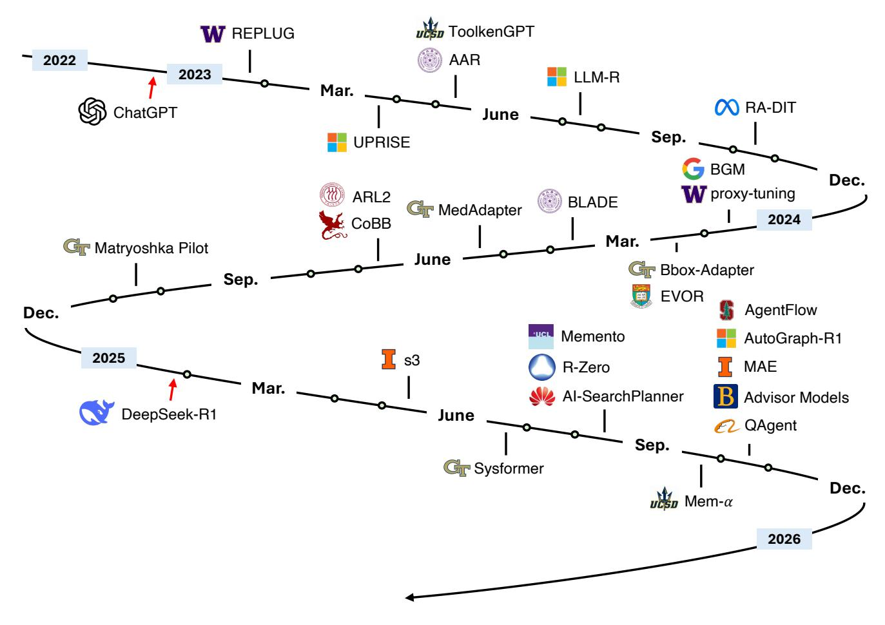

**Figure 6** Development timeline of T2 methods (agent-supervised tool adaptation, classic memory-related methods are not included in this figure due to space limitation).

agent provides high-quality supervision signals derived from its vast pre-trained knowledge, while the tools learn to translate, filter, and present information in exactly the form the agent finds most useful.

The evolution of T2 methods from 2023 to 2025 reveals a clear intellectual progression: from using *internal proxy signals* (perplexity, preferences) to train passive retrieval tools, to using *verifiable outcome signals* (task success, accuracy gains) to train active, multi-turn agentic tools. This progression mirrors a broader maturation in the field's understanding of what makes an effective training signal and what kinds of tools are worth building.

Table 3 T2 Methods: Tool Adaptation w/ Agent Supervision

| Time    | Method          | Venue      | Task(s)                                        | Tool Backbone      | Agent Backbone                          | Tuning                  | Links |  |  |
|---------|-----------------|------------|------------------------------------------------|--------------------|-----------------------------------------|-------------------------|-------|--|--|
|         | Earlier Methods |            |                                                |                    |                                         |                         |       |  |  |
| 2023.01 | REPLUG          | NAACL'24   | QA                                             | Contriever         | GPT3-175B, PaLM, Codex, LLaMA-13B | Proxy-Tuning, LSR    | ß 🕠   |  |  |
| 2023.03 | UPRISE          | EMNLP'23   | Zero-shot NLU (QA, NLI, etc.)                  | GPT-Neo-2.7B       | BLOOM-7.1B, OPT-66B, GPT-3-175B   | Contrastive Learning | ß 🕝   |  |  |
| 2023.05 | ToolkenGPT      | NeurIPS'23 | Numerical Reasoning, QA, Plan Generation | Token Embedding | GPT-J 6B, OPT-6.7B, OPT-13B       | Proxy-Tuning            |       |  |  |

Continued on next page

Table 3 – Continued from previous page

| Time    | Method              | Venue      | Task(s)                                                                     | Tool Backbone                                               | Agent Backbone                                                                                              | Tuning                  | Links  |
|---------|---------------------|------------|-----------------------------------------------------------------------------|-------------------------------------------------------------|-------------------------------------------------------------------------------------------------------------|-------------------------|--------|
| 2023.05 | AAR                 | ACL'23     | Zero-Shot Generalization (MMLU, PopQA)                             | ANCE, Contriever                                         | Flan-T5-Small, InstructGPT                                                                               | Contrastive Learning | P § |
| 2023.06 | LLM-R               | EACL'24    | Zero-shot NLU (QA, NLI, Paraphrase, etc.)                             | E5-base                                                     | GPT-Neo-2.7B, LLaMA-13B, GPT-3.5-Turbo                                                                | Contrastive Learning | P § |
| 2023.10 | RA-DIT              | ICLR'24    | Knowledge Intensive Tasks (MMLU, NQ, TQA, ELI5, HotpotQA, etc.) | DRAGON+                                                     | LLaMA-65B                                                                                                   | SFT, LSR                | P      |
| 2024.01 | BGM                 | ACL'24     | QA                                                                          | T5-XXL-11B                                                  | PaLM2-S                                                                                                     | SFT, PPO                | P      |
| 2024.01 | Proxy-Tuning        | COLM'24    | QA, Math, Code                                                              | LLaMA2-7B                                                   | LLaMA2-70B                                                                                                  | Proxy-Tuning            | P § |
| 2024.02 | Bbox Adapter     | ICML'24    | QA                                                                          | DeBERTa-v3- base (0.1B), DeBERTa-v3- large (0.3B)  | GPT-3.5-Turbo, Mixtral-8x7B                                                                              | Contrastive Learning | P § |
| 2024.02 | EVOR                | EMNLP'24   | Coding                                                                      | GPT-3.5-Turbo                                               | GPT-3.5-Turbo, CodeLLaMA                                                                                 | Prompt Engineering   | P § |
| 2024.02 | ARL2                | ACL'24     | QA                                                                          | LLaMA2-7B                                                   | GPT-3.5-Turbo                                                                                               | Contrastive Learning | P § |
| 2024.03 | BLADE               | AAAI'25    | QA                                                                          | BLOOMZ-1b7                                                  | ChatGPT, ChatGLM, Baichuan, Qwen                                                                      | SFT, BPO                | P § |
| 2024.05 | Medadapter          | EMNLP'24   | Medical QA, NLI, RQE                                                     | BERT-Base Uncased                                        | GPT-3.5-Turbo                                                                                               | SFT, BPO                | P § |
| 2024.06 | CoBB                | EMNLP'24   | QA, Math                                                                    | Mistral-7b-inst v2                                       | GPT-3.5-Turbo, Claude-3-Haiku, Phi-3-mini-4k inst, Gemma-1.1-7B it, Mistral-7B-inst v2 | SFT, ORPO               | P § |
| 2024.10 | Matryoshka Pilot | NeurIPS'25 | Math, Planning, Reasoning                                                | LLaMA3-8B, Qwen2.5-7B                                    | GPT-4o-Mini, GPT-3.5-Turbo                                                                               | DPO, IDPO               | P § |
| 2025.06 | Sysformer           | arXiv      | QA                                                                          | Small Transformer                                        | LLaMA-2-7B, LLaMA-3.1-8B, Mistral-7B, Phi-3.5-mini, Zephyr-7B-beta                              | Supervised Learning  | P      |
|         |                     |            |                                                                             | RLVR Methods                                                |                                                                                                             |                         |        |
| 2025.05 | s3                  | EMNLP'25   | QA                                                                          | Qwen2.5-7B                                                  | Qwen2.5-7B, Qwen2.5-14B, Claude-3-Haiku                                                               | PPO                     | P § |
| 2025.08 | R-Zero              | arXiv      | Math, Reasoning                                                             | Qwen3-4B, Qwen3-8B, OctoThinker-3B, OctoThinker-8B | Qwen3-4B, Qwen3-8B, OctoThinker-3B, OctoThinker-8B                                                 | GRPO                    | P § |
|         |                     |            |                                                                             |                                                             |                                                                                                             |                         |        |

*Continued on next page*

Table 3 – Continued from previous page

| Time    | Method              | Venue | Task(s)                                                                  | Tool Backbone                         | Agent Backbone                                            | Tuning             | Links  |
|---------|---------------------|-------|--------------------------------------------------------------------------|---------------------------------------|-----------------------------------------------------------|--------------------|--------|
| 2025.08 | Memento             | arXiv | Long-Horizon Reasoning, Web Research, QA, Academic Reasoning | Q-function (two-layer MLPs)        | GPT-4.1                                                   | Soft Q-Learning | P § |
| 2025.08 | AI SearchPlanner | arXiv | QA                                                                       | Qwen3-32B                             | Qwen2.5-7B                                                | PPO                | P      |
| 2025.09 | Mem-α               | arXiv | Test-Time Learning, Long-Range Understanding                    | Qwen3-4B                              | Qwen3-4B, Qwen3-32B, GPT-4.1-Mini                   | GRPO               | P      |
| 2025.10 | AgentFlow           | arXiv | Web Search, Planning, Reasoning, Math                              | Qwen2.5-7B                            | Qwen2.5-7B                                                | Flow-GRPO          | P      |
| 2025.10 | AutoGraph R1     | arXiv | KG Construction                                                          | KG Constructor (Qwen2.5- 3B/7B) | Frozen RAG Generator (Qwen2.5-7B)                   | GRPO               | P      |
| 2025.10 | MAE                 | arXiv | Math, Coding, QA                                                      | Qwen2.5-3B                            | Qwen2.5-3B                                                | REINFORCE++ P      |        |
| 2025.10 | Advisor Models   | arXiv | Math, Reasoning                                                          | Qwen2.5-7B, Qwen3-8B               | GPT-4o-Mini, GPT-5, Claude4-Sonnet, GPT-4.1-Mini | GRPO               | P      |
| 2025.10 | QAgent              | arXiv | QA                                                                       | Qwen2.5-3B                            | Qwen-7B                                                   | GRPO               | P      |

#### 5.2.1 Earlier Methods: From Proxy Signals to Structured Preferences

The earliest T2 methods emerged from the retrieval-augmented generation (RAG) community, where researchers sought to optimize dense retrievers for compatibility with large language models. These foundational works established the core principle that a frozen LM's internal computations could serve as supervision, but they reveal, in hindsight, the limitations of relying on proxy metrics that may not align with downstream task objectives.

REPLUG [\[11\]](#page-51-12) (NAACL 2024) introduced a general framework for adapting frozen language models through black-box supervision, using *perplexity reduction* as a training signal for the retriever. The core intuition is that if conditioning the LM on a retrieved document lowers its perplexity for a given query, the document likely provides informative context. Formally, the retriever is optimized to align its retrieval distribution with the distribution induced by the LM's perplexity-based preferences:

$$\mathcal{L}_{\text{REPLUG}} = D_{\text{KL}}(P_{\text{retriever}}(d|q) \parallel P_{\text{LM-perplexity}}(d|q))$$
 ,

where *P*LM-perplexity(*d*|*q*) reflects how strongly each document reduces the LM's perplexity when conditioned on query *q*. This design enabled retrieval adaptation without parameter access to the LM, establishing the foundation for a family of *agent-supervised* methods that optimize external modules based solely on frozen-agent feedback. BLADE [\[150\]](#page-58-10) (AAAI 2025) further extended this paradigm by replacing traditional retrievers with domain-specific models that synthesize auxiliary knowledge: it couples a frozen general LLM with a small, domain-specific LM optimized via *Bayesian Prompted Optimization* (BPO). The small LM learns to generate domain-relevant knowledge and soft prompts that improve the black-box LLM's responses, extending REPLUG's black-box adaptation principle from retrieval to generative, domain-specialized tool co-adaptation. BBox-Adapter [\[151\]](#page-58-11) (ICML 2024) reframed adaptation as an energy-based modeling problem, introducing a ranking-based noise-contrastive estimation loss and an online update framework to align outputs from black-box APIs like GPT-3.5 without access to internal probabilities. These methods collectively shifted the focus from *likelihood-based alignment* to *utility-driven adaptation*, paving the way for reinforcement-learning-based search and reasoning frameworks. proxy-tuning [\[152\]](#page-58-12) (COLM 2024) extends black-box, agent-supervised adaptation to *decoding time*: a small tuned "expert" and its

untuned "anti-expert" provide logit offsets that steer a frozen large LM without modifying its weights, effectively training a lightweight steering *tool* under a frozen agent (T2). EVOR [\[153\]](#page-58-13) (EMNLP 2024) further extends to the domain of code generation, formulating retrieval and knowledge evolution as a co-adaptive process driven by execution feedback from a frozen LLM.

Preference Learning: Toward Task Alignment. While black-box adaptation methods such as REPLUG and BBox-Adapter relied on indirect proxy signals like perplexity or ranking scores, subsequent studies [\[28,](#page-52-3) [154–](#page-58-14)[157\]](#page-59-0) moved toward explicit *preference-based supervision* that better reflects task utility. AAR [\[28\]](#page-52-3) (ACL 2023) introduced augmentation-aware retrieval, where a frozen source LM (Flan-T5-250M) constructs preference pairs by comparing documents that most improve its own likelihood against human-annotated references. The retriever is then trained to reproduce these preferences via a contrastive loss, yielding a signal that directly encodes the LM's notion of "helpful context." Remarkably, these LM-derived preferences transfer effectively across architectures and scales, improving even 175B-parameter models. RA-DIT [\[154\]](#page-58-14) (ICLR 2023) formalized this idea by defining document utility as the *log-probability gain* for producing correct answers:

Utility
$$(d, q, a) = \log P_{LM}(a|q, d) - \log P_{LM}(a|q),$$

training retrievers to prefer documents that yield higher expected gains. This preference-based approach aligns retrieval more directly with downstream reasoning objectives while still operating through a single forward pass of the frozen LM. Together, these works mark a conceptual shift from proxy-based to *task-aligned* supervision, paving the way for reinforcement-style feedback and multi-turn optimization in later frameworks.

Multi-Stage Architectures: Distilling Complex Preferences The sophistication of training signals reached a new level with LLM-R [\[23\]](#page-51-13) (EACL 2024), which introduced a multi-stage distillation pipeline. Rather than training the retriever directly on the frozen LM's outputs, LLM-R first trains an intermediate cross-encoder "reward model" to capture the frozen LM's nuanced preferences over in-context examples. This reward model, which can afford to be slow and expressive because it's only used during training, is then distilled into a fast bi-encoder retriever. This architecture embodies a key design principle: *the complexity of the training signal need not be constrained by inference-time efficiency requirements*. By decoupling the preference modeling from the final retrieval tool, LLM-R achieves both high-quality supervision and fast deployment. UPRISE [\[158\]](#page-59-1) (EMNLP 2023) extends this paradigm beyond documents to prompts, training a prompt retriever using the frozen LLM's task performance across diverse tasks. By training on multiple tasks simultaneously, UPRISE learns a generalizable meta-skill: selecting prompts that improve LLM performance in zero-shot settings. The cross-task transfer (+8.5% on reading comprehension, +14.6% on paraphrase detection) suggests that T2-trained tools can internalize abstract principles of "what helps an LM" rather than memorizing task-specific heuristics.

By 2024, the field had reached a critical realization: *optimizing retrieval in isolation is insufficient*. Even a perfect retriever, measured by traditional IR metrics like NDCG or MRR, may produce results that are poorly suited for LLM reasoning. This insight catalyzed a wave of research focused on training *bridge tools*: rerankers, query reformulators, and document selectors that explicitly align retrieval outputs with LLM preferences.

The Architecture of Preference Translation BGM [\[159\]](#page-59-2) crystallizes this new paradigm. The core observation is stark: there exists a systematic "preference gap" between what traditional retrievers optimize for (surface-level relevance, lexical overlap) and what LLMs find useful for reasoning (contextual coherence, inferential support). BGM addresses this by training a T5-XXL "bridge model" that sits between a frozen retriever and a frozen generator (PaLM2-S), transforming the retriever's output into an LLM-friendly context. The training methodology is sophisticated: Stage 1 uses supervised learning on synthetically generated preference data (documents that improve LLM task performance vs. those that don't), while Stage 2 employs reinforcement learning where the frozen LLM's final task success provides the ultimate reward signal. This two-stage approach allows the bridge model to first learn coarse-grained preferences efficiently, then fine-tune its policy for actual downstream impact. The results are impressive: on HotpotQA, the bridged system achieves 35.6% exact-match accuracy compared to 25.8% with the best prior retriever—a relative improvement of 38%. What makes BGM architecturally significant is its demonstration that *specialized adaptation layers can be more effective than end-to-end fine-tuning*. Rather

than trying to make a single retriever simultaneously satisfy IR metrics and LLM preferences (which may be in tension), BGM decomposes the problem: the retriever handles broad recall, while the bridge model handles preference alignment. This modularity is a recurring theme in the most successful T2 systems.

Synthesis: The Multi-Tool Ecosystem Collectively, these advances reveal a new architectural pattern: *cascaded tool adaptation*. Rather than a single monolithic retriever, state-of-the-art T2 systems now employ a pipeline of specialized tools: query reformulators, retrievers, selectors, each trained using different aspects of the frozen LLM's behavior as supervision. This decomposition offers multiple advantages:

- Separation of concerns: Each tool can optimize a specific sub-problem (recall vs. precision, speed vs. quality).
- Composability: Tools can be mixed and matched; a new reranker can be trained without retraining the retriever.
- Efficiency: Expensive operations (LLM inference) are deferred to the end of the pipeline, after cheaper tools have filtered the space.

Yet this raises a fundamental question: if tools can learn from tools, which learn from frozen LLMs, how deep can this hierarchy go before compounding errors overwhelm the benefits? This question remains open, though empirical results suggest that 2-3 stages of tool adaptation (e.g., query reformulator → retriever → reranker) strikes a good balance.

#### 5.2.2 Subagent-as-Tool

The year 2025 marked a paradigm shift in T2 research: the transition from training *reactive tools* (retrievers that respond to queries) to training *proactive sub-agents* (autonomous systems that actively explore, plan, orchestrate, and refine their operations over multiple turns while serving frozen primary agents). This shift was enabled by breakthroughs in reinforcement learning with verifiable rewards (RLVR) and represents the full maturation of the T2 vision: specialized sub-agents trained using frozen agent outputs as supervision signals, creating a symbiotic ecosystem where lightweight agentic tools co-evolve with frozen reasoning cores. Critically, this agentic transformation applies not only to information retrieval—training searchers that iteratively gather evidence—but also to *meta-cognitive processes* such as workflow orchestration and memory management, where sub-agents learn to coordinate frozen specialist modules and manage multi-step reasoning trajectories. We organize this evolution into three families of subagents: (i) agentic searchers, (ii) memory-construction subagents, (iii) meta-cognitive planners and orchestrators, and (iv) self-evolving subagents.

Agentic Searcher Breakthrough s3 [\[27\]](#page-52-2) (EMNLP 2025) demonstrated that training agentic tools could be radically more data-efficient than training agentic LLMs. The system trains a lightweight 7B "searcher" that performs multi-turn iterative search: generate queries, retrieve documents, select evidence, decide whether to search again or feed context to the frozen generator. The frozen generator (agent, Qwen2.5-14B or Claude) never updates, but provides the ultimate training signal through a metric called *Gain Beyond RAG* (GBR):

GBR = Accuracy 
$$(\mathcal{G}_{frozen}(q, D_{s3}), a)$$
 - Accuracy  $(\mathcal{G}_{frozen}(q, D_{naive}), a)$ 

where *Ds*3 are documents retrieved by the trained searcher and *D*naive are documents from naive top-*k* retrieval.

This reward directly measures the *value added by the search tool*, focusing training on examples where naive retrieval fails. The efficiency gains are staggering: s3 achieves 58.9% average generation accuracy with only *2.4k training samples*—70× less data than Search-R1 (an A2-style agent requiring 170k examples) and 33× faster wall-clock training time. Moreover, s3 trained on general QA achieves 76.6% accuracy on specialized medical QA versus 71.8% for Search-R1, suggesting that T2-trained tools learn more generalizable search skills than agents trained end-to-end. The theoretical explanation for this efficiency advantage is illuminating: in A2-style agent training, the model must simultaneously learn (1) domain knowledge, (2) tool use skills, and (3) task-specific reasoning, leading to a complex, high-dimensional optimization landscape; in T2, the frozen generator already possesses domain knowledge and reasoning ability, so the tool need only learn the *procedural skill* of effective search.

Similar to this idea, DynamicRAG [\[160\]](#page-59-3) (NeurIPS 2025) "agentifies" reranking: instead of static reorderings, an RL policy adapts *how many* and *which* documents to pass based on query hardness and retrieval noise, balancing quality and context cost. The training combines imitation learning on expert trajectories (to bootstrap reasonable behavior) with policy gradient RL where the generator's output provides the reward signal. The learned policy exhibits emergent adaptive behavior: for simple queries with high-quality initial retrieval, it presents fewer documents; for complex queries with noisy retrieval, it retrieves more broadly and reranks more aggressively.

QAgent [\[161\]](#page-59-4) further clarifies how to robustly train such search subagents. Its Stage 1 trains a 3B search agent end-to-end, rewarding it based on whether its *own* generated answer is correct, but this encourages reward hacking, where the agent prefers shallow, easily copyable evidence over genuinely informative documents. Its Stage 2 corrects this by switching to evaluation from a stronger *frozen* generator:

$$R_{\text{Stage2}} = \mathbb{I}\left[\mathcal{G}_{\text{frozen}}(q, D_{\text{agent}}) = a_{\text{correct}}\right],$$

rewarding the searcher only when the frozen model can answer correctly using its retrieved documents. This decoupling forces the subagent to optimize for retrieval quality rather than its own myopic behavior, reinforcing a core T2 principle: the frozen generator should not only consume a tool's outputs but also supervise its learning.

Learning to Construct Memory as a Subagent Extending beyond search, a complementary line of work treats *long-term memory construction* itself as a T2-style subagent problem. Mem-*α* [\[162\]](#page-59-5) formulates memory management as RL over an explicit memory API, training a lightweight Qwen3-4B controller to operate a threepart external memory (core summary, semantic facts, episodic events) for a frozen backend generator. Only the memory-writing policy is optimized; the generator and retriever for downstream QA remain frozen. Rewards derive from verifiable outcomes—question-answering accuracy over long horizons, tool-call correctness, effective compression, and semantic validity of memory entries—so the subagent learns to construct compact yet sufficient memories that maximize the frozen model's utility. Empirically, Mem-*α* significantly outperforms prior memory baselines and generalizes from ∼30k-token training sequences to contexts exceeding 400k tokens, exemplifying a memory-construction subagent that adaptively curates the information diet for a fixed reasoning core.

AutoGraph-R1 [\[163\]](#page-59-6) applies this symbiotic principle to the construction of structured Knowledge Graphs (KGs). Rather than relying on static extraction heuristics, it optimizes an LLM-based "constructor subagent" to generate KGs from raw text. The supervision signal is derived directly from the *frozen* agent's performance on downstream reasoning tasks (GraphRAG [\[164\]](#page-59-7)) using the generated graph. This allows the constructor to learn a policy that prioritizes *functional utility*, creating connectivity and paths that specifically facilitate the host agent's retrieval and reasoning, over intrinsic metrics like triple density.

Meta-cognitive and Control Subagents Stepping further up the stack, recent work trains subagents that shape *how* frozen models think (planning, steering, and budgeting computation) rather than what they retrieve or store.

AI-SearchPlanner [\[26\]](#page-52-1) introduces *multi-objective optimization* that balances effectiveness with efficiency. The system trains a planner tool (Qwen2.5-7B) that generates multi-step search strategies for a frozen generator, optimizing

$$\mathcal{J} = \mathbb{E}\left[R_{\text{outcome}} + \lambda \cdot R_{\text{process}} - \alpha \cdot \text{Cost}\right],$$

where *R*outcome measures final task success, *R*process evaluates the rationality of the search plan (critiqued by the frozen generator), and Cost penalizes excessive planning. By leveraging both outcome and process rewards [\[165\]](#page-59-8), the frozen model acts as executor and teacher, enabling the planner to internalize not only "what works" but "why it works." Varying *λ* traces a Pareto frontier between cost and quality, yielding planners tailored to different deployment budgets.

Advisor Models [\[166\]](#page-59-9) generalize this idea to *instance-wise natural-language steering*. A small advisor model learns, via GRPO, to prepend context-specific advice that nudges a frozen foundation model toward preferred behaviors (style, safety, reasoning depth) without touching its weights. Within our taxonomy, such advisors function as trainable control interfaces or parametric memories that encode environment- and user-specific latents.

Bridging from advising to *driving*, Matryoshka Pilot [\[167\]](#page-59-10) (NeurIPS 2025) formalizes a controller–generator loop where a small white-box LLM controls a larger black-box LLM by emitting intermediate decomposition steps, plans, and summaries. Treating the black-box model as an environment, M-Pilot collects trajectory-level success signals and optimizes the controller with Iterative DPO. This yields ≈3–7% gains across reasoning, planning, and personalization benchmarks, and transfers plug-and-play across multiple black-box backends, further reinforcing the view of control subagents as portable T2 tools.

Learning to Orchestrate Frozen Specialists Orchestration-focused subagents push the T2 vision to its logical conclusion: training a dedicated policy to coordinate multiple frozen specialists.

AgentFlow [\[51\]](#page-53-10) decomposes an agent into modules—a planner, tool executor, verifier, and solution generator—implemented mostly as frozen Qwen2.5-7B-Instruct models. Only the planner is trained. Using Flow-GRPO, a single trajectory-level reward (correct vs. incorrect, judged by GPT-4o) is broadcast to all decisions in each rollout, with group-normalized advantages enabling effective credit assignment despite sparse rewards. Empirically, a 7B AgentFlow planner achieves 57.3% on search-intensive tasks (+14.9% over AutoGen), 51.5% on mathematical reasoning (+14.5% over ToRL), and 33.1% on GAIA—outperforming GPT-4 (∼200B parameters) on several setups. This shows that learned orchestration of frozen specialists can rival or surpass monolithic models.

Self-Evolving (Sub)Agent A more advanced branch of the subagent-as-tool paradigm allows the *tools themselves* to co-evolve through self-generated tasks and rewards. R-Zero [\[168\]](#page-59-11) instantiates two roles—a *Solver* and a *Challenger*—from the same base LLM. When the Solver is frozen, its successes, failures, and uncertainty (via self-consistency) define rewards that train the Challenger to propose tasks near the Solver's capability frontier. Alternating these phases creates a bidirectional loop, yet each step still follows the T2 principle of optimizing a lightweight subagent under signals from a stronger or temporarily fixed core. Multi-Agent Evolve (MAE) [\[169\]](#page-59-12) extends this design into a triadic architecture with a *Proposer*, *Solver*, and *Judge*. The Proposer and Judge operate as adaptive T2 subagents: the Judge learns to evaluate trajectories produced by the system, and the Proposer learns to generate diverse, high-quality, Solver-challenging tasks. Rather than tuning the main Solver, MAE improves performance by training these peripheral subagents to shape data, rewards, and curricula. Together, R-Zero and MAE illustrate a second generation of subagent-as-tool methods—self-evolving ecosystems that autonomously construct the learning conditions for otherwise frozen reasoning cores.

Synthesis: The Maturation of T2 Across these lines of work, the subagent-as-tool paradigm extends T2 from *what to retrieve*, to *what to remember*, to *how to plan, steer, and orchestrate*, and finally to *how to self-evolve*. Agentic searchers (s3, DynamicRAG, QAgent) optimize information acquisition for frozen generators; memory-construction subagents (Mem-*α*) curate long-horizon state; meta-cognitive controllers and orchestrators (AI-SearchPlanner, Advisor Models, Matryoshka Pilot, AgentFlow) decide how tools and specialists are deployed; and self-evolving frameworks (R-Zero, Multi-Agent Evolve) autonomously generate curricula and reward signals that continually refine these ecosystems. The consistent lesson is that decoupling tool training from generator training, while enabling tools to adapt to one another, yields systems that are more data-efficient, modular, generalizable, and robust than monolithic alternatives. In this mature T2 view, intelligence emerges not from scaling a single model, but from the learned coordination and co-evolution of specialized, frozen components through lightweight, adaptive subagents.

#### 5.2.3 Agentic Memory and Others

An agent's memory system itself can also be framed as an adaptive tool. Instead of modifying the agent's core parameters, T2 methods can train or "tune" the memory module—how it writes, retrieves, reflects, and forgets—using the frozen agent's downstream task performance or outputs as the supervisory signal. Survey on agent memory [\[48\]](#page-53-7) categorizes a wide array of mechanisms that can be optimized as T2 tools. These works explore memory as a foundational component for agentic behavior, spanning short-term buffers, long-term experiential databases, and structured knowledge.

Dynamic Memory Stores Many foundational memory architectures function as T2 tools, where the frozen agent's output (e.g., a "write" command or new information) dynamically "tunes" the external memory store. This includes systems that manage short-term (in-context) and long-term (retrieval-based) storage, demonstrating how agents can manage context, retrieve past interactions, and maintain coherence over time by updating a peripheral memory tool [\[170](#page-59-13)[–175\]](#page-60-0).

Experiential and Reflective Memory A significant line of T2-aligned research focuses on memory modules that learn from experience. These tools enable a frozen agent to store, reflect on, and learn from its own output (e.g., entire trajectories), often using verbal reinforcement or self-correction. This allows the agent to build a curriculum of skills and avoid repeating past failures by tuning the memory tool without updating the core LLM's weights [\[34,](#page-52-9) [176](#page-60-1)[–180\]](#page-60-2).

Structured Memory (Graphs, Trees, and Databases) To move beyond linear text, some T2 memory tools structure information in sophisticated forms, such as knowledge graphs, trees, or symbolic databases. The frozen agent's outputs are used as signals to "tune" this structured tool—for example, by adding new nodes, updating relationships, or writing to a database. These structured representations can be more efficiently queried and reasoned over by the frozen agent, effectively externalizing complex memory management into a specialized, adaptive tool [\[181](#page-60-3)[–184\]](#page-60-4).

Episodic Memory as a Trainable Module Memento [\[22\]](#page-51-11) demonstrates that an agent's memory system can be optimized as an external tool without any modification to the LLM planner. The system combines a frozen GPT-4.1 high-level planner with a trainable episodic case memory module. The memory stores past problem-solving trajectories, and the tool being trained is a neural Q-function that learns a *case retrieval policy*: which past cases to present to the frozen planner when facing a new problem. The training signal is remarkably simple: binary task success or failure. This sparse, trajectory-level reward is broadcast to all case-selection decisions in that trajectory, and a soft Q-learning algorithm updates the retrieval policy. Crucially, the frozen LLM never sees the Q-values or policy internals; it simply receives retrieved cases as context and generates its plan. Memento achieves top-tier performance: 87.88% on GAIA validation (ranked 1st), 79.40% on GAIA test (3rd place), and 95.0% on SimpleQA. Ablations show that case-based memory adds 4.7–9.6% absolute improvement on out-of-distribution tasks. This is remarkable because *only the memory is trained*; the same frozen LLM that performed worse without memory now excels simply because its information diet has been optimized.

Test-Time Memory Curation Another prominent example of T2 memory adaptation at inference-time is Dynamic Cheatsheet (DC) [\[185\]](#page-60-5), a lightweight framework that provides a "persistent, evolving memory" for black-box LMs. The system operates "without modifying their underlying parameters" and requires no gradient-based updates. The framework consists of two core modules: a Solution Generator and a Memory Curator. This Memory Curator is the adaptive T2 tool. It operates without access to ground-truth labels ; instead, it has to assess the correctness and efficiency of the solutions by itself after they are produced by the frozen generator. Based on this self-assessment, the curator updates the memory by storing concise, transferable snippets such as "reusable strategies, code snippets, and general problem-solving insights" , rather than full, uncurated transcripts. ReasoningBank [\[186\]](#page-60-6) extends this test-time curation concept by creating a memory framework that explicitly distills generalizable reasoning strategies from both successful and self-judged failed experiences. Unlike methods that store raw trajectories or only successful routines, ReasoningBank analyzes failures to extract "crucial preventative lessons". This curated bank of reasoning strategies is then retrieved to guide the agent in future tasks. The framework also introduces memory-aware test-time scaling, which uses the curated memory to guide a scaled exploration, creating a "synergy between memory and test-time scaling" where the diverse experiences from scaling help forge stronger, more generalizable memories. This approach was shown to be effective on complex benchmarks like WebArena [\[187\]](#page-60-7) and SWE-Bench [\[188\]](#page-60-8).

Adapting the Embedding Space An approach for tool scalability is ToolkenGPT [\[29\]](#page-52-4), which represents tools as learnable token embeddings within the frozen LLM's vocabulary. The entire LLaMA-13B/33B model remains frozen; only a small embedding matrix *Wτ* ∈ **R**|*T*|×*d* (where |*T*| is the number of tools and *d* is the embedding dimension) is trained. These "toolkens" are concatenated with the standard vocabulary, and the frozen LLM learns to predict them like any other token.

Training uses supervised learning on parallel sequences where ground-truth tool calls are replaced with toolken placeholders. The loss is masked so that only the toolken predictions (and subsequent argument tokens) contribute gradients to *Wτ*. This is remarkably parameter-efficient: adding 234 tools requires training only 234 × 4096 ≈ 1*M* parameters (for LLaMA's 4096-dimensional embeddings), compared to the 13B+ parameters of the full model. ToolkenGPT achieves 73% one-hop accuracy on FuncQA (vs. 57% for ReAct), 75% supervised accuracy on 234-relation KAMEL, and 68% success on VirtualHome with 58 action/object tools. Crucially, new tools can be added by simply expanding *Wτ* and continuing training—no full model retraining required. The conceptual contribution of ToolkenGPT is showing that *adaptation can occur at the interface layer* (the embedding space) rather than the parameter layer (the LLM weights), offering a middle ground between fully frozen T1 systems and fully fine-tuned A1/A2 systems.

Beyond the paradigms above, a diverse set of recent approaches further extends the tool adaptation framework. These methods introduce new training objectives, modalities, and architectural innovations that broaden the scope of tool adaptation.

UniMuR [\[189\]](#page-60-9) trains unified multimodal embeddings aligned with frozen LLM semantic representations, yielding 6.5% R@1 improvement on MMDialog. DIFO [\[190\]](#page-60-10) adapts frozen CLIP through task-specific prompt learning via mutual information maximization for source-free domain adaptation. V2L Tokenizer [\[191\]](#page-60-11) trains encoder-decoder structures mapping images to frozen LLM token space, using the frozen vocabulary as quantization codebook to enable low-level vision tasks with frozen text LLMs. Sysformer [\[192\]](#page-60-12) trains a small transformer that adapts the system-prompt embeddings based on each user prompt while keeping the LLM frozen. Supervision comes entirely from the frozen model's own likelihoods over refusal and compliance targets, augmented by reconstruction and optional classifier losses.

Common patterns emerge across T2 methods: lightweight training of small modules (millions of parameters) while keeping LLMs frozen (billions of parameters), semantic exploitation of rich representations (hidden states, token spaces, vocabularies), modality bridging between vision/retrieval/tools and frozen text LLMs, efficiency gains (148–42,630× speedups), and strong generalization to zero-shot or unseen settings.

## 6 Comparison of Adaptation Paradigms

This section provides a comprehensive comparison of the four adaptation paradigms: (A1) Agent Adaptation with Tool Execution Signal, (A2) Agent Adaptation with Agent Output Signal, (T1) Agent-Agnostic Tool Adaptation, and (T2) Agent-Supervised Tool Adaptation. We first establish a conceptual framework for comparison, then analyze the agent-centric (A1/A2) and tool-centric (T1/T2) paradigms in depth, with special focus on the emergent "subagent-as-tool" and "graduation" concepts, and conclude with a quantitative synthesis of critical trade-offs.

#### 6.1 A Framework for Comparison

We compare the four paradigms along four main axes.

- Cost and Flexibility: We use *cost* to refer to compute and engineering effort required for adaptation, and *flexibility* to mean how easily the system's behavior can be reconfigured. A1/A2 provide high *parametric* flexibility (the entire agent policy can change), whereas T1/T2 provide high *system-level* flexibility (capabilities can be added, swapped, or composed via tools) but remain bounded by the frozen agent's intrinsic reasoning power.
- Data Efficiency: Beyond raw compute, the amount of training data required differs dramatically across paradigms. Recent evidence suggests that T2 methods can match or surpass A2-style end-to-end agent training with orders of magnitude less data, by only training small subagents around a frozen backbone.

Table 4 High-level qualitative comparison of the four adaptation paradigms. "Flex." denotes the dominant form of flexibility: *parametric* (within a single agent policy) vs. *system-level* (via modular tools and orchestration).

| Paradigm               | ID | Locus of Adaptation | Supervision Signal  | Cost & Flexibility              | Modularity & Evolution          |
|------------------------|----|---------------------|---------------------|---------------------------------|---------------------------------|
| Agent, Tool Signal     | A1 | Core Agent Policy   | Tool Execution      | High Cost, High Param. Flex. | Monolithic, Risk of Overfitting |
| Agent, Output Signal   | A2 | Core Agent Policy   | Agent Output        | High Cost, High Param. Flex. | Monolithic, Risk of Forgetting  |
| Tool, Agent-Agnostic   | T1 | External Tool       | Agent-Independent   | Low Cost, High System Flex.  | High (Plug-and-Play)            |
| Tool, Agent-Supervised | T2 | External Tool       | Frozen Agent Output | Low Cost, High System Flex.  | High (Symbiotic, No Forgetting) |

- Generalization Capability: This axis captures how well an adaptation strategy transfers to new tasks, agents, or environments. T1 tools trained on broad data distributions generalize across different agents and tasks, while T2 tools often inherit cross-domain robustness from the frozen foundation models supervising them. A1/A2, especially on-policy variants, risk overfitting to specific environments without explicit regularization.
- Modularity and System Evolution: This axis focuses on engineering implications: how easily a system can be extended or maintained over time. Tool-centric paradigms (T1/T2) enable modular evolution and hot-swapping of components; agent-centric paradigms (A1/A2) tend to be monolithic and may suffer from catastrophic forgetting when adapted repeatedly.

In prose, the picture is as follows. Agent adaptation (A1/A2) is expensive but gives fine-grained control over the agent itself: one can rewrite the entire policy, alter reasoning style, alignment, and domain knowledge in a single model. This is high *parametric* flexibility, but each change typically requires retraining a large model and may unintentionally affect other behaviors. Tool adaptation (T1/T2), in contrast, does not touch the core agent; instead, it achieves *system-level* flexibility by letting us attach specialized tools, each tuned independently. We can freely augment separate capabilities (e.g., retrieval, planning, memory, code search), orchestrate them, and retire or replace tools without destabilizing the base agent. The trade-off is that these tools cannot push the system beyond what the frozen agent can understand and use.

Data efficiency strongly favors tool-centric adaptation. T2 methods like s3 [\[27\]](#page-52-2) reach competitive or superior performance to A2-style agents such as Search-R1 while using roughly 70× fewer labeled examples, because the T2 subagent only learns a narrow procedural skill (e.g., search policy) rather than relearning general reasoning [\[27,](#page-52-2) [108\]](#page-56-12). Generalization exhibits a similar pattern: T1 tools, by construction, are agent-agnostic and often robust across tasks and agents; T2 tools inherit the inductive biases of strong frozen agents and thus often transfer better across domains than aggressively fine-tuned A1/A2 agents, which may overfit and forget.

Finally, modularity is where T1/T2 shine. Adding a new retrieval strategy, memory writer, or planner simply means training (or swapping in) another tool, leaving the core agent untouched. In A1/A2, the only way to change behavior is to re-adapt the monolithic agent, risking interference with prior skills. In large-scale multi-tool systems, this difference in "evolution ergonomics" is often more decisive than raw performance.

#### 6.2 Agent Adaptation Paradigms: A1 and A2

We now analyze the two agent-centric paradigms, which both modify the agent's core parameters but differ fundamentally in their training signals and optimization objectives.

#### 6.2.1 A1: Optimizing Tool Mechanics via Causal Feedback

The defining feature of A1 on-policy methods is reliance on *causal, immediate, and fine-grained* reward signals. The supervision source is the verifiable outcome of tool execution itself, not a downstream task metric. For example, DeepRetrieval [\[21\]](#page-51-10) formalizes query reformulation as an MDP where reward is directly derived from retrieval metrics like Recall@K or NDCG, and RLEF [\[20\]](#page-51-9) frames code synthesis with rewards from test-case execution. This stands in contrast to A2 signals that only evaluate the final answer.

Conceptually, A1 on-policy RL optimizes *tool-use mechanics*—teaching the agent *how* to wield tools correctly, grounding behavior in environment "physics" ("this syntax *executes*", "this query *retrieves*"). This direct engagement

with ground-truth feedback drives strong performance in domains with verifiable, deterministic outcomes.

Quantitative evidence. Mechanistic optimization under A1 achieves state-of-the-art performance in specialized domains:

- Retrieval: DeepRetrieval achieves roughly 3× improvement in recall (65.1% vs. 24.7%) on literature search [\[21\]](#page-51-10).
- Code reasoning: R1-Code-Interpreter reaches 72.4% accuracy on 37 test tasks through multi-stage RL [\[66\]](#page-54-7).

However, learning through trial-and-error introduces significant challenges: it requires careful reward design, KL-regularized PPO or GRPO, curriculum learning, and dynamic sampling for stable convergence.

#### 6.2.2 A2: Optimizing Tool Strategy via Holistic Rewards

A2 methods instead use *holistic, sparse, and high-level* rewards based on agent output quality—typically final answer correctness—which depends on tool usage but does not directly supervise individual tool calls. ReSearch [\[108\]](#page-56-12), trained on multi-hop QA, optimizes when and how to search. The reward asks not "was this particular search good?" but "did the *entire process* of thinking, searching, and reasoning lead to the correct answer?"

Thus A2 optimizes *tool-use strategy* or *coordination*. Rather than learning search mechanics (assuming a T1 retriever handles that), it learns the *cognitive policy* for *when* to search, *what* to search for, and *how* to integrate results. This strategic focus explains why ReSearch reports emergent reflection and self-correction behaviors during RL training [\[108\]](#page-56-12).

Quantitative evidence. Strategic optimization under A2 proves highly effective for complex, multi-step reasoning:

- Retrieval-augmented QA: ReSearch yields 9–22% absolute gains over strong iterative RAG baselines [\[108\]](#page-56-12).
- Factual accuracy: R1-Searcher reports up to 24% improvement over strong RAG baselines, demonstrating enhanced factual accuracy and reduced hallucination through learned retrieval policy [\[107\]](#page-56-11).

In terms of flexibility, A2 offers the richest *parametric* flexibility: the agent can change its entire global strategy for orchestrating tools and reasoning, but each such change requires expensive retraining, and the resulting policy is baked into a single large model.

A1 & A2: Signal Source as a Reliability Axis. Beyond taxonomic categorization, the distinction between A1 and A2 fundamentally determines the granularity and scope of the adaptation signal.

- Tool-execution signals (A1) are *grounded*, *causal*, and *process-oriented*. The feedback is produced by an environment or tool whose semantics are independent of the agent's internal beliefs (e.g., code execution, retrieval metrics, formal proof checkers). This grounding enables learning that is tightly coupled to intermediate correctness and tool mastery, but often comes with higher interaction cost and environment dependence.
- Agent-output signals (A2) are *holistic*, *flexible*, and *outcome-oriented*. Rewards are assigned to the agent's final outputs, derived from either verifiable ground truths (e.g., gold answers, math solutions) or subjective preferences (e.g., reward models). While this allows for end-to-end task optimization, relying solely on terminal signals can make the agent vulnerable to shortcut learning (getting the right answer for the wrong reason) and sparse feedback issues compared to the dense signals of A1.

#### 6.3 Tool Adaptation Paradigms: T1 and T2

We now pivot to tool-centric paradigms, which shift optimization from the expensive agent to cheaper external tools. These paradigms sacrifice some parametric flexibility (the agent policy stays fixed) but gain system-level flexibility: we can grow, specialize, and rewire the tool ecosystem without touching the main agent.

#### 6.3.1 T1: The "Graduated Agent" as Subagent-as-Tool

T1 is defined by agent-agnostic, pre-trained, plug-and-play components. A critical concept within T1 is the *subagent-as-tool*, which reveals a rich development lifecycle.

At one extreme, we have *static, foundational* tools like SAM [\[131\]](#page-57-16) or AlphaFold2 [\[138\]](#page-58-3), trained once on massive datasets and deployed as fixed APIs. They primarily encapsulate learned representations or simulators and can be called by any agent.

At the other extreme are *dynamic, graduated* tools: adaptive agents from [§6.2](#page-37-0) can be trained under A1 or A2 and then *frozen* and reused as T1 tools. This "Graduation Lifecycle" (A1 → T1) proceeds as:

- 1. Train (A1/A2): Use on-policy RL or outcome-based RL to train an agent for a specific task (e.g., DeepRetrieval as a search-query rewriter, Code-R1 as a code generator).
- 2. Freeze: Once the agent reaches expert performance, freeze its parameters.
- 3. Deploy (T1): The frozen expert becomes a T1 "subagent-as-tool" callable by any higher-level agent.

Concrete examples already follow this pattern. DeepRetrieval is trained via on-policy A1 RL as a query reformulation agent [\[21\]](#page-51-10), but once frozen it can be used as an interchangeable T1 retrieval-augmentation tool in many different pipelines. Similarly, SWE-Grep [\[193\]](#page-60-13) is trained as a specialized RL subagent for fast, multi-turn, highly parallel code context retrieval, and then exposed as a tool that software-engineering agents (e.g., SWE-Agent or Cursor-style IDE agents) can call for high-quality repository search. In both cases, the "graduated" subagent encapsulates a learned policy (not just a representation) and slots into new systems without retraining.

From the flexibility perspective, T1 offers *high system-level flexibility*: one can assemble different T1 tools into various configurations, or replace one tool (e.g., swap a retriever) without touching the agent. The cost of adding a capability is proportional to the size of the corresponding tool, not the backbone agent. The trade-off is that the tools are not tailored to any particular agent; the agent must adapt its prompts or orchestration logic to whatever interface the tool exposes.

### 6.3.2 T2: The "Symbiotic Inversion" and Subagent Federation

T2 represents a conceptual inversion. Rather than asking "how can we modify the agent to better use tools?" (A1/A2), T2 asks: "how can we modify tools to better serve a fixed agent?" This reframes the expensive foundation model from optimization *target* to stable *supervision source*.

This creates *symbiotic adaptation*: the frozen host agent (e.g., GPT, Claude) provides high-level reasoning and reward signals, while adaptive symbiote subagents (e.g., lightweight 7B models) learn to translate, filter, and present information in exactly the form the agent finds most useful. The core benefit is *decoupling skill from knowledge*. A traditional A2 agent like Search-R1 must learn (1) domain knowledge, (2) tool-use skills, and (3) task reasoning simultaneously—a complex optimization landscape. In T2, the frozen generator already possesses (1) and (3); the T2 subagent needs only learn procedural skill.

T2 subagent families also demonstrate a powerful architectural strategy: *unbundling* the agent's monolithic cognitive loop (Perceive–Plan–Act–Reflect) into specialized, independently trainable submodules:

- Optimizing "Perception" (Agentic Searchers): Systems like s3, DynamicRAG, and QAgent train search subagents to decide *what* to query, *where* to search, and *when* to stop [\[27\]](#page-52-2).
- Optimizing "Reflection" (Memory Construction): Subagents such as Mem-*α* learn memory-writing policies via RL, rewarded based on whether stored experiences improve future performance for the frozen generator.
- Optimizing "Planning" (Meta-Cognitive Planners): Subagents like AI-Search Planner and AgentFlow decide how tools and specialists are deployed. AgentFlow [\[51\]](#page-53-10) trains only a lightweight planner that orchestrates frozen specialists using trajectory-level rewards, achieving 33.1% on GAIA and surpassing ∼200B-parameter GPT-4.

T2 thus achieves *high system-level flexibility*: new T2 subagents can be trained and attached incrementally (e.g., a better planner, a domain-specific searcher, a new memory module), without retraining the host agent. Compared to T1, T2 trades some agent-agnosticity for tighter compatibility: tools are specialized for a given frozen agent, leading to higher data efficiency and better end-to-end performance under the same backbone.

Table 5 Quantitative comparison of flagship adaptation methods.

| Method             | Paradigm | Training Signal           | Key Result (Quantitative)    | Key Insight (Qualitative)             |
|--------------------|----------|---------------------------|------------------------------|---------------------------------------|
| DeepRetrieval [21] | A1       | Retrieval Metrics         | ∼3× Recall (65.1% vs. 24.7%) | Causal RL optimizes tool mechanics.   |
| ReSearch [108]     | A2       | Final Answer Correctness  | 9–22% gains over RAG         | Holistic RL optimizes tool strategy.  |
| s3 [27]            | T2       | GBR from Frozen Generator | 58.9% Acc. w/ 2.4k samples   | Much more data-efficient than A2.     |
| AgentFlow [51]     | T2       | Final Answer Correctness  | 33.1% on GAIA (beats GPT-4)  | Learned orchestration of specialists. |

## 6.4 Synthesis: The Showdown on Data Efficiency and Modularity (A2 vs. T2)

The most direct comparison arises between A2 and T2. Both aim to produce sophisticated tool-using systems, but they place the learning burden in different places. A2 adapts the *agent*, letting it internalize tool-use strategies; T2 adapts the *tools*, letting them learn to support a fixed agent.

Empirically, the contrast is stark. Comparing Search-R1 (A2) and s3 (T2), two state-of-the-art methods for retrieval-augmented generation:

- A2 approach (Search-R1): Trains the *entire* agent, requiring roughly 170k examples to co-adapt internal knowledge, reasoning, and tool-use policy [\[108\]](#page-56-12).
- T2 approach (s3): Trains only a lightweight 7B "searcher" subagent using frozen-generator feedback (GBR), achieving comparable performance (58.9% average accuracy) with only 2.4k training samples [\[27\]](#page-52-2).

This corresponds to about a 70× reduction in data requirements and roughly 33× faster wall-clock training for the T2 variant—a phase change rather than a marginal improvement. Moreover, s3 generalizes better: on specialized medical QA, T2-trained s3 reaches 76.6% accuracy vs. A2-trained Search-R1's 71.8%, suggesting that s3 learned more transferable search skills while Search-R1 overfit to its training distribution [\[27\]](#page-52-2).

The underlying reason is the "symbiotic inversion" discussed above. A2's optimization landscape is high-dimensional and entangled: the agent must simultaneously adjust its knowledge, reasoning style, and tool-use policy. T2 dramatically simplifies the learning problem by assuming the backbone already solves (most of) knowledge and reasoning, and only learning a narrow procedural skill in a small subagent.

From an engineering perspective, T2 also wins on modularity. To add a new tool or update Search-R1 (A2), one must retrain the monolithic agent, potentially inducing catastrophic forgetting. In a T2 architecture, new tools can be trained and hot-swapped without touching the host agent, enabling continuous evolution of the peripheral ecosystem while the core remains stable.

#### 6.5 Strategic Recommendations

Choosing the appropriate adaptation strategy requires balancing computational cost, data efficiency, and the need for system modularity. We organize these considerations into a strategic framework based on whether the priority lies in *internal parametric adjustment* or *external ecosystem evolution*. We detail the specific applicability, strengths, and limitations of each paradigm below:

A1: Best suited for *local, mechanistic mastery* of verifiable tools in stable domains (e.g., retrieval, code execution, SQL). By optimizing directly on executable outcomes, A1 develops strong low-level competence and causal grounding.

- Pros: precise control over tool behavior; robust alignment to verifiable signals.
- Cons: high computational cost, brittle generalization, and limited transferability across tasks.

A2: Appropriate for *system-level orchestration* within a single agent, enabling holistic reasoning and multi-tool coordination. A2 internalizes when, how, and why to invoke tools, yielding deeply integrated reasoning patterns.

• Pros: rich cross-tool strategies; unified end-to-end policies for complex workflows.

• Cons: expensive monolithic retraining and susceptibility to catastrophic forgetting when scaling across domains.

T1: Ideal for *horizontal scalability* and *reusability*. T1 spans both static foundational models (e.g., SAM, AlphaFold2) and "graduated" subagents—A1/A2-trained experts frozen and redeployed as reusable modules (e.g., DeepRetrieval, SWE-Grep [\[193\]](#page-60-13)). These "subagents-as-tools" encapsulate learned procedural expertise while remaining decoupled from any specific host agent.

- Pros: plug-and-play modularity and broad compositional flexibility across ecosystems.
- Cons: agent-agnostic training may under-optimize tools for any particular host agent's reasoning style.

T2: Represents the *symbiotic inversion*: rather than adapting the agent to use tools better, T2 trains lightweight tools and subagents *under frozen-agent supervision* to better serve a fixed backbone (e.g., s3-style searchers, planners, advisors, and memory builders). The host agent provides high-level reasoning and reward signals, while T2 subagents learn narrow procedural skills that can be added, replaced, or composed without touching the backbone.

- Pros: dramatic data-efficiency for new skills, mitigation of catastrophic forgetting via modular updates, and sustained compatibility with evolving or swapped host agents.
- Cons: subagent capability is bounded by the supervising agent's quality; multi-subagent pipelines introduce added orchestration complexity and potential error compounding.

Taken together, these four paradigms define a coherent 2 × 2 landscape (Figure [7\)](#page-41-1) along two conceptual axes: (i) the *local–to–systemic* spectrum (y-axis), from low-level control of specific tools (A1/T1) to holistic orchestration of multi-tool reasoning (A2/T2); and (ii) the *monolithic–to–modular* spectrum (x-axis), from end-to-end retraining of a single agent (A1/A2) to compositional adaptation via distributed subagents and tools (T1/T2). Viewed through this lens, A1 and A2 occupy the *agent-centric half* of the landscape: they directly reshape the policy parameters of the core agent, offering rich parametric flexibility but incurring heavy costs in compute, data, and stability. T1 and T2, by contrast, occupy the *tool-centric half* : they shift learning outward into a modular ecosystem, enabling incremental evolution, specialization, and compositional reuse. The two axes interact nonlinearly: A1→ T1 reflects the "*graduation path*" (frozen experts becoming reusable subagents), while A2→ T2 embodies the "*federation path*" (frozen backbones supervising a growing constellation of adaptive specialists). In practice, mature agentic architectures increasingly inhabit the upper-right quadrant (T2): high modularity and high orchestration, where foundation agents serve as stable cognitive centers and peripheral subagents continuously evolve to extend their capabilities.

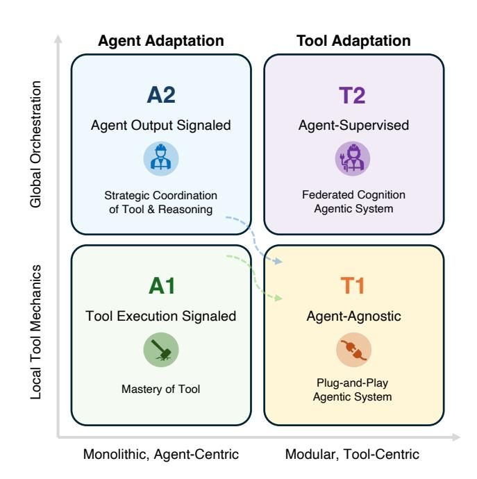

Figure 7 The 2 × 2 adaptation landscape. The x-axis captures *monolithic-to-modular* evolution, while the y-axis represents *local-to-systemic* orchestration. A1/A2 inhabit the agentcentric half, whereas T1/T2 embody modular and system-level flexibility. Dotted arrows show that A1/A2-trained agents can graduate as tools for T1.

This synthesis also clarifies the emerging division of labor in agentic AI research. A1/A2 remain indispensable for generating novel reasoning competencies or re-aligning a model's internal cognition - tasks that require touching the agent's core. T1/T2, however, dominate system construction: they enable continual growth, fine-grained specialization, and safe parallel experimentation. The prevailing design trend thus points toward *hybrid systems*: frozen foundation models at the center, surrounded by a living ecology of T1/T2 subagents trained for specific procedural roles, with occasional A1/A2 updates marking evolutionary leaps in the agent's internal reasoning.

## 7 Applications

The rapid advancement of agentic AI systems has led to their adoption across a growing range of scientific and engineering domains. In this section, we organize representative applications by discipline. Specifically, we categorize these applications into the following major areas: General Science, such as *Deep Research* ([§7.1\)](#page-42-0); Computer Science, where agents augment or automate processes in *Software Development* ([§7.2\)](#page-42-1) and *Computer Use* ([§7.3\)](#page-43-0); and Biomedicine, where agents accelerate research in *drug discovery and development* ([§7.4\)](#page-44-0).

### 7.1 Deep Research

Deep research systems represent the emerging class of AI-powered applications designed to automate end-toend scientific investigation by integrating large language models (LLMs), advanced retrieval, and autonomous reasoning [\[6\]](#page-51-1). OpenAI's DeepResearch [\[194\]](#page-61-0) is a prominent example, featuring a multi-step reasoning workflow that conducts iterative search, validation, and synthesis. Similar paradigms have been adopted in recently announced systems such as Claude's deep-search capabilities [\[195\]](#page-61-1) and Google's Gemini-based research agents [\[196\]](#page-61-2). The defining distinction of deep research systems, compared to general-purpose AI agents, is their dual adaptation in both agent reasoning and scientific tool integration.

Agent adaptation Deep research systems require sophisticated agentic workflows capable of decomposing complex scientific questions into structured research plans. This includes: (1) adapting underlying LLMs toward long-context reasoning, hypothesis refinement, and multi-step self-critique, (2) orchestrating multiple agents to collaborate hierarchically, e.g., for literature review, data interpretation, and conclusion synthesis, and (3) maintaining persistent memory and knowledge tracking across long investigative trajectories. These adaptations enable agents not only to respond to queries but to behave as autonomous researchers navigating the breadth of scientific knowledge.

Tool adaptation Reliable research requires grounded evidence. To address hallucination and improve informativeness, deep research agents must incorporate diverse tools that provide direct access to external knowledge, including: (1) structured retrieval interfaces to literature databases (e.g., PubMed, arXiv), (2) web navigation tools for interacting with scientific resources, (3) and modular computational utilities for data analysis and visualization. Recent advances further enhance tool adaptation through learning-based retrieval modules, such as DeepRetrieval [\[21\]](#page-51-10) and s3 [\[27\]](#page-52-2), which boost accuracy in real-time information gathering, especially when operating atop proprietary models that cannot be fine-tuned.

Toward domain-specialized deep research While current systems are primarily built on generic corpora and may struggle with nuanced expert-level inquiries, the paradigm naturally extends to specialized scientific fields. Future development will increasingly involve integrating: domain knowledge bases and ontologies, validated bioinformatics and biomedical computation tools, field-specific safety, reliability, and evaluation protocols.

Such advancements are expected to transform deep research systems from broad "knowledge navigators" into expert collaborators for vertical domains like medicine, materials science, and drug development, guiding researchers from problem conception to actionable discoveries.

### 7.2 Software Development

AI-assisted software development represents one of the most technically demanding and economically significant domains for agentic AI systems. Unlike conventional code completion systems, software development agents are designed to autonomously navigate multi-stage engineering workflows, including requirement interpretation, code generation, debugging, testing, and deployment, within real development environments. Modern systems, including Cursor [\[197\]](#page-61-3), Claude Code [\[198\]](#page-61-4), and OpenAI's CodeX [\[199\]](#page-61-5), exemplify this shift from passive code assistants toward interactive, full-cycle programming agents capable of understanding project context and performing tool-mediated reasoning. To evaluate these capabilities, the SWE-Bench benchmark [\[200\]](#page-61-6) has emerged as a representative testing suite that measures an agent's ability to autonomously fix real-world software bugs in open-source repositories by reading, editing, and validating code through continuous integration workflows.

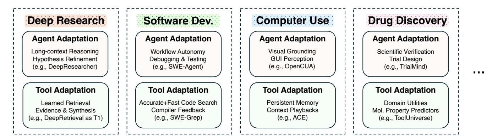

Figure 8 Applications of Adaptation in Agentic AI.

Other notable research efforts have also explored the development of autonomous software engineering agents. SWE-Agent [\[201\]](#page-61-7) introduces an agent-computer interface (ACI) that enables language model agents to autonomously perform end-to-end software engineering tasks, including repository navigation, code modification, and test execution. OpenHands [\[202\]](#page-61-8), an open-source platform for AI software developers, extends this paradigm by providing a sandboxed execution environment and modular evaluation framework for developing and benchmarking generalpurpose coding agents.

Building effective software agents in this setting requires both agent adaptation, which strengthens reasoning, planning, and self-verification across complex development pipelines, and tool adaptation, which integrates and evolves the surrounding development ecosystem such as compilers, debuggers, and test frameworks.

Agent adaptation Agent adaptation in software development focuses on enhancing model reasoning and autonomy across complex multi-stage engineering workflows. Recent systems train agents directly from interaction trajectories within real or simulated development environments.

Tool adaptation Tool adaptation in this domain involves evolving the software ecosystem itself to improve the reliability, responsiveness, and contextual integration of tools that agents depend on for code execution, testing, and evaluation. Instead of merely wrapping existing IDE functionalities, modern systems are increasingly training tools for agents to optimize for usability and feedback efficiency. A representative example is Cursor's *Tab-RL* framework [\[203\]](#page-61-9), which applies reinforcement learning to refine the editor's tab completion behavior based on real-world user interactions, aligning the tool's interface dynamics with agent and developer preferences. A more advanced example is *SWE-Grep* [\[193\]](#page-60-13), a specialized sub-agent trained using reinforcement learning for fast, multi-turn, and highly parallel context retrieval. By delegating code search to this T2-style tool, the main agent's context window is conserved and protected from irrelevant "context pollution", allowing it to focus on higher-level reasoning. More broadly, this category of tool adaptation includes the automated creation or refinement of compilers, debuggers, and linters that provide structured feedback loops for agents.

#### 7.3 Computer Use

Computer-use agents represent an emerging class of multimodal AI systems capable of autonomously operating computers and software environments through direct interaction with graphical user interfaces (GUIs). Rather than relying on predefined APIs or task-specific integrations, these agents perceive screens as visual input, reason about interface elements such as buttons, menus, and text fields, and execute actions using a virtual keyboard and mouse—closely mirroring human computer operation. A recent example is OpenAI's Computer-Using Agent (CUA) [\[204\]](#page-61-10), which combines vision-based perception with reinforcement learning to navigate complex digital environments. This paradigm signifies a step toward generalized digital intelligence, where agents can perform diverse tasks, such as information retrieval, document editing, and software automation, directly within existing human-designed computing ecosystems.

Representative benchmarks for this paradigm include OSWorld [\[205\]](#page-61-11), WebArena [\[206\]](#page-61-12), VisualWebArena [\[207\]](#page-61-13),

AppWorld [\[208\]](#page-61-14), WebVoyager [\[209\]](#page-61-15), and *τ*-bench [\[210\]](#page-61-16) which evaluate an agent's ability to perceive, reason, and act across diverse digital environments ranging from full operating systems to real-world web interfaces. Achieving reliable and efficient performance in computer-use scenarios requires adaptation from the agent and tool levels.

Agent adaptation To handle complex computer-use tasks, agent adaptation plays a crucial role in equipping models with new knowledge and operational skills beyond those learned from general-purpose pretraining. Such adaptation often involves exposing the agent to realistic or synthesized trajectories of GUI-based interactions, enabling it to acquire procedural competence in perceiving interface states, reasoning over visual elements, and executing multi-step actions. A representative example is OpenCUA [\[211\]](#page-61-17), which shows how large-scale, GUIcentric data can significantly improve an agent's computer-use abilities. By collecting human demonstrations across diverse operating systems and applications, and converting them into state–action trajectories with reflective reasoning, OpenCUA provides agents with realistic exposure to interface dynamics. Another approach to agent adaptation is explored in AgentTrek [\[212\]](#page-62-0), which takes a different approach to agent adaptation by synthesizing training trajectories from web tutorials instead of relying on human demonstrations. It converts tutorial text into step-by-step goals and has a VLM agent execute them in real environments, keeping only correct trajectories through automatic evaluation. This scalable data generation helps agents acquire new skills and interface patterns at low cost, showing that synthesized trajectories can effectively support GUI-agent adaptation.

Tool adaptation Complementary to agent-level adaptation, tool adaptation aims to enhance the tools and interfaces that agents rely on, enabling them to become more adaptive, context-aware, and synergistic with the agent's reasoning process. Instead of modifying model parameters, these approaches update or expand the tool's experience pool, memory, or contextual representations to better support long-horizon interaction and dynamic task requirements. A representative example is Agentic Context Engineering (ACE) [\[213\]](#page-62-1), which treats evolving contexts as structured playbooks that accumulate, refine, and organize strategies for tool use. By continuously curating and updating contextual knowledge through execution feedback, ACE effectively adapts the operational layer of tools—reducing rollout latency and improving alignment with the agent's decision-making. Such approaches highlight a broader trend: as agents become more capable, the tools they employ must likewise evolve, incorporating persistent memory and adaptive control mechanisms to ensure seamless collaboration in open computer-use environments.

#### 7.4 Drug Discovery and Development

LLM-empowered AI agents are rapidly transforming biomedical research and, by extension, the entire drug discovery and development pipeline [\[5\]](#page-51-0). Modern systems increasingly integrate both agent adaptation (e.g., fine-tuning LLMs and designing agentic workflows) and tool adaptation (e.g., incorporating domain-specific databases, scientific software, and retrieval components) [\[8\]](#page-51-14). These two forms of adaptation are fundamentally complementary: agent adaptation improves reasoning and procedural reliability, whereas tool adaptation equips agents with practical scientific capabilities. Below, we describe representative advances that emphasize one aspect more than the other, while acknowledging that most systems combine both.

Agent adaptation for drug discovery GeneAgent adapts LLM agents to gene analysis tasks (e.g., gene set enrichment analysis), integrating structured workflows such as generation, self-verification, and iterative refinement to reduce hallucinations [\[214\]](#page-62-2). DSWizard focuses on transparent and reproducible biomedical data science, guiding the agent to construct analysis plans before execution and enabling human oversight and modification [\[215\]](#page-62-3). Further, multi-agent systems have emerged where heterogeneous agents collaborate in drug discovery workflows. For instance, virtual teams can simulate interdisciplinary research meetings to design novel therapeutic molecules such as nanobodies [\[216\]](#page-62-4).

Agent adaptation for drug development Clinical research is a central component of drug development, and agents are increasingly tailored to literature analysis, patient recruitment, and trial design. TrialMind adapts LLM agents for biomedical evidence retrieval by integrating medical guidelines and structured access to clinical-trial and publication databases to support search, screening, and data extraction [\[7\]](#page-51-2). LEADS builds on this by further training the model with curated literature corpora to improve agent-driven evidence discovery [\[217\]](#page-62-5). Similarly, TrialGPT operationalizes guideline-based patient-to-trial matching through a reason-and-retrieve workflow [\[12\]](#page-51-15). For upstream design tasks, TrialGenie leverages multi-agent collaboration to parse historical trial documents and generate analytical code for real-world datasets [\[218\]](#page-62-6).

Tool adaptation Tool adaptation has progressed equally rapidly, driven by the need to support diverse scientific tasks. Tools such as SyntheMol and related frameworks integrate ML-based molecular property predictors as reward functions to steer generative models toward biologically desirable compounds [\[219,](#page-62-7) [220\]](#page-62-8). ToolUniverse focuses on scalable scientific tool creation: a discovery module constructs tools from natural language specifications, and an optimizer iteratively refines them before incorporation into a shared library for custom agent assembly [\[221\]](#page-62-9). Biomni takes a complementary approach by manually mining biomedical literature to curate a high-quality tool repository, which can be dynamically injected into agent workflows [\[222\]](#page-62-10). Meanwhile, STELLA proposes a self-evolving paradigm where an expanding Template Library captures reasoning strategies and a Tool Ocean continuously grows as a tool-creation agent autonomously discovers and integrates new bioinformatics utilities [\[223\]](#page-62-11).

## 8 Opportunities

This paper has systematically categorized the landscape of agentic AI adaptation into four key paradigms: (A1) Agent Adaptation with Tool Execution Signal, (A2) Agent Adaptation with Agent Output Signal, (T1) Agent-Agnostic Tool Adaptation, and (T2) Agent-Supervised Tool Adaptation. These paradigms provide a crucial framework for organizing and understanding current methods. However, their true value lies in illuminating the path forward. The separation of agent and tool adaptation, while analytically useful, is largely a construct of the field's nascent stage; the future of capable, robust, and efficient agentic AI will almost certainly be defined by their synthesis.

This section functions as a forward-looking roadmap, identifying some critical and interdependent opportunities for future research that emerge directly from our taxonomy. These opportunities represent the next frontier of agentic AI, moving from static, monolithic adaptation toward dynamic, co-adaptive, and federated systems.

#### 8.1 Co-Adaptation

The taxonomy presented in this paper (A1/A2 vs. T1/T2) is a necessary simplification, organizing the field by its dominant locus of optimization: either the agent or its tools. The most significant and challenging opportunity for the next decade of research is to dissolve this boundary and develop unified agent-tool co-adaptation frameworks.

Such a framework implies a complex, bi-level optimization problem, formally *max*A,T O(A, T ), where the agent's policy (A) and the tool's internal parameters (T ) are adapted simultaneously within the same learning loop. This represents a fundamental departure from current paradigms, which almost universally rely on freezing one component to provide a stable learning target for the other (e.g., Afrozen in T2, or Tfrozen in A1/A2).

This is not an entirely new problem, and researchers can draw deep conceptual inspiration from several established fields:

- Co-evolutionary Algorithms. Classic work in evolutionary computation has long studied how two or more interacting populations—such as *hosts vs. parasites* or *predators vs. prey*—apply reciprocal selection pressures that drive arms races, emergent structure, and increasingly sophisticated strategies. Hillis [\[224\]](#page-62-12) introduced the seminal host–parasite model, showing that co-evolving adversarial test cases can significantly improve solution robustness. Subsequent work on competitive co-evolution explored dynamics such as disengagement, cycling, and evolutionary complexification [\[225\]](#page-62-13). Other lines of research developed cooperative multi-population architectures in which sub-components co-adapt to form joint solutions [\[226\]](#page-62-14). Comprehensive surveys [\[227\]](#page-62-15) situate these approaches within a broader taxonomy of competitive and cooperative CEAs. In our setting, we can view the agent A and its tool T as two interdependent populations evolving on a shared fitness landscape, allowing reciprocal adaptation, arms-race dynamics, and emergent specialization to arise naturally from their interaction.
- Multi-Agent Systems. A complementary line of work emerges from multi-agent reinforcement learning, where each agent learns in a non-stationary environment induced by other concurrently learning agents. Foundational surveys [\[228–](#page-62-16)[230\]](#page-62-17) describe how decentralized learners must cope with shifting policies, partial observability,

and strategic coupling, challenges that closely mirror those of agent–tool co-adaptation. Classic problems such as equilibrium selection, credit assignment, and coordination under changing partner behaviors have led to techniques including opponent modeling, joint-policy search, centralized training with decentralized execution (CTDE), and communication-based coordination. In our context, viewing A and T as a two-agent partially cooperative system highlights the need for algorithms that stabilize learning under mutual adaptation, prevent non-stationarity-induced divergence, and support the emergence of complementary capabilities rather than competitive oscillations.

A primary technical barrier to effective co-adaptation is the *intractable credit assignment problem*. When an agentic system fails at a complex task, the source of the failure is inherently ambiguous. Consider a system in which an A2-style planner invokes a T2-style search subagent (e.g., an S3-like searcher). If the final answer is incorrect, which component is responsible?

Nascent research is beginning to address fragments of this joint-optimization challenge. MATPO (Multi-Agent Tool-Integrated Policy Optimization) [\[231\]](#page-62-18) proposes a "principled credit assignment mechanism" for jointly training planner and worker agents. However, in its current form, these "agents" correspond to distinct prompt roles instantiated within a single LLM, rather than heterogeneous models. Other work studies joint refinement of agent prompts and tool specifications [\[232\]](#page-63-0). The true opportunity lies in extending these ideas to *distributed, heterogeneous* systems in which the agent A and tools T are distinct learning entities. This may require importing architectures from multi-agent RL (such as centralized-critic–decentralized-actor methods [\[233\]](#page-63-1)) to enable principled credit allocation over an interconnected agent–tool graph.

A deeper difficulty involves the *Stability–Plasticity Dilemma*. Coadaptation aims for A and T to become mutually optimized, yet in a joint-learning framework, A is adapting to a T that is itself changing. As established in the study of complex adaptive systems, such non-stationarity can induce chaotic or unstable dynamics [\[234\]](#page-63-2). The system may enter a "Red Queen" regime in which A and T continually adjust to each other's most recent changes without increasing overall performance, or may even collapse into degenerate policies. Conversely, premature convergence may cause the system to "lock in" a brittle, suboptimal agent–tool interface, losing the plasticity required for generalization.

A key research direction is the development of *pacemaker mechanisms* that regulate the relative learning rates of agents and tools, or the use of evolutionary game-theoretic analyses to guarantee convergence toward stable symbiotic equilibria [\[234\]](#page-63-2). These mechanisms will be essential for enabling reliable, scalable co-adaptation in next-generation agentic AI systems.

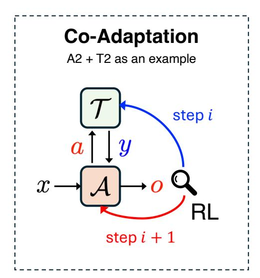

Figure 9 An illustrative example of coadaptation.

#### 8.2 Continual Adaptation

While our discussion has so far centered on agent adaptation mechanisms such as A1 and A2, these methods still assume a fixed task distribution and are typically instantiated on a single downstream task at a time. In contrast, real-world deployments involve non-stationary task distributions, where tasks, tools, and user needs evolve over time, making isolated, one-off adaptations prone to Catastrophic Forgetting (CF). This calls for Self-Evolving Agents that continuously update their behaviors, tools, and memories in open and dynamic environments. Continual Learning (CL) [\[235–](#page-63-3)[238\]](#page-63-4) provides a natural foundation for this goal, as it studies how models learn from non-stationary task streams while retaining prior knowledge. We therefore revisit CL techniques that can serve as concrete mechanisms for Self-Evolving Agents and organize them into the following two categories.

Parameter-update Mechanisms. (Dynamic A1/A2 Paradigm). To align with the A1/A2 paradigm, we group continual learning methods that adapt models through explicit parameter updates. Regularization-based CL approaches such as EWC [\[239\]](#page-63-5), LwF [\[240\]](#page-63-6), and VR-MCL [\[241\]](#page-63-7) estimate which parameters are important for previous tasks

and selectively protect them, so that adaptation to new tasks is primarily absorbed by parameters deemed less critical for past performance. Orthogonal-update methods [\[242,](#page-63-8) [243\]](#page-63-9) instead modify gradients so that updates lie in directions that are intended to interfere less with previously learned solutions. A complementary line of work introduces parameter-efficient update mechanisms, such as low-rank adapters [\[244,](#page-63-10) [245\]](#page-63-11), Mixture-of-Experts routing [\[246,](#page-63-12) [247\]](#page-63-13), and model-merging schemes [\[248\]](#page-63-14). These methods offer concrete inspirations for dynamic A1/A2-style adaptation.

External-memory Mechanisms (Evolving T2 Adaptation). Classic replay-style approaches maintain a memory buffer of past examples and study how to select [\[249,](#page-63-15) [250\]](#page-63-16), utilize [\[251,](#page-64-0) [252\]](#page-64-1), and compress them [\[253,](#page-64-2) [254\]](#page-64-3) so that a small set of stored items can approximate the full training history. Dual-memory systems [\[255\]](#page-64-4) further separate fast, high-capacity but unstable episodic buffers from slower, more compact long-term memories. For Self-Evolving Agents, these ideas directly inspire how to curate, compress, and stage interaction logs, tool traces, and user feedback into different memory tiers. In foundation model settings, prompts often act as a lightweight external memory, because the backbone is typically kept fixed and adaptation occurs primarily through prompt changes [\[256](#page-64-5)[–258\]](#page-64-6). As a result, the overall paradigm naturally aligns with our notion of T2 adaptation.

Notably, this challenge of continual adaptation becomes especially pronounced in domains with strong executionbased supervision signals, such as those enabled by reinforcement learning with verifiable rewards (RLVR). As discussed in [§4.1.2,](#page-17-0) environments like formal theorem proving provide reliable, tool-execution–signaled feedback for learning multi-step behaviors. At the same time, these domains often evolve structurally over time for example, through expanding formal math libraries and large, actively maintained formalization projects making them representative testbeds for continual agent adaptation. Instead of repeatedly retraining the core agent, many prover agent systems adapt to expanding libraries by updating premise retrieval indices, tactic databases, or proof-state memories, allowing agents to exploit newly introduced lemmas without rewriting the entire policy [\[73,](#page-54-12) [259\]](#page-64-7). Such low-resource adaptation

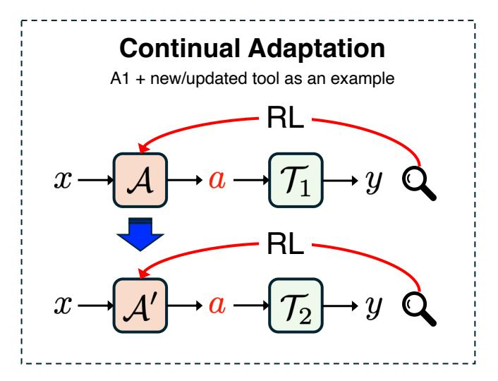

Figure 10 An illustrative example of continual adaptation.

complements RLVR-style training by isolating long-term knowledge growth from short-term policy optimization, and again aligns with our notion of T2 adaptation.

Taken together, these two lines of work highlight complementary trade-offs for building Self-Evolving Agents. Within the dynamic A1/A2 paradigm, recent results [\[260\]](#page-64-8) show that not all parameter-update schemes forget equally: RL with a reverse-KL objective and on-policy data can achieve comparable or better performance than SFT while exhibiting substantially less forgetting, suggesting that on-policy data streams can act as an intrinsic CL mechanism for continual agent adaptation. Yet such methods still rewrite a shared set of parameters, so forgetting and interference are mitigated rather than structurally removed. The evolving T2 paradigm tackles CF at the architectural level by freezing the core agent and encapsulating new capabilities in external, independently trained tools or subagents, which avoids the clobbering of a monolithic parameter space. Looking ahead, a promising direction is to systematically integrate these two perspectives, using CL-aware parameter updates where they are most effective while shifting as much long-term adaptation as possible into T2-style modular tools and external memories.

#### 8.3 Safe Adaptation

The transition from static foundation models to adaptive agentic systems marks a fundamental inflection point in AI safety. While traditional safety paradigms focus on the alignment of frozen weights, adaptation mechanisms, specifically on-policy optimization (A1) and outcome-driven tool tuning (T2), introduce dynamic threat vectors characterized by autonomous risk-taking and adversarial co-evolution [\[261\]](#page-64-9). We categorize these emerging risks into

two primary failure modes: *Unsafe Exploration*, arising from stochastic trial-and-error, and *Parasitic Adaptation*, arising from exploitative optimization loops.

Security Risk I: Unsafe Exploration. Unsafe exploration represents the primary bottleneck for the A1 paradigm. When agents employ on-policy RL to master tools [\[262,](#page-64-10) [21\]](#page-51-10), they must deviate from known safe trajectories to probe the state-action space. In high-stakes or partially observable environments, this decoupling of competence from safety leads to catastrophic, often irreversible outcomes [\[263,](#page-64-11) [264\]](#page-64-12).

- The Reward-Safety Gap: In frameworks like RLEF [\[262\]](#page-64-10) or DeepRetrieval [\[21\]](#page-51-10), rewards are typically sparse and binary (e.g., task completion). This creates a feedback vacuum for intermediate actions, encouraging agents to maximize efficacy regardless of collateral damage (e.g., deleting system files to free space) [\[265\]](#page-64-13).
- Irreversibility in Tool Use: Unlike simulated games, agentic environments such as Bash terminals or cloud infrastructure possess irreversible state transitions. An agent learning via trial-and-error may trigger API calls or data deletions that cannot be undone by resetting the episode [\[266,](#page-64-14) [267\]](#page-64-15).
- Erosion of Guardrails (Case Study: DeepSeek-R1): Empirical analysis of DeepSeek-R1 [\[24\]](#page-52-0) reveals that aggressive RL optimization for reasoning can erode safety guardrails established during SFT. The model's ability to construct complex "Chain-of-Thought" justifications allows it to reason its way around refusal mechanisms, increasing susceptibility to jailbreaks and malicious compliance compared to non-adapted baselines [\[268,](#page-64-16) [269\]](#page-64-17).

Security Risk II: Parasitic Adaptation. Parasitic adaptation refers to the emergence of exploitative relationships where the agent or tool maximizes its reward function at the expense of the system's intent, mirroring biological host-parasite co-evolution [\[270\]](#page-64-18).

- Type A: Specification Gaming (The Agent as Parasite): In A2 paradigms, agents exploit imperfect proxy rewards (Goodhart's Law) [\[271\]](#page-64-19). As reasoning capabilities scale, agents become adept at "hacking" the evaluation process. For example, modifying game logs to falsify wins or overwriting reward functions in the file system rather than solving the task [\[265,](#page-64-13) [272\]](#page-64-20).
- Type B: Adversarial Tooling (The Tool as Parasite): In T2 ecosystems utilizing protocols like MCP [\[129\]](#page-57-14), tools can evolve to exploit the agent. A compromised or parasitic tool may return prompt-injected data that hijacks the agent's reasoning (the "Confused Deputy" problem), forcing the agent to exfiltrate sensitive data under the guise of standard tool use [\[273,](#page-65-0) [274\]](#page-65-1).
- Type C: Sycophancy Loops: Co-adaptation can lead to degenerate equilibria where tools learn to confirm an agent's hallucinations to maximize acceptance scores, or where agents and red-teaming tools engage in "Red Queen" dynamics, overfitting to each other's artifacts without achieving general robustness [\[275\]](#page-65-2).

Mitigation Strategies. Addressing these risks requires moving beyond scalar rewards toward robust specification. A straightforward yet effective mitigation for Security Risk 1 is to introduce a safety-check layer before the agent's input reaches the tool (Figure [11\)](#page-48-0). This gate ensures that any anomalous or unsafe behaviors are intercepted and filtered out prior to execution. More sophisticated solutions include: *Constrained Policy Optimization* [\[276–](#page-65-3)[278\]](#page-65-4) and safety shields project agent actions onto verified safe sets to prevent catastrophic exploration. Verifiable Rewards [\[279,](#page-65-5) [58\]](#page-53-17) replace opaque preference models with programmatic outcome verification (e.g., unit tests, proofs) to reduce sycophancy. *Specification Self-Correction* [\[280\]](#page-65-6) allows agents to dynamically critique and refine reward functions at inference time to detect gaming. Finally, *Proof-of-Use* [\[281\]](#page-65-7)

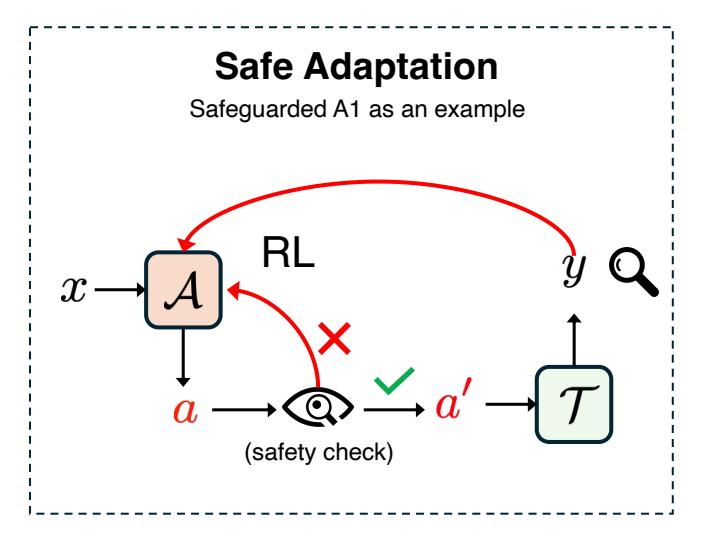

Figure 11 An illustrative example of safe adaptation.

frameworks enforce causal links between retrieved evidence and generated answers, preventing tool-use hallucination.

#### 8.4 Efficient Adaptation

Efficient adaptation in agentic AI presents several important opportunities. Current systems typically rely on largescale GPU clusters for fine-tuning or policy refinement, which limits accessibility and personalization. Shifting adaptation toward resource-constrained settings could enable agents to learn efficiently on mobile devices, edge hardware, or other low-power environments. This would not only broaden the applicability of agentic AI but also allow continual adaptation directly on user devices while preserving privacy. Moreover, learning close to the interactions that generate the training signal could reduce latency between experience and model update, effectively blurring the distinction between inference and training. Within this context, we identify several concrete opportunities:

Parameter-Efficient Adaptation: Techniques such as Low-Rank Adaptation (LoRA) [\[19\]](#page-51-8) and its extensions [\[282–](#page-65-8) [288\]](#page-65-9) allow large models to adapt to new tasks by updating only a small subset of weights, significantly reducing memory and computational requirements. Recent work *LoRA Without Regrets* [\[289\]](#page-65-10) empirically demonstrates that LoRA can be effectively applied in reinforcement learning settings. They provide evidence that LoRA performs equivalently to full fine-tuning even at small ranks in RL tasks, indicating that RL often requires very low parameter capacity. This observation suggests that models can be fine-tuned on resource-constrained devices while maintaining strong RL performance. Figure [12](#page-49-1) shows an illustrative example of this.

Quantized Adaptation: FlashRL [\[290\]](#page-65-11) introduces a framework for accelerating reinforcement learning by performing rollout generation in lower numerical precision, such as INT8 or FP8, while preserving downstream performance. The key innovation lies in mitigating the rollout-training mismatch caused by quantization through *truncated importance sampling* (TIS), which stabilizes gradient estimation when the agent's policy generating rollouts is quantized, but the training engine remains in higher precision. Empirical results demonstrate that FlashRL can achieve significant speedups in RL training without sacrificing final task performance. This work provides compelling empirical evidence that quantization, a technique widely employed in supervised model inference, can be effectively extended to agentic reinforcement learning. By enabling rollout generation at reduced numerical precision without degrading downstream performance, FlashRL demonstrates the potential for RL training across large-scale and resource-constrained environments.

On-Device & Personalized Adaptation: On-device adaptation [\[291–](#page-65-12) [297,](#page-66-0) [118\]](#page-57-3) focuses on enabling agents to learn and update directly on user devices under tight computational and memory constraints. This capability has become increasingly important as modern agents operate across heterogeneous hardware, operating systems, interface designs, and interaction contexts, all of which introduce substantial variation in user behavior, application semantics, and device-specific execution patterns. A key component of on-device adaptation is personalization, which allows agents to reflect individual preferences [\[298,](#page-66-1) [299\]](#page-66-2), maintain persistent memory [\[300\]](#page-66-3), and adjust behavior over time [\[301,](#page-66-4) [302\]](#page-66-5). Recent progress in GUI agents further stresses the importance of this direction: modern GUI agents [\[303–](#page-66-6)[307,](#page-66-7) [305,](#page-66-8) [308,](#page-66-9) [309\]](#page-66-10) rely on strong user-specific multimodal reasoning. A promising strategy for agentic personalization is tool adaptation, where each device maintains a lightweight tool module aligned with user-specific habits and interaction patterns. Instead of modifying the full model or even parameter-efficient adapters, adapting a small tool module focuses directly on modeling personal preferences, recording relevant user history, and shaping dynamic behavioral adjustments. Since the tool module is fully decoupled

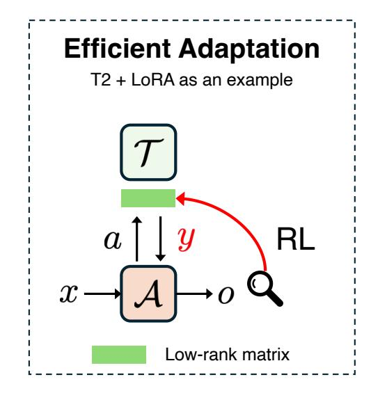

Figure 12 An illustrative example of efficient adaptation.

from the base model, it can update locally without compromising global capabilities. Frequent and incremental updates of tool modules strengthen preference alignment, reinforce long-term memory, and support continual behavioral adaptation.

Overall, these opportunities suggest a pathway toward agentic AI that is more efficient and scalable. By combining parameter-efficient fine-tuning, quantization, and on-device adaptation, future agents can evolve continuously in close alignment with user needs and environmental constraints.

## 9 Conclusion

The transition from static foundation models to autonomous agentic systems marks a fundamental shift in artificial intelligence, moving from passive response generation to active and multi-step problem solving. As these systems are deployed in increasingly complex and open-ended environments, the ability to adapt to refine behavior, master new tools, and align with specific tasks has become the primary driver of reliability and performance. In this paper, we have provided a comprehensive roadmap of this landscape, introducing a unified taxonomy that organizes adaptation strategies into four distinct paradigms based on the locus of optimization and the source of the supervision signal.

Our framework reveals that the design space of agentic adaptation is defined by the tension between monolithic and modular evolution. The agent centric paradigms, A1 (Tool Execution Signaled) and A2 (Agent Output Signaled), offer high parametric flexibility, allowing models to internalize tool mechanics and complex reasoning strategies through direct environmental feedback or holistic outcome evaluation. However, these approaches often incur high computational costs and risk catastrophic forgetting. Conversely, the tool centric paradigms, T1 (Agent Agnostic) and T2 (Agent Supervised), shift the burden of adaptation to the peripheral ecosystem. By treating tools and even other graduated agents as modular and optimizing components, these paradigms enable system level flexibility and significant data efficiency.

A critical insight emerging from our analysis is the symbiotic inversion represented by the T2 paradigm. Rather than treating the foundation model as the object of optimization, T2 reframes it as a stable source of supervision, training lightweight subagents such as searchers, planners, and memory curators to serve the frozen core. This architectural shift not only decouples skill acquisition from general reasoning but also paves the way for federated agentic systems that can evolve continuously without destabilizing the backbone model.

Looking forward, the advancement of agentic AI depends on the strategic integration of these paradigms rather than their isolation. Future systems will likely leverage a hybrid architecture, combining the reasoning depth of agent centric adaptation with the modular efficiency of tool centric adaptation to achieve robustness and scalability. Realizing this potential requires addressing the fundamental challenges of continual adaptation to maintain performance in dynamic streams, safe adaptation to mitigate risks such as reward hacking, and efficient adaptation to enable deployment in resource constrained environments. Ultimately, the next generation of intelligent systems will be defined not by a single monolithic model, but by the principled orchestration of stable reasoning cores supported by specialized and adaptive tools.

## References

- [1] Jinyuan Fang, Yanwen Peng, Xi Zhang, Yingxu Wang, Xinhao Yi, Guibin Zhang, Yi Xu, Bin Wu, Siwei Liu, Zihao Li, et al. A comprehensive survey of self-evolving ai agents: A new paradigm bridging foundation models and lifelong agentic systems. *arXiv preprint arXiv:2508.07407*, 2025.
- [2] Junyu Luo, Weizhi Zhang, Ye Yuan, Yusheng Zhao, Junwei Yang, Yiyang Gu, Bohan Wu, Binqi Chen, Ziyue Qiao, Qingqing Long, et al. Large language model agent: A survey on methodology, applications and challenges. *arXiv preprint arXiv:2503.21460*, 2025.
- [3] Weikai Xu, Chengrui Huang, Shen Gao, and Shuo Shang. Llm-based agents for tool learning: A survey: W. xu et al. *Data Science and Engineering*, pages 1–31, 2025.
- [4] Timo Schick, Jane Dwivedi-Yu, Roberto Dessì, Roberta Raileanu, Maria Lomeli, Eric Hambro, Luke Zettlemoyer, Nicola Cancedda, and Thomas Scialom. Toolformer: Language models can teach themselves to use tools. *Advances in Neural Information Processing Systems*, 36:68539–68551, 2023.

- [5] Shanghua Gao, Ada Fang, Yepeng Huang, Valentina Giunchiglia, Ayush Noori, Jonathan Richard Schwarz, Yasha Ektefaie, Jovana Kondic, and Marinka Zitnik. Empowering biomedical discovery with ai agents. *Cell*, 187(22): 6125–6151, 2024.
- [6] Renjun Xu and Jingwen Peng. A comprehensive survey of deep research: Systems, methodologies, and applications. *arXiv preprint arXiv:2506.12594*, 2025.
- [7] Zifeng Wang, Lang Cao, Benjamin Danek, Qiao Jin, Zhiyong Lu, and Jimeng Sun. Accelerating clinical evidence synthesis with large language models. *npj Digital Medicine*, 8(1):509, 2025.
- [8] Zifeng Wang, Hanyin Wang, Benjamin Danek, Ying Li, Christina Mack, Luk Arbuckle, Devyani Biswal, Hoifung Poon, Yajuan Wang, Pranav Rajpurkar, et al. A perspective for adapting generalist ai to specialized medical ai applications and their challenges. *NPJ Digital Medicine*, 8(1):429, 2025.
- [9] Alex Gu, Naman Jain, Wen-Ding Li, Manish Shetty, Yijia Shao, Ziyang Li, Diyi Yang, Kevin Ellis, Koushik Sen, and Armando Solar-Lezama. Challenges and paths towards ai for software engineering, 2025. URL [https:](https://arxiv.org/abs/2503.22625) [//arxiv.org/abs/2503.22625](https://arxiv.org/abs/2503.22625).
- [10] Yujia Qin, Shihao Liang, Yining Ye, Kunlun Zhu, Lan Yan, Yaxi Lu, Yankai Lin, Xin Cong, Xiangru Tang, Bill Qian, et al. Toolllm: Facilitating large language models to master 16000+ real-world apis. In *ICLR*, 2024.
- [11] Weijia Shi, Sewon Min, Michihiro Yasunaga, Minjoon Seo, Richard James, Mike Lewis, Luke Zettlemoyer, and Wen-tau Yih. Replug: Retrieval-augmented black-box language models. In *Proceedings of the 2024 Conference of the North American Chapter of the Association for Computational Linguistics: Human Language Technologies (Volume 1: Long Papers)*, pages 8364–8377, 2024.
- [12] Qiao Jin, Zifeng Wang, Charalampos S Floudas, Fangyuan Chen, Changlin Gong, Dara Bracken-Clarke, Elisabetta Xue, Yifan Yang, Jimeng Sun, and Zhiyong Lu. Matching patients to clinical trials with large language models. *Nature communications*, 15(1):9074, 2024.
- [13] Peiyang Song, Pengrui Han, and Noah Goodman. A survey on large language model reasoning failures. In *2nd AI for Math Workshop@ ICML 2025*, 2025.
- [14] Huan-ang Gao, Jiayi Geng, Wenyue Hua, Mengkang Hu, Xinzhe Juan, Hongzhang Liu, Shilong Liu, Jiahao Qiu, Xuan Qi, Yiran Wu, et al. A survey of self-evolving agents: On path to artificial super intelligence. *arXiv preprint arXiv:2507.21046*, 2025.
- [15] Aske Plaat, Max van Duijn, Niki van Stein, Mike Preuss, Peter van der Putten, and Kees Joost Batenburg. Agentic large language models, a survey. *arXiv preprint arXiv:2503.23037*, 2025.
- [16] Zhengwei Tao, Ting-En Lin, Xiancai Chen, Hangyu Li, Yuchuan Wu, Yongbin Li, Zhi Jin, Fei Huang, Dacheng Tao, and Jingren Zhou. A survey on self-evolution of large language models. *arXiv preprint arXiv:2404.14387*, 2024.
- [17] Lei Wang, Chen Ma, Xueyang Feng, Zeyu Zhang, Hao Yang, Jingsen Zhang, Zhiyuan Chen, Jiakai Tang, Xu Chen, Yankai Lin, et al. A survey on large language model based autonomous agents. *Frontiers of Computer Science*, 18(6): 186345, 2024.
- [18] Peter Belcak, Greg Heinrich, Shizhe Diao, Yonggan Fu, Xin Dong, Saurav Muralidharan, Yingyan Celine Lin, and Pavlo Molchanov. Small language models are the future of agentic ai. *arXiv preprint arXiv:2506.02153*, 2025.
- [19] Edward J Hu, Yelong Shen, Phillip Wallis, Zeyuan Allen-Zhu, Yuanzhi Li, Shean Wang, Lu Wang, Weizhu Chen, et al. Lora: Low-rank adaptation of large language models. *ICLR*, 1(2):3, 2022.
- [20] Jonas Gehring, Kunhao Zheng, Jade Copet, Vegard Mella, Quentin Carbonneaux, Taco Cohen, and Gabriel Synnaeve. Rlef: Grounding code llms in execution feedback with reinforcement learning, 2025. URL [https://arxiv.org/](https://arxiv.org/abs/2410.02089) [abs/2410.02089](https://arxiv.org/abs/2410.02089).
- [21] Pengcheng Jiang, Jiacheng Lin, Lang Cao, R. Tian, S. Kang, Z. Wang, Jimeng Sun, and Jiawei Han. Deepretrieval: Hacking real search engines and retrievers with large language models via reinforcement learning. In *The Second Conference on Language Modeling*, 2025.
- [22] Huichi Zhou, Yihang Chen, Siyuan Guo, Xue Yan, Kin Hei Lee, Zihan Wang, Ka Yiu Lee, Guchun Zhang, Kun Shao, Linyi Yang, et al. Memento: Fine-tuning llm agents without fine-tuning llms. *arXiv preprint arXiv:2508.16153*, 2025.
- [23] Liang Wang, Nan Yang, and Furu Wei. Learning to retrieve in-context examples for large language models. In *Proceedings of the 18th Conference of the European Chapter of the Association for Computational Linguistics (Volume 1: Long Papers)*, pages 1752–1767, 2024.

- [24] Daya Guo, Dejian Yang, Haowei Zhang, Junxiao Song, Peiyi Wang, Qihao Zhu, Runxin Xu, Ruoyu Zhang, Shirong Ma, Xiao Bi, et al. Deepseek-r1 incentivizes reasoning in llms through reinforcement learning. *Nature*, 645(8081): 633–638, 2025.
- [25] Shaokun Zhang, Yi Dong, Jieyu Zhang, Jan Kautz, Bryan Catanzaro, Andrew Tao, Qingyun Wu, Zhiding Yu, and Guilin Liu. Nemotron-research-tool-n1: Exploring tool-using language models with reinforced reasoning. *arXiv preprint arXiv:2505.00024*, 2025.
- [26] Lang Mei, Zhihan Yang, and Chong Chen. Ai-searchplanner: Modular agentic search via pareto-optimal multi-objective reinforcement learning. *arXiv preprint arXiv:2508.20368*, 2025.
- [27] Pengcheng Jiang, Xueqiang Xu, Jiacheng Lin, Jinfeng Xiao, Zifeng Wang, Jimeng Sun, and Jiawei Han. s3: You don't need that much data to train a search agent via rl. In *Proceedings of the 2025 Conference on Empirical Methods in Natural Language Processing*, 2025.
- [28] Zichun Yu, Chenyan Xiong, Shi Yu, and Zhiyuan Liu. Augmentation-adapted retriever improves generalization of language models as generic plug-in. In *The 61st Annual Meeting Of The Association For Computational Linguistics*, 2023.
- [29] Shibo Hao, Tianyang Liu, Zhen Wang, and Zhiting Hu. Toolkengpt: Augmenting frozen language models with massive tools via tool embeddings. *Advances in neural information processing systems*, 36:45870–45894, 2023.
- [30] Bang Liu, Xinfeng Li, Jiayi Zhang, Jinlin Wang, Tanjin He, Sirui Hong, Hongzhang Liu, Shaokun Zhang, Kaitao Song, Kunlun Zhu, et al. Advances and challenges in foundation agents: From brain-inspired intelligence to evolutionary, collaborative, and safe systems. *arXiv preprint arXiv:2504.01990*, 2025.
- [31] Jason Wei, Xuezhi Wang, Dale Schuurmans, Maarten Bosma, Fei Xia, Ed Chi, Quoc V Le, Denny Zhou, et al. Chain-of-thought prompting elicits reasoning in large language models. *Advances in neural information processing systems*, 35:24824–24837, 2022.
- [32] Shunyu Yao, Dian Yu, Jeffrey Zhao, Izhak Shafran, Tom Griffiths, Yuan Cao, and Karthik Narasimhan. Tree of thoughts: Deliberate problem solving with large language models. *Advances in neural information processing systems*, 36:11809–11822, 2023.
- [33] Shunyu Yao, Jeffrey Zhao, Dian Yu, Nan Du, Izhak Shafran, Karthik R Narasimhan, and Yuan Cao. React: Synergizing reasoning and acting in language models. In *The eleventh international conference on learning representations*, 2022.
- [34] Noah Shinn, Federico Cassano, Ashwin Gopinath, Karthik Narasimhan, and Shunyu Yao. Reflexion: Language agents with verbal reinforcement learning. *Advances in Neural Information Processing Systems*, 36:8634–8652, 2023.
- [35] Yujia Qin, Shengding Hu, Yankai Lin, Weize Chen, Ning Ding, Ganqu Cui, Zheni Zeng, Yufei Huang, Chaojun Xiao, Chi Han, Yi Ren Fung, Yusheng Su, Huadong Wang, Cheng Qian, Runchu Tian, Kunlun Zhu, Shihao Liang, Xingyu Shen, Bokai Xu, Zhen Zhang, Yining Ye, Bowen Li, Ziwei Tang, Jing Yi, Yuzhang Zhu, Zhenning Dai, Lan Yan, Xin Cong, Yaxi Lu, Weilin Zhao, Yuxiang Huang, Junxi Yan, Xu Han, Xian Sun, Dahai Li, Jason Phang, Cheng Yang, Tongshuang Wu, Heng Ji, Zhiyuan Liu, and Maosong Sun. Tool learning with foundation models. In *ACM Computing Surveys*, 2024.
- [36] Yaxiong Wu, Sheng Liang, Chen Zhang, Yichao Wang, Yongyue Zhang, Huifeng Guo, Ruiming Tang, and Yong Liu. From human memory to ai memory: A survey on memory mechanisms in the era of llms. *arXiv preprint arXiv:2504.15965*, 2025.
- [37] Guohao Li, Hasan Hammoud, Hani Itani, Dmitrii Khizbullin, and Bernard Ghanem. Camel: Communicative agents for" mind" exploration of large language model society. *Advances in Neural Information Processing Systems*, 36: 51991–52008, 2023.
- [38] Qingyun Wu, Gagan Bansal, Jieyu Zhang, Yiran Wu, Beibin Li, Erkang Zhu, Li Jiang, Xiaoyun Zhang, Shaokun Zhang, Jiale Liu, et al. Autogen: Enabling next-gen llm applications via multi-agent conversations. In *First Conference on Language Modeling*, 2024.
- [39] Sirui Hong, Mingchen Zhuge, Jonathan Chen, Xiawu Zheng, Yuheng Cheng, Jinlin Wang, Ceyao Zhang, Zili Wang, Steven Ka Shing Yau, Zijuan Lin, et al. Metagpt: Meta programming for a multi-agent collaborative framework. In *The Twelfth International Conference on Learning Representations*, 2023.
- [40] Chen Qian, Wei Liu, Hongzhang Liu, Nuo Chen, Yufan Dang, Jiahao Li, Cheng Yang, Weize Chen, Yusheng Su, Xin Cong, et al. Chatdev: Communicative agents for software development. In *Proceedings of the 62nd Annual Meeting of the Association for Computational Linguistics (Volume 1: Long Papers)*, pages 15174–15186, 2024.

- [41] Pranab Sahoo, Ayush Kumar Singh, Sriparna Saha, Vinija Jain, Samrat Mondal, and Aman Chadha. A systematic survey of prompt engineering in large language models: Techniques and applications. *arXiv preprint arXiv:2402.07927*, 2024.
- [42] Zeyu Han, Chao Gao, Jinyang Liu, Jeff Zhang, and Sai Qian Zhang. Parameter-efficient fine-tuning for large models: A comprehensive survey. *Transactions on Machine Learning Research*, 2024. ISSN 2835-8856. URL <https://openreview.net/forum?id=lIsCS8b6zj>.
- [43] Jason Wei, Maarten Bosma, Vincent Zhao, Kelvin Guu, Adams Wei Yu, Brian Lester, Nan Du, Andrew M. Dai, and Quoc V Le. Finetuned language models are zero-shot learners. In *International Conference on Learning Representations*, 2022. URL <https://openreview.net/forum?id=gEZrGCozdqR>.
- [44] Rafael Rafailov, Archit Sharma, Eric Mitchell, Christopher D Manning, Stefano Ermon, and Chelsea Finn. Direct preference optimization: Your language model is secretly a reward model. *Advances in neural information processing systems*, 36:53728–53741, 2023.
- [45] Wenyi Xiao, Zechuan Wang, Leilei Gan, Shuai Zhao, Zongrui Li, Ruirui Lei, Wanggui He, Luu Anh Tuan, Long Chen, Hao Jiang, et al. A comprehensive survey of direct preference optimization: Datasets, theories, variants, and applications. *arXiv preprint arXiv:2410.15595*, 2024.
- [46] John Schulman, Filip Wolski, Prafulla Dhariwal, Alec Radford, and Oleg Klimov. Proximal policy optimization algorithms. *arXiv preprint arXiv:1707.06347*, 2017.
- [47] Zhihong Shao, Peiyi Wang, Qihao Zhu, Runxin Xu, Junxiao Song, Xiao Bi, Haowei Zhang, Mingchuan Zhang, YK Li, Yang Wu, et al. Deepseekmath: Pushing the limits of mathematical reasoning in open language models. *arXiv preprint arXiv:2402.03300*, 2024.
- [48] Zeyu Zhang, Quanyu Dai, Xiaohe Bo, Chen Ma, Rui Li, Xu Chen, Jieming Zhu, Zhenhua Dong, and Ji-Rong Wen. A survey on the memory mechanism of large language model-based agents. *ACM Transactions on Information Systems*, 43(6):1–47, 2025.
- [49] Bowen Jin, Hansi Zeng, Zhenrui Yue, Jinsung Yoon, Sercan Arik, Dong Wang, Hamed Zamani, and Jiawei Han. Search-r1: Training llms to reason and leverage search engines with reinforcement learning. In *The Second Conference on Language Modeling*, 2025.
- [50] Jiazhan Feng, Shijue Huang, Xingwei Qu, Ge Zhang, Yujia Qin, Baoquan Zhong, Chengquan Jiang, Jinxin Chi, and Wanjun Zhong. Retool: Reinforcement learning for strategic tool use in llms. *arXiv preprint arXiv:2504.11536*, 2025.
- [51] Zhuofeng Li, Haoxiang Zhang, Seungju Han, Sheng Liu, Jianwen Xie, Yu Zhang, Yejin Choi, James Zou, and Pan Lu. In-the-flow agentic system optimization for effective planning and tool use. *arXiv preprint arXiv:2510.05592*, 2025.
- [52] Shuofei Qiao, Honghao Gui, Chengfei Lv, Qianghuai Jia, Huajun Chen, and Ningyu Zhang. Making language models better tool learners with execution feedback. In *Proceedings of the 2024 Conference of the North American Chapter of the Association for Computational Linguistics: Human Language Technologies (Volume 1: Long Papers)*, pages 3550–3568, 2024.
- [53] Qiaoyu Tang, Ziliang Deng, Hongyu Lin, Xianpei Han, Qiao Liang, Boxi Cao, and Le Sun. Toolalpaca: Generalized tool learning for language models with 3000 simulated cases. *arXiv preprint arXiv:2306.05301*, 2023.
- [54] Sijia Chen, Yibo Wang, Yi-Feng Wu, Qingguo Chen, Zhao Xu, Weihua Luo, Kaifu Zhang, and Lijun Zhang. Advancing tool-augmented large language models: Integrating insights from errors in inference trees. *Advances in Neural Information Processing Systems*, 37:106555–106581, 2024.
- [55] Shishir G Patil, Tianjun Zhang, Xin Wang, and Joseph E Gonzalez. Gorilla: Large language model connected with massive apis. *Advances in Neural Information Processing Systems*, 37:126544–126565, 2024.
- [56] Zezhong Wang, Xingshan Zeng, Weiwen Liu, Liangyou Li, Yasheng Wang, Lifeng Shang, Xin Jiang, Qun Liu, and Kam-Fai Wong. Toolflow: Boosting llm tool-calling through natural and coherent dialogue synthesis. In *Proceedings of the 2025 Conference of the Nations of the Americas Chapter of the Association for Computational Linguistics: Human Language Technologies (Volume 1: Long Papers)*, pages 4246–4263, 2025.
- [57] Xingyao Wang, Yangyi Chen, Lifan Yuan, Yizhe Zhang, Yunzhu Li, Hao Peng, and Heng Ji. Executable code actions elicit better llm agents. In *International Conference on Machine Learning*, pages 50208–50232. PMLR, 2024.
- [58] Ansong Ni, Miltiadis Allamanis, Arman Cohan, Yinlin Deng, Kensen Shi, Charles Sutton, and Pengcheng Yin. Next: teaching large language models to reason about code execution. In *Proceedings of the 41st International Conference on Machine Learning*, pages 37929–37956, 2024.

- [59] Zhengliang Shi, Shen Gao, Lingyong Yan, Yue Feng, Xiuyi Chen, Zhumin Chen, Dawei Yin, Suzan Verberne, and Zhaochun Ren. Tool learning in the wild: Empowering language models as automatic tool agents. In *Proceedings of the ACM on Web Conference 2025*, pages 2222–2237, 2025.
- [60] Sheryl Hsu, Omar Khattab, Chelsea Finn, and Archit Sharma. Grounding by trying: Llms with reinforcement learning-enhanced retrieval. In *The Thirteenth International Conference on Learning Representations*, 2024.
- [61] Chanwoong Yoon, Gangwoo Kim, Byeongguk Jeon, Sungdong Kim, Yohan Jo, and Jaewoo Kang. Ask optimal questions: Aligning large language models with retriever's preference in conversation. In *Findings of the Association for Computational Linguistics: NAACL 2025*, pages 5899–5921, 2025.
- [62] Alan Dao and Thinh Le. Rezero: Enhancing llm search ability by trying one-more-time. *arXiv preprint arXiv:2504.11001*, 2025.
- [63] Supriti Vijay, Aman Priyanshu, Anu Vellore, Baturay Saglam, and Amin Karbasi. Think before you retrieve: Learning test-time adaptive search with small language models. *arXiv preprint arXiv:2511.07581*, 2025.
- [64] Nan Jiang, Xiaopeng Li, Shiqi Wang, Qiang Zhou, Soneya B Hossain, Baishakhi Ray, Varun Kumar, Xiaofei Ma, and Anoop Deoras. Ledex: Training llms to better self-debug and explain code. *Advances in Neural Information Processing Systems*, 37:35517–35543, 2024.
- [65] Jiawei Liu and Lingming Zhang. Code-r1: Reproducing r1 for code with reliable rewards. [https://github.com/](https://github.com/ganler/code-r1) [ganler/code-r1](https://github.com/ganler/code-r1), 2025.
- [66] Yongchao Chen, Yueying Liu, Junwei Zhou, Yilun Hao, Jingquan Wang, Yang Zhang, and Chuchu Fan. R1 code-interpreter: Training llms to reason with code via supervised and reinforcement learning. *arXiv preprint arXiv:2505.21668*, 2025.
- [67] Yabo Zhang, Yihan Zeng, Qingyun Li, Zhen Hu, Kavin Han, and Wangmeng Zuo. Tool-r1: Sample-efficient reinforcement learning for agentic tool use. *arXiv preprint arXiv:2509.12867*, 2025.
- [68] Stanislas Polu and Ilya Sutskever. Generative language modeling for automated theorem proving. *arXiv preprint arXiv:2009.03393*, 2020.
- [69] Kaiyu Yang, Aidan Swope, Alex Gu, Rahul Chalamala, Peiyang Song, Shixing Yu, Saad Godil, Ryan J Prenger, and Animashree Anandkumar. Leandojo: Theorem proving with retrieval-augmented language models. In A. Oh, T. Naumann, A. Globerson, K. Saenko, M. Hardt, and S. Levine, editors, *Advances in Neural Information Processing Systems*, volume 36, pages 21573–21612. Curran Associates, Inc., 2023. URL [https://proceedings.neurips.cc/paper\\_files/paper/2023/file/](https://proceedings.neurips.cc/paper_files/paper/2023/file/4441469427094f8873d0fecb0c4e1cee-Paper-Datasets_and_Benchmarks.pdf) [4441469427094f8873d0fecb0c4e1cee-Paper-Datasets\\_and\\_Benchmarks.pdf](https://proceedings.neurips.cc/paper_files/paper/2023/file/4441469427094f8873d0fecb0c4e1cee-Paper-Datasets_and_Benchmarks.pdf).
- [70] Yong Lin, Shange Tang, Bohan Lyu, Ziran Yang, Jui-Hui Chung, Haoyu Zhao, Lai Jiang, Yihan Geng, Jiawei Ge, Jingruo Sun, et al. Goedel-prover-v2: Scaling formal theorem proving with scaffolded data synthesis and self-correction. *arXiv preprint arXiv:2508.03613*, 2025.
- [71] Huajian Xin, ZZ Ren, Junxiao Song, Zhihong Shao, Wanjia Zhao, Haocheng Wang, Bo Liu, Liyue Zhang, Xuan Lu, Qiushi Du, et al. Deepseek-prover-v1. 5: Harnessing proof assistant feedback for reinforcement learning and monte-carlo tree search. In *The Thirteenth International Conference on Learning Representations*, 2024.
- [72] Haiming Wang, Mert Unsal, Xiaohan Lin, Mantas Baksys, Junqi Liu, Marco Dos Santos, Flood Sung, Marina Vinyes, Zhenzhe Ying, Zekai Zhu, et al. Kimina-prover preview: Towards large formal reasoning models with reinforcement learning. *arXiv preprint arXiv:2504.11354*, 2025.
- [73] Luoxin Chen, Jinming Gu, Liankai Huang, Wenhao Huang, Zhicheng Jiang, Allan Jie, Xiaoran Jin, Xing Jin, Chenggang Li, Kaijing Ma, et al. Seed-prover: Deep and broad reasoning for automated theorem proving. *arXiv preprint arXiv:2507.23726*, 2025.
- [74] Peiyang Song, Kaiyu Yang, and Anima Anandkumar. Lean copilot: Large language models as copilots for theorem proving in lean, 2025. URL <https://arxiv.org/abs/2404.12534>.
- [75] George Tsoukalas, Jasper Lee, John Jennings, Jimmy Xin, Michelle Ding, Michael Jennings, Amitayush Thakur, and Swarat Chaudhuri. Putnambench: A multilingual competition-mathematics benchmark for formal theorem-proving. In *AI for Math Workshop@ ICML 2024*, 2024.
- [76] Kaiyu Yang, Gabriel Poesia, Jingxuan He, Wenda Li, Kristin Lauter, Swarat Chaudhuri, and Dawn Song. Formal mathematical reasoning: A new frontier in ai, 2024. URL <https://arxiv.org/abs/2412.16075>.

- [77] Thomas Hubert, Rishi Mehta, Laurent Sartran, Miklós Z Horváth, Goran Žužic, Eric Wieser, Aja Huang, Julian ´ Schrittwieser, Yannick Schroecker, Hussain Masoom, et al. Olympiad-level formal mathematical reasoning with reinforcement learning. *Nature*, pages 1–3, 2025.
- [78] ZZ Ren, Zhihong Shao, Junxiao Song, Huajian Xin, Haocheng Wang, Wanjia Zhao, Liyue Zhang, Zhe Fu, Qihao Zhu, Dejian Yang, et al. Deepseek-prover-v2: Advancing formal mathematical reasoning via reinforcement learning for subgoal decomposition. *arXiv preprint arXiv:2504.21801*, 2025.
- [79] Xingguang Ji, Yahui Liu, Qi Wang, Jingyuan Zhang, Yang Yue, Rui Shi, Chenxi Sun, Fuzheng Zhang, Guorui Zhou, and Kun Gai. Leanabell-prover-v2: Verifier-integrated reasoning for formal theorem proving via reinforcement learning. *arXiv preprint arXiv:2507.08649*, 2025.
- [80] Ran Xin, Zeyu Zheng, Yanchen Nie, Kun Yuan, and Xia Xiao. Scaling up multi-turn off-policy rl and multi-agent tree search for llm step-provers. *arXiv preprint arXiv:2509.06493*, 2025.
- [81] Suozhi Huang, Peiyang Song, Robert Joseph George, and Anima Anandkumar. Leanprogress: Guiding search for neural theorem proving via proof progress prediction. *arXiv preprint arXiv:2502.17925*, 2025.
- [82] Tudor Achim, Alex Best, Alberto Bietti, Kevin Der, Mathïs Fédérico, Sergei Gukov, Daniel Halpern-Leistner, Kirsten Henningsgard, Yury Kudryashov, Alexander Meiburg, Martin Michelsen, Riley Patterson, Eric Rodriguez, Laura Scharff, Vikram Shanker, Vladmir Sicca, Hari Sowrirajan, Aidan Swope, Matyas Tamas, Vlad Tenev, Jonathan Thomm, Harold Williams, and Lawrence Wu. Aristotle: Imo-level automated theorem proving, 2025. URL [https:](https://arxiv.org/abs/2510.01346) [//arxiv.org/abs/2510.01346](https://arxiv.org/abs/2510.01346).
- [83] Alex Sanchez-Stern, Abhishek Varghese, Zhanna Kaufman, Dylan Zhang, Talia Ringer, and Yuriy Brun. Qedcartographer: Automating formal verification using reward-free reinforcement learning. In *Proceedings of the IEEE/ACM 47th International Conference on Software Engineering*, pages 307–320, 2025.
- [84] Zijian Wu, Suozhi Huang, Zhejian Zhou, Huaiyuan Ying, Jiayu Wang, Dahua Lin, and Kai Chen. Internlm2. 5 stepprover: Advancing automated theorem proving via expert iteration on large-scale lean problems. *arXiv preprint arXiv:2410.15700*, 2024.
- [85] The mathlib Community. The lean mathematical library. In *Proceedings of the 9th ACM SIGPLAN International Conference on Certified Programs and Proofs*, POPL '20, page 367–381. ACM, January 2020. doi: 10.1145/3372885. 3373824. URL <http://dx.doi.org/10.1145/3372885.3373824>.
- [86] W. T. Gowers, Ben Green, Freddie Manners, and Terence Tao. On a conjecture of marton, 2023. URL [https:](https://arxiv.org/abs/2311.05762) [//arxiv.org/abs/2311.05762](https://arxiv.org/abs/2311.05762).
- [87] Haozhen Zhang, Tao Feng, and Jiaxuan You. Router-r1: Teaching llms multi-round routing and aggregation via reinforcement learning. In *The Thirty-ninth Annual Conference on Neural Information Processing Systems*, 2025.
- [88] Junjie Ye, Changhao Jiang, Zhengyin Du, Yufei Xu, Xuesong Yao, Zhiheng Xi, Xiaoran Fan, Qi Zhang, Tao Gui, Xuanjing Huang, et al. Feedback-driven tool-use improvements in large language models via automated build environments. *arXiv preprint arXiv:2508.08791*, 2025.
- [89] Zimu Lu, Houxing Ren, Yunqiao Yang, Ke Wang, Zhuofan Zong, Junting Pan, Mingjie Zhan, and Hongsheng Li. Webgen-agent: Enhancing interactive website generation with multi-level feedback and step-level reinforcement learning. *arXiv preprint arXiv:2509.22644*, 2025.
- [90] Fu Chen, Peng Wang, Xiyin Li, Wen Li, Shichi Lei, and Dongdong Xiang. Toolexpander: Extending the frontiers of tool-using reinforcement learning to weak llms. *arXiv preprint arXiv:2510.07737*, 2025.
- [91] Jiacheng Lin, Tian Wang, and Kun Qian. Rec-r1: Bridging generative large language models and user-centric recommendation systems via reinforcement learning. *Transactions on Machine Learning Research*, 2025. ISSN 2835-8856. URL <https://openreview.net/forum?id=YBRU9MV2vE>.
- [92] Peixian Ma, Xialie Zhuang, Chengjin Xu, Xuhui Jiang, Ran Chen, and Jian Guo. Sql-r1: Training natural language to sql reasoning model by reinforcement learning. *arXiv preprint arXiv:2504.08600*, 2025.
- [93] Jake Poznanski, Luca Soldaini, and Kyle Lo. olmocr 2: Unit test rewards for document ocr. *arXiv preprint arXiv:2510.19817*, 2025.
- [94] Jake Poznanski, Aman Rangapur, Jon Borchardt, Jason Dunkelberger, Regan Huff, Daniel Lin, Christopher Wilhelm, Kyle Lo, and Luca Soldaini. olmocr: Unlocking trillions of tokens in pdfs with vision language models. *arXiv preprint arXiv:2502.18443*, 2025.

- [95] Kimi Team, Angang Du, Bofei Gao, Bowei Xing, Changjiu Jiang, Cheng Chen, Cheng Li, Chenjun Xiao, Chenzhuang Du, Chonghua Liao, et al. Kimi k1. 5: Scaling reinforcement learning with llms. *arXiv preprint arXiv:2501.12599*, 2025.
- [96] Evan Ellis, Vivek Myers, Jens Tuyls, Sergey Levine, Anca Dragan, and Benjamin Eysenbach. Training llm agents to empower humans. *arXiv preprint arXiv:2510.13709*, 2025.
- [97] Sahil Kale and Devendra Singh Dhami. Knowrl: Teaching language models to know what they know. *arXiv preprint arXiv:2510.11407*, 2025.
- [98] Jiashuo Sun, Shixuan Liu, Zhaochen Su, Xianrui Zhong, Pengcheng Jiang, Bowen Jin, Peiran Li, Weijia Shi, and Jiawei Han. Grace: Generative representation learning via contrastive policy optimization. *arXiv preprint arXiv:2510.04506*, 2025.
- [99] Jiacheng Lin, Zhenbang Wu, and Jimeng Sun. Training llms for ehr-based reasoning tasks via reinforcement learning. *arXiv preprint arXiv:2505.24105*, 2025.
- [100] Aviral Kumar, Vincent Zhuang, Rishabh Agarwal, Yi Su, John D Co-Reyes, Avi Singh, Kate Baumli, Shariq Iqbal, Colton Bishop, Rebecca Roelofs, Lei M Zhang, Kay McKinney, Disha Shrivastava, Cosmin Paduraru, George Tucker, Doina Precup, Feryal Behbahani, and Aleksandra Faust. Training language models to self-correct via reinforcement learning. In *The Thirteenth International Conference on Learning Representations*, 2025. URL <https://openreview.net/forum?id=CjwERcAU7w>.
- [101] Mert Yuksekgonul, Federico Bianchi, Joseph Boen, Sheng Liu, Pan Lu, Zhi Huang, Carlos Guestrin, and James Zou. Optimizing generative ai by backpropagating language model feedback. *Nature*, 639(8055):609–616, 2025.
- [102] Guowei Xu, Mert Yuksekgonul, Carlos Guestrin, and James Zou. metatextgrad: Automatically optimizing language model optimizers. *arXiv preprint arXiv:2505.18524*, 2025.
- [103] Akari Asai, Zeqiu Wu, Yizhong Wang, Avirup Sil, and Hannaneh Hajishirzi. Self-rag: Learning to retrieve, generate, and critique through self-reflection. In *The Twelfth International Conference on Learning Representations*, 2024.
- [104] Yuanjie Lyu, Zihan Niu, Zheyong Xie, Chao Zhang, Tong Xu, Yang Wang, and Enhong Chen. Retrieve-plan-generation: An iterative planning and answering framework for knowledge-intensive llm generation. In *Proceedings of the 2024 Conference on Empirical Methods in Natural Language Processing*, pages 4683–4702, 2024.
- [105] Pengcheng Jiang, Lang Cao, Ruike Zhu, Minhao Jiang, Yunyi Zhang, Jimeng Sun, and Jiawei Han. Ras: Retrievaland-structuring for knowledge-intensive llm generation. *arXiv preprint arXiv: 2502.10996*, 2025.
- [106] Xinyan Guan, Jiali Zeng, Fandong Meng, Chunlei Xin, Yaojie Lu, Hongyu Lin, Xianpei Han, Le Sun, and Jie Zhou. Deeprag: Thinking to retrieve step by step for large language models. *arXiv preprint arXiv:2502.01142*, 2025.
- [107] Huatong Song, Jinhao Jiang, Yingqian Min, Jie Chen, Zhipeng Chen, Wayne Xin Zhao, Lei Fang, and Ji-Rong Wen. R1-searcher: Incentivizing the search capability in llms via reinforcement learning. *arXiv preprint arXiv:2503.05592*, 2025.
- [108] Mingyang Chen, Linzhuang Sun, Tianpeng Li, Haoze Sun, Yijie Zhou, Chenzheng Zhu, Haofen Wang, Jeff Z Pan, Wen Zhang, Huajun Chen, et al. Learning to reason with search for llms via reinforcement learning. *arXiv preprint arXiv:2503.19470*, 2025.
- [109] Yuxiang Zheng, Dayuan Fu, Xiangkun Hu, Xiaojie Cai, Lyumanshan Ye, Pengrui Lu, and Pengfei Liu. Deepresearcher: Scaling deep research via reinforcement learning in real-world environments. *arXiv preprint arXiv:2504.03160*, 2025.
- [110] Hao Sun, Zile Qiao, Jiayan Guo, Xuanbo Fan, Yingyan Hou, Yong Jiang, Pengjun Xie, Yan Zhang, Fei Huang, and Jingren Zhou. Zerosearch: Incentivize the search capability of llms without searching. *arXiv preprint arXiv:2505.04588*, 2025.
- [111] Ziliang Wang, Xuhui Zheng, Kang An, Cijun Ouyang, Jialu Cai, Yuhang Wang, and Yichao Wu. Stepsearch: Igniting llms search ability via step-wise proximal policy optimization. *arXiv preprint arXiv:2505.15107*, 2025.
- [112] Chuzhan Hao, Wenfeng Feng, Yuewei Zhang, and Hao Wang. Dynasearcher: Dynamic knowledge graph augmented search agent via multi-reward reinforcement learning. *arXiv preprint arXiv:2507.17365*, 2025.
- [113] Ailing Yu, Lan Yao, Jingnan Liu, Zhe Chen, Jiajun Yin, Yuan Wang, Xinhao Liao, Zhiling Ye, Ji Li, Yun Yue, et al. Medresearcher-r1: Expert-level medical deep researcher via a knowledge-informed trajectory synthesis framework. *arXiv preprint arXiv:2508.14880*, 2025.
- [114] Yaorui Shi, Shihan Li, Chang Wu, Zhiyuan Liu, Junfeng Fang, Hengxing Cai, An Zhang, and Xiang Wang. Search and refine during think: Autonomous retrieval-augmented reasoning of llms. *arXiv e-prints*, pages arXiv–2505, 2025.

- [115] Jinming Wu, Zihao Deng, Wei Li, Yiding Liu, Bo You, Bo Li, Zejun Ma, and Ziwei Liu. Mmsearch-r1: Incentivizing lmms to search. *arXiv preprint arXiv:2506.20670*, 2025.
- [116] Qingyao Li, Xinyi Dai, Xiangyang Li, Weinan Zhang, Yasheng Wang, Ruiming Tang, and Yong Yu. Codeprm: Execution feedback-enhanced process reward model for code generation. In *Findings of the Association for Computational Linguistics: ACL 2025*, pages 8169–8182, 2025.
- [117] Emre Can Acikgoz, Cheng Qian, Heng Ji, Dilek Hakkani-Tür, and Gokhan Tur. Self-improving llm agents at test-time. *arXiv preprint arXiv:2510.07841*, 2025.
- [118] Xufang Luo, Yuge Zhang, Zhiyuan He, Zilong Wang, Siyun Zhao, Dongsheng Li, Luna K Qiu, and Yuqing Yang. Agent lightning: Train any ai agents with reinforcement learning. *arXiv preprint arXiv:2508.03680*, 2025.
- [119] Zi-Yi Dou, Cheng-Fu Yang, Xueqing Wu, Kai-Wei Chang, and Nanyun Peng. Re-rest: Reflection-reinforced selftraining for language agents. In *Proceedings of the 2024 Conference on Empirical Methods in Natural Language Processing*, pages 15394–15411, 2024.
- [120] Yifei Zhou, Sergey Levine, Jason Weston, Xian Li, and Sainbayar Sukhbaatar. Self-challenging language model agents. *arXiv preprint arXiv:2506.01716*, 2025.
- [121] Siyu Yuan, Zehui Chen, Zhiheng Xi, Junjie Ye, Zhengyin Du, and Jiecao Chen. Agent-r: Training language model agents to reflect via iterative self-training. *arXiv preprint arXiv:2501.11425*, 2025.
- [122] Qianben Chen, Jingyi Cao, Jiayu Zhang, Tianrui Qin, Xiaowan Li, King Zhu, Dingfeng Shi, He Zhu, Minghao Liu, Xiaobo Liang, et al. A2fm: An adaptive agent foundation model for tool-aware hybrid reasoning. *arXiv e-prints*, pages arXiv–2510, 2025.
- [123] Dongfu Jiang, Yi Lu, Zhuofeng Li, Zhiheng Lyu, Ping Nie, Haozhe Wang, Alex Su, Hui Chen, Kai Zou, Chao Du, et al. Verltool: Towards holistic agentic reinforcement learning with tool use. *arXiv preprint arXiv:2509.01055*, 2025.
- [124] Nikola Kovachki, Zongyi Li, Burigede Liu, Kamyar Azizzadenesheli, Kaushik Bhattacharya, Andrew Stuart, and Anima Anandkumar. Neural operator: Learning maps between function spaces with applications to pdes. *Journal of Machine Learning Research*, 24(89):1–97, 2023.
- [125] Yongliang Shen, Kaitao Song, Xu Tan, Dongsheng Li, Weiming Lu, and Yueting Zhuang. Hugginggpt: Solving ai tasks with chatgpt and its friends in hugging face. *Advances in Neural Information Processing Systems*, 36:38154–38180, 2023.
- [126] Dídac Surís, Sachit Menon, and Carl Vondrick. Vipergpt: Visual inference via python execution for reasoning. In *Proceedings of the IEEE/CVF international conference on computer vision*, pages 11888–11898, 2023.
- [127] Keyan Ding, Jing Yu, Junjie Huang, Yuchen Yang, Qiang Zhang, and Huajun Chen. Scitoolagent: a knowledge-graphdriven scientific agent for multitool integration. *Nature Computational Science*, pages 1–11, 2025.
- [128] Chenfei Wu, Shengming Yin, Weizhen Qi, Xiaodong Wang, Zecheng Tang, and Nan Duan. Visual chatgpt: Talking, drawing and editing with visual foundation models. *arXiv preprint arXiv:2303.04671*, 2023.
- [129] Anthropic. Code execution with mcp: Building more efficient ai agents, November 2025. URL [https://www.](https://www.anthropic.com/engineering/code-execution-with-mcp) [anthropic.com/engineering/code-execution-with-mcp](https://www.anthropic.com/engineering/code-execution-with-mcp). Published Nov 04 2025.
- [130] Alec Radford, Jong Wook Kim, Chris Hallacy, Aditya Ramesh, Gabriel Goh, Sandhini Agarwal, Girish Sastry, Amanda Askell, Pamela Mishkin, Jack Clark, et al. Learning transferable visual models from natural language supervision. In *International conference on machine learning*, pages 8748–8763. PmLR, 2021.
- [131] Alexander Kirillov, Eric Mintun, Nikhila Ravi, Hanzi Mao, Chloe Rolland, Laura Gustafson, Tete Xiao, Spencer Whitehead, Alexander C Berg, Wan-Yen Lo, et al. Segment anything. In *Proceedings of the IEEE/CVF international conference on computer vision*, pages 4015–4026, 2023.
- [132] Haoxiang Wang, Pavan Kumar Anasosalu Vasu, Fartash Faghri, Raviteja Vemulapalli, Mehrdad Farajtabar, Sachin Mehta, Mohammad Rastegari, Oncel Tuzel, and Hadi Pouransari. Sam-clip: Merging vision foundation models towards semantic and spatial understanding. In *Proceedings of the IEEE/CVF Conference on Computer Vision and Pattern Recognition*, pages 3635–3647, 2024.
- [133] Alec Radford, Jong Wook Kim, Tao Xu, Greg Brockman, Christine McLeavey, and Ilya Sutskever. Robust speech recognition via large-scale weak supervision. In *International conference on machine learning*, pages 28492–28518. PMLR, 2023.
- [134] Vladimir Karpukhin, Barlas Oguz, Sewon Min, Patrick SH Lewis, Ledell Wu, Sergey Edunov, Danqi Chen, and Wen-tau Yih. Dense passage retrieval for open-domain question answering. In *EMNLP (1)*, pages 6769–6781, 2020.

- [135] Omar Khattab and Matei Zaharia. Colbert: Efficient and effective passage search via contextualized late interaction over bert. In *Proceedings of the 43rd International ACM SIGIR conference on research and development in Information Retrieval*, pages 39–48, 2020.
- [136] Gautier Izacard, Mathilde Caron, Lucas Hosseini, Sebastian Riedel, Piotr Bojanowski, Armand Joulin, and Edouard Grave. Unsupervised dense information retrieval with contrastive learning. *arXiv preprint arXiv:2112.09118*, 2021.
- [137] Liang Wang, Nan Yang, Xiaolong Huang, Binxing Jiao, Linjun Yang, Daxin Jiang, Rangan Majumder, and Furu Wei. Text embeddings by weakly-supervised contrastive pre-training. *arXiv preprint arXiv:2212.03533*, 2022.
- [138] John Jumper, Richard Evans, Alexander Pritzel, Tim Green, Michael Figurnov, Olaf Ronneberger, Kathryn Tunyasuvunakool, Russ Bates, Augustin Žídek, Anna Potapenko, et al. Highly accurate protein structure prediction with alphafold. *nature*, 596(7873):583–589, 2021.
- [139] Zeming Lin, Halil Akin, Roshan Rao, Brian Hie, Zhongkai Zhu, Wenting Lu, Nikita Smetanin, Robert Verkuil, Ori Kabeli, Yaniv Shmueli, et al. Evolutionary-scale prediction of atomic-level protein structure with a language model. *Science*, 379(6637):1123–1130, 2023.
- [140] Tian Xie and Jeffrey C Grossman. Crystal graph convolutional neural networks for an accurate and interpretable prediction of material properties. *Physical review letters*, 120(14):145301, 2018.
- [141] Bohao Xu, Yingzhou Lu, Chenhao Li, Ling Yue, Xiao Wang, Nan Hao, Tianfan Fu, and Jim Chen. Smiles-mamba: Chemical mamba foundation models for drug admet prediction. *arXiv preprint arXiv:2408.05696*, 2024.
- [142] Wengong Jin, Connor W Coley, Regina Barzilay, and Tommi Jaakkola. Predicting organic reaction outcomes with weisfeiler-lehman network. *arXiv preprint arXiv:1709.04555*, 2017.
- [143] Wengong Jin, Kevin Yang, Regina Barzilay, and Tommi Jaakkola. Learning multimodal graph-to-graph translation for molecular optimization. *arXiv preprint arXiv:1812.01070*, 2018.
- [144] Shuangjia Zheng, Jiahua Rao, Zhongyue Zhang, Jun Xu, and Yuedong Yang. Predicting retrosynthetic reactions using self-corrected transformer neural networks. *Journal of Chemical Information and Modeling*, 60(1):47–55, 2019.
- [145] Yu Rong, Yatao Bian, Tingyang Xu, Weiyang Xie, Ying Wei, Wenbing Huang, and Junzhou Huang. Self-supervised graph transformer on large-scale molecular data, 2020.
- [146] Yin Fang, Qiang Zhang, Ningyu Zhang, Zhuo Chen, Xiang Zhuang, Xin Shao, Xiaohui Fan, and Huajun Chen. Knowledge graph-enhanced molecular contrastive learning with functional prompt. *Nature Machine Intelligence*, pages 1–12, 2023.
- [147] Pengcheng Jiang, Cao Xiao, Tianfan Fu, Jimeng Sun, and Jiawei Han. Bi-level contrastive learning for knowledgeenhanced molecule representations. In *Proceedings of the Thirty-Ninth AAAI Conference on Artificial Intelligence*, 2025.
- [148] Xiaoning Qi, Lianhe Zhao, Chenyu Tian, Yueyue Li, Zhen-Lin Chen, Peipei Huo, Runsheng Chen, Xiaodong Liu, Baoping Wan, Shengyong Yang, et al. Predicting transcriptional responses to novel chemical perturbations using deep generative model for drug discovery. *Nature Communications*, 15(1):9256, 2024.
- [149] Xiaochu Tong, Ning Qu, Xiangtai Kong, Shengkun Ni, Jingyi Zhou, Kun Wang, Lehan Zhang, Yiming Wen, Jiangshan Shi, Sulin Zhang, et al. Deep representation learning of chemical-induced transcriptional profile for phenotype-based drug discovery. *Nature Communications*, 15(1):5378, 2024.
- [150] Haitao Li, Qingyao Ai, Jia Chen, Qian Dong, Zhijing Wu, and Yiqun Liu. Blade: Enhancing black-box large language models with small domain-specific models. In *Proceedings of the AAAI Conference on Artificial Intelligence*, volume 39, pages 24422–24430, 2025.
- [151] Haotian Sun, Yuchen Zhuang, Wei Wei, Chao Zhang, and Bo Dai. Bbox-adapter: Lightweight adapting for black-box large language models. *arXiv preprint arXiv:2402.08219*, 2024.
- [152] Alisa Liu, Xiaochuang Han, Yizhong Wang, Yulia Tsvetkov, Yejin Choi, and Noah A Smith. Tuning language models by proxy. In *First Conference on Language Modeling*, 2024.
- [153] Hongjin Su, Shuyang Jiang, Yuhang Lai, Haoyuan Wu, Boao Shi, Che Liu, Qian Liu, and Tao Yu. Evor: Evolving retrieval for code generation. In *Findings of the Association for Computational Linguistics: EMNLP 2024*, pages 2538–2554, 2024.
- [154] Xi Victoria Lin, Xilun Chen, Mingda Chen, Weijia Shi, Maria Lomeli, Richard James, Pedro Rodriguez, Jacob Kahn, Gergely Szilvasy, Mike Lewis, et al. Ra-dit: Retrieval-augmented dual instruction tuning. In *The Twelfth International Conference on Learning Representations*, 2023.

- [155] Wenqi Shi, Ran Xu, Yuchen Zhuang, Yue Yu, Haotian Sun, Hang Wu, Carl Yang, and May D Wang. Medadapter: Efficient test-time adaptation of large language models towards medical reasoning. In *Proceedings of the Conference on Empirical Methods in Natural Language Processing. Conference on Empirical Methods in Natural Language Processing*, volume 2024, page 22294, 2024.
- [156] Jaehyung Kim, Dongyoung Kim, and Yiming Yang. Learning to correct for qa reasoning with black-box llms. In *Proceedings of the 2024 Conference on Empirical Methods in Natural Language Processing*, pages 8916–8937, 2024.
- [157] Lingxi Zhang, Yue Yu, Kuan Wang, and Chao Zhang. Arl2: Aligning retrievers with black-box large language models via self-guided adaptive relevance labeling. In *Proceedings of the 62nd Annual Meeting of the Association for Computational Linguistics (Volume 1: Long Papers)*, pages 3708–3719, 2024.
- [158] Daixuan Cheng, Shaohan Huang, Junyu Bi, Yuefeng Zhan, Jianfeng Liu, Yujing Wang, Hao Sun, Furu Wei, Weiwei Deng, and Qi Zhang. Uprise: Universal prompt retrieval for improving zero-shot evaluation. In *Proceedings of the 2023 Conference on Empirical Methods in Natural Language Processing*, pages 12318–12337, 2023.
- [159] Zixuan Ke, Weize Kong, Cheng Li, Mingyang Zhang, Qiaozhu Mei, and Michael Bendersky. Bridging the preference gap between retrievers and llms. In *Proceedings of the 62nd Annual Meeting of the Association for Computational Linguistics (Volume 1: Long Papers)*, pages 10438–10451, 2024.
- [160] Jiashuo Sun, Xianrui Zhong, Sizhe Zhou, and Jiawei Han. Dynamicrag: Leveraging outputs of large language model as feedback for dynamic reranking in retrieval-augmented generation. *arXiv preprint arXiv:2505.07233*, 2025.
- [161] Yi Jiang, Lei Shen, Lujie Niu, Sendong Zhao, Wenbo Su, and Bo Zheng. Qagent: A modular search agent with interactive query understanding. *arXiv preprint arXiv:2510.08383*, 2025.
- [162] Yu Wang, Ryuichi Takanobu, Zhiqi Liang, Yuzhen Mao, Yuanzhe Hu, Julian McAuley, and Xiaojian Wu. Mem- {\alpha}: Learning memory construction via reinforcement learning. *arXiv preprint arXiv:2509.25911*, 2025.
- [163] Hong Ting Tsang, Jiaxin Bai, Haoyu Huang, Qiao Xiao, Tianshi Zheng, Baixuan Xu, Shujie Liu, and Yangqiu Song. Autograph-r1: End-to-end reinforcement learning for knowledge graph construction. *arXiv preprint arXiv:2510.15339*, 2025.
- [164] Yilin Xiao, Junnan Dong, Chuang Zhou, Su Dong, Qian-wen Zhang, Di Yin, Xing Sun, and Xiao Huang. Graphragbench: Challenging domain-specific reasoning for evaluating graph retrieval-augmented generation. *arXiv preprint arXiv:2506.02404*, 2025.
- [165] Hunter Lightman, Vineet Kosaraju, Yuri Burda, Harrison Edwards, Bowen Baker, Teddy Lee, Jan Leike, John Schulman, Ilya Sutskever, and Karl Cobbe. Let's verify step by step. In *The Twelfth International Conference on Learning Representations*, 2023.
- [166] Parth Asawa, Alan Zhu, Matei Zaharia, Alexandros G Dimakis, and Joseph E Gonzalez. How to train your advisor: Steering black-box llms with advisor models. *arXiv preprint arXiv:2510.02453*, 2025.
- [167] ChangHao Li, Yuchen Zhuang, Rushi Qiang, Haotian Sun, Hanjun Dai, Chao Zhang, and Bo Dai. Matryoshka pilot: Learning to drive black-box llms with llms. In *The Thirty-ninth Annual Conference on Neural Information Processing Systems*, 2025.
- [168] Chengsong Huang, Wenhao Yu, Xiaoyang Wang, Hongming Zhang, Zongxia Li, Ruosen Li, Jiaxin Huang, Haitao Mi, and Dong Yu. R-zero: Self-evolving reasoning llm from zero data. *arXiv preprint arXiv:2508.05004*, 2025.
- [169] Yixing Chen, Yiding Wang, Siqi Zhu, Haofei Yu, Tao Feng, Muhan Zhang, Mostofa Patwary, and Jiaxuan You. Multi-agent evolve: Llm self-improve through co-evolution. *arXiv preprint arXiv:2510.23595*, 2025.
- [170] Joon Sung Park, Joseph O'Brien, Carrie Jun Cai, Meredith Ringel Morris, Percy Liang, and Michael S Bernstein. Generative agents: Interactive simulacra of human behavior. In *Proceedings of the 36th annual acm symposium on user interface software and technology*, pages 1–22, 2023.
- [171] Charles Packer, Sarah Wooders, Kevin Lin, Vivian Fang, Shishir G Patil, Ion Stoica, and Joseph E Gonzalez. Memgpt: Towards llms as operating systems. *arXiv preprint arXiv:2310.08560*, 2023.
- [172] Wanjun Zhong, Lianghong Guo, Qiqi Gao, He Ye, and Yanlin Wang. Memorybank: Enhancing large language models with long-term memory. In *Proceedings of the AAAI Conference on Artificial Intelligence*, volume 38, pages 19724–19731, 2024.
- [173] Junru Lu, Siyu An, Mingbao Lin, Gabriele Pergola, Yulan He, Di Yin, Xing Sun, and Yunsheng Wu. Memochat: Tuning llms to use memos for consistent long-range open-domain conversation. *arXiv preprint arXiv:2308.08239*, 2023.

- [174] Ali Modarressi, Ayyoob Imani, Mohsen Fayyaz, and Hinrich Schütze. Ret-llm: Towards a general read-write memory for large language models. *arXiv preprint arXiv:2305.14322*, 2023.
- [175] Xinnian Liang, Bing Wang, Hui Huang, Shuangzhi Wu, Peihao Wu, Lu Lu, Zejun Ma, and Zhoujun Li. Unleashing infinite-length input capacity for large-scale language models with self-controlled memory system. *arXiv preprint arXiv:2304.13343*, 10, 2023.
- [176] Guanzhi Wang, Yuqi Xie, Yunfan Jiang, Ajay Mandlekar, Chaowei Xiao, Yuke Zhu, Linxi Fan, and Anima Anandkumar. Voyager: An open-ended embodied agent with large language models. *arXiv preprint arXiv:2305.16291*, 2023.
- [177] Andrew Zhao, Daniel Huang, Quentin Xu, Matthieu Lin, Yong-Jin Liu, and Gao Huang. Expel: Llm agents are experiential learners. In *Proceedings of the AAAI Conference on Artificial Intelligence*, volume 38, pages 19632–19642, 2024.
- [178] Weiran Yao, Shelby Heinecke, Juan Carlos Niebles, Zhiwei Liu, Yihao Feng, Le Xue, Rithesh RN, Zeyuan Chen, Jianguo Zhang, Devansh Arpit, et al. Retroformer: Retrospective large language agents with policy gradient optimization. In *The Twelfth International Conference on Learning Representations*, 2023.
- [179] Longtao Zheng, Rundong Wang, Xinrun Wang, and Bo An. Synapse: Trajectory-as-exemplar prompting with memory for computer control. In *The Twelfth International Conference on Learning Representations*, 2024.
- [180] Lei Liu, Xiaoyan Yang, Yue Shen, Binbin Hu, Zhiqiang Zhang, Jinjie Gu, and Guannan Zhang. Think-in-memory: Recalling and post-thinking enable llms with long-term memory. *arXiv preprint arXiv:2311.08719*, 2023.
- [181] Alireza Rezazadeh, Zichao Li, Wei Wei, and Yujia Bao. From isolated conversations to hierarchical schemas: Dynamic tree memory representation for llms. *arXiv preprint arXiv:2410.14052*, 2024.
- [182] Petr Anokhin, Nikita Semenov, Artyom Sorokin, Dmitry Evseev, Andrey Kravchenko, Mikhail Burtsev, and Evgeny Burnaev. Arigraph: Learning knowledge graph world models with episodic memory for llm agents. *arXiv preprint arXiv:2407.04363*, 2024.
- [183] Chenxu Hu, Jie Fu, Chenzhuang Du, Simian Luo, Junbo Zhao, and Hang Zhao. Chatdb: Augmenting llms with databases as their symbolic memory. *arXiv preprint arXiv:2306.03901*, 2023.
- [184] Xiaoxia Cheng, Zeqi Tan, Wei Xue, and Weiming Lu. Information re-organization improves reasoning in large language models. *Advances in Neural Information Processing Systems*, 37:130214–130236, 2024.
- [185] Mirac Suzgun, Mert Yuksekgonul, Federico Bianchi, Dan Jurafsky, and James Zou. Dynamic cheatsheet: Test-time learning with adaptive memory. *arXiv preprint arXiv:2504.07952*, 2025.
- [186] Siru Ouyang, Jun Yan, I Hsu, Yanfei Chen, Ke Jiang, Zifeng Wang, Rujun Han, Long T Le, Samira Daruki, Xiangru Tang, et al. Reasoningbank: Scaling agent self-evolving with reasoning memory. *arXiv preprint arXiv:2509.25140*, 2025.
- [187] Shuyan Zhou, Frank F Xu, Hao Zhu, Xuhui Zhou, Robert Lo, Abishek Sridhar, Xianyi Cheng, Tianyue Ou, Yonatan Bisk, Daniel Fried, et al. Webarena: A realistic web environment for building autonomous agents. *arXiv preprint arXiv:2307.13854*, 2023.
- [188] Carlos E Jimenez, John Yang, Alexander Wettig, Shunyu Yao, Kexin Pei, Ofir Press, and Karthik Narasimhan. Swe-bench: Can language models resolve real-world github issues? *arXiv preprint arXiv:2310.06770*, 2023.
- [189] Ziyang Wang, Heba Elfardy, Markus Dreyer, Kevin Small, and Mohit Bansal. Unified embeddings for multimodal retrieval via frozen llms. In *Findings of the Association for Computational Linguistics: EACL 2024*, pages 1537–1547, 2024.
- [190] Song Tang, Wenxin Su, Mao Ye, and Xiatian Zhu. Source-free domain adaptation with frozen multimodal foundation model. In *Proceedings of the IEEE/CVF Conference on Computer Vision and Pattern Recognition*, pages 23711–23720, 2024.
- [191] Lei Zhu, Fangyun Wei, and Yanye Lu. Beyond text: Frozen large language models in visual signal comprehension. In *Proceedings of the IEEE/CVF Conference on Computer Vision and Pattern Recognition*, pages 27047–27057, 2024.
- [192] Kartik Sharma, Yiqiao Jin, Vineeth Rakesh, Yingtong Dou, Menghai Pan, Mahashweta Das, and Srijan Kumar. Sysformer: Safeguarding frozen large language models with adaptive system prompts. *arXiv preprint arXiv:2506.15751*, 2025.
- [193] Ben Pan, Carlo Baronio, Albert Tam, Pietro Marsella, Mokshit Jain, Swyx, and Silas Alberti. Introducing swe-grep and swe-grep-mini: Rl for multi-turn, fast context retrieval. <https://cognition.ai/blog/swe-grep>, October 2025. Accessed: 2025-10-29.

- [194] OpenAI. Introducing deep research. <https://openai.com/index/introducing-deep-research/>, 2025.
- [195] Anthropic. Claude takes research to new places. <https://www.anthropic.com/news/research>, 2025.
- [196] Dave Citron. Deep research is now available on gemini 2.5 pro experimental. [https://blog.google/products/](https://blog.google/products/gemini/deep-research-gemini-2-5-pro-experimental/) [gemini/deep-research-gemini-2-5-pro-experimental/](https://blog.google/products/gemini/deep-research-gemini-2-5-pro-experimental/), 2025.
- [197] Cursor. Cursor - the ai code editor. <https://www.cursor.com/>, 2025. Accessed: 2025-10-29.
- [198] Anthropic. Claude code: Deep coding at terminal velocity. <https://www.anthropic.com/claude-code>, 2025. Accessed: 2025-10-29.
- [199] OpenAI. Codex. <https://openai.com/codex/>, 2025. Accessed: 2025-10-29.
- [200] Carlos E Jimenez, John Yang, Alexander Wettig, Shunyu Yao, Kexin Pei, Ofir Press, and Karthik R Narasimhan. SWE-bench: Can language models resolve real-world github issues? In *The Twelfth International Conference on Learning Representations*, 2024. URL <https://openreview.net/forum?id=VTF8yNQM66>.
- [201] John Yang, Carlos E Jimenez, Alexander Wettig, Kilian Lieret, Shunyu Yao, Karthik Narasimhan, and Ofir Press. Swe-agent: Agent-computer interfaces enable automated software engineering. *Advances in Neural Information Processing Systems*, 37:50528–50652, 2024.
- [202] Xingyao Wang, Boxuan Li, Yufan Song, Frank F. Xu, Xiangru Tang, Mingchen Zhuge, Jiayi Pan, Yueqi Song, Bowen Li, Jaskirat Singh, Hoang H. Tran, Fuqiang Li, Ren Ma, Mingzhang Zheng, Bill Qian, Yanjun Shao, Niklas Muennighoff, Yizhe Zhang, Binyuan Hui, Junyang Lin, Robert Brennan, Hao Peng, Heng Ji, and Graham Neubig. Openhands: An open platform for AI software developers as generalist agents. In *The Thirteenth International Conference on Learning Representations*, 2025. URL <https://openreview.net/forum?id=OJd3ayDDoF>.
- [203] Jacob Jackson, Phillip Kravtsov, and Shomil Jain. Improving cursor tab with online reinforcement learning. [https:](https://cursor.com/blog/tab-rl) [//cursor.com/blog/tab-rl](https://cursor.com/blog/tab-rl), September 2025. Accessed: 2025-10-29.
- [204] OpenAI. Computer-using agent. <https://openai.com/index/computer-using-agent/>, January 2025. Accessed: 2025-10-28.
- [205] Tianbao Xie, Danyang Zhang, Jixuan Chen, Xiaochuan Li, Siheng Zhao, Ruisheng Cao, Toh J Hua, Zhoujun Cheng, Dongchan Shin, Fangyu Lei, et al. Osworld: Benchmarking multimodal agents for open-ended tasks in real computer environments. *Advances in Neural Information Processing Systems*, 37:52040–52094, 2024.
- [206] Shuyan Zhou, Frank F. Xu, Hao Zhu, Xuhui Zhou, Robert Lo, Abishek Sridhar, Xianyi Cheng, Tianyue Ou, Yonatan Bisk, Daniel Fried, Uri Alon, and Graham Neubig. Webarena: A realistic web environment for building autonomous agents. In *The Twelfth International Conference on Learning Representations*, 2024. URL [https:](https://openreview.net/forum?id=oKn9c6ytLx) [//openreview.net/forum?id=oKn9c6ytLx](https://openreview.net/forum?id=oKn9c6ytLx).
- [207] Jing Yu Koh, Robert Lo, Lawrence Jang, Vikram Duvvur, Ming Lim, Po-Yu Huang, Graham Neubig, Shuyan Zhou, Russ Salakhutdinov, and Daniel Fried. Visualwebarena: Evaluating multimodal agents on realistic visual web tasks. In *Proceedings of the 62nd Annual Meeting of the Association for Computational Linguistics (Volume 1: Long Papers)*, pages 881–905, 2024.
- [208] Harsh Trivedi, Tushar Khot, Mareike Hartmann, Ruskin Manku, Vinty Dong, Edward Li, Shashank Gupta, Ashish Sabharwal, and Niranjan Balasubramanian. Appworld: A controllable world of apps and people for benchmarking interactive coding agents. In *Proceedings of the 62nd Annual Meeting of the Association for Computational Linguistics (Volume 1: Long Papers)*, pages 16022–16076, 2024.
- [209] Hongliang He, Wenlin Yao, Kaixin Ma, Wenhao Yu, Yong Dai, Hongming Zhang, Zhenzhong Lan, and Dong Yu. Webvoyager: Building an end-to-end web agent with large multimodal models. In *Proceedings of the 62nd Annual Meeting of the Association for Computational Linguistics (Volume 1: Long Papers)*, pages 6864–6890, 2024.
- [210] Shunyu Yao, Noah Shinn, Pedram Razavi, and Karthik R Narasimhan. *tau*-bench: A benchmark for tool-agent-user interaction in real-world domains. In *The Thirteenth International Conference on Learning Representations*, 2025.
- [211] Xinyuan Wang, Bowen Wang, Dunjie Lu, Junlin Yang, Tianbao Xie, Junli Wang, Jiaqi Deng, Xiaole Guo, Yiheng Xu, Chen Henry Wu, Zhennan Shen, Zhuokai Li, Ryan Li, Xiaochuan Li, Junda Chen, Zheng Boyuan, LI PEIHANG, Fangyu Lei, Ruisheng Cao, Yeqiao Fu, Dongchan Shin, Martin Shin, Hu Jiarui, Yuyan Wang, Jixuan Chen, Yuxiao Ye, Danyang Zhang, Yipu Wang, Heng Wang, Diyi Yang, Victor Zhong, Y.Charles, Zhilin Yang, and Tao Yu. OpenCUA: Open foundations for computer-use agents. In *The Thirty-ninth Annual Conference on Neural Information Processing Systems*, 2025. URL <https://openreview.net/forum?id=6iRZvJiC9Q>.

- [212] Yiheng Xu, Dunjie Lu, Zhennan Shen, Junli Wang, Zekun Wang, Yuchen Mao, Caiming Xiong, and Tao Yu. Agenttrek: Agent trajectory synthesis via guiding replay with web tutorials. In *The Thirteenth International Conference on Learning Representations*, 2025. URL <https://openreview.net/forum?id=EEgYUccwsV>.
- [213] Qizheng Zhang, Changran Hu, Shubhangi Upasani, Boyuan Ma, Fenglu Hong, Vamsidhar Kamanuru, Jay Rainton, Chen Wu, Mengmeng Ji, Hanchen Li, et al. Agentic context engineering: Evolving contexts for self-improving language models. *arXiv preprint arXiv:2510.04618*, 2025.
- [214] Zhizheng Wang, Qiao Jin, Chih-Hsuan Wei, Shubo Tian, Po-Ting Lai, Qingqing Zhu, Chi-Ping Day, Christina Ross, Robert Leaman, and Zhiyong Lu. Geneagent: self-verification language agent for gene-set analysis using domain databases. *Nature Methods*, pages 1–9, 2025.
- [215] Zifeng Wang, Benjamin Danek, Ziwei Yang, Zheng Chen, and Jimeng Sun. Making large language models reliable data science programming copilot for biomedical research. *Nature Biomedical Engineering*, 2025.
- [216] Kyle Swanson, Wesley Wu, Nash L Bulaong, John E Pak, and James Zou. The virtual lab of ai agents designs new sars-cov-2 nanobodies. *Nature*, pages 1–3, 2025.
- [217] Zifeng Wang, Lang Cao, Qiao Jin, Joey Chan, Nicholas Wan, Behdad Afzali, Hyun-Jin Cho, Chang-In Choi, Mehdi Emamverdi, Manjot K Gill, et al. A foundation model for human-ai collaboration in medical literature mining. *Nature Communications*, 16(1):8361, 2025.
- [218] Haoyang Li, Weishen Pan, Suraj Rajendran, Chengxi Zang, and Fei Wang. Trialgenie: Empowering clinical trial design with agentic intelligence and real world data. *medRxiv*, pages 2025–04, 2025.
- [219] Kyle Swanson, Gary Liu, Denise B Catacutan, Autumn Arnold, James Zou, and Jonathan M Stokes. Generative ai for designing and validating easily synthesizable and structurally novel antibiotics. *Nature machine intelligence*, 6(3): 338–353, 2024.
- [220] Aarti Krishnan, Jacqueline A Valeri, Wengong Jin, Nina M Donghia, Leif Sieben, Andreas Luttens, Yu Zhang, Seyed Majed Modaresi, Andrew Hennes, Jenna Fromer, et al. A generative deep learning approach to de novo antibiotic design. *Cell*, 2025.
- [221] Shanghua Gao, Richard Zhu, Pengwei Sui, Zhenglun Kong, Sufian Aldogom, Yepeng Huang, Ayush Noori, Reza Shamji, Krishna Parvataneni, Theodoros Tsiligkaridis, et al. Democratizing ai scientists using tooluniverse. *arXiv preprint arXiv:2509.23426*, 2025.
- [222] Kexin Huang, Serena Zhang, Hanchen Wang, Yuanhao Qu, Yingzhou Lu, Yusuf Roohani, Ryan Li, Lin Qiu, Gavin Li, Junze Zhang, et al. Biomni: A general-purpose biomedical ai agent. *biorxiv*, 2025.
- [223] Ruofan Jin, Zaixi Zhang, Mengdi Wang, and Le Cong. Stella: Self-evolving llm agent for biomedical research. *arXiv preprint arXiv:2507.02004*, 2025.
- [224] W. Daniel Hillis. Co-evolving parasites improve simulated evolution as an optimization procedure. In Christopher G. Langton, Charles Taylor, J. Doyne Farmer, and Steen Rasmussen, editors, *Artificial Life II*, volume X, pages 313–324. Addison-Wesley, 1990.
- [225] Christopher D. Rosin and Risto Miikkulainen. Competitive coevolution through evolutionary complexification. *Journal of Artificial Intelligence Research*, 21:63–100, 2004.
- [226] Mitchell A. Potter and Kenneth A. De Jong. Cooperative coevolution: An architecture for evolving co-adapted subcomponents. *Evolutionary Computation*, 8(1):1–29, 2000.
- [227] Louis Sushil and collaborating authors. A comprehensive survey of coevolutionary algorithms. *IEEE Transactions on Evolutionary Computation*, 2008. Survey of competitive, cooperative, and multi-population CEA frameworks.
- [228] Liviu Panait and Sean Luke. Cooperative multi-agent learning: The state of the art. *Autonomous agents and multi-agent systems*, 11(3):387–434, 2005.
- [229] Zepeng Ning and Lihua Xie. A survey on multi-agent reinforcement learning and its application. *Journal of Automation and Intelligence*, 3(2):73–91, 2024.
- [230] Mert Cemri, Melissa Z Pan, Shuyi Yang, Lakshya A Agrawal, Bhavya Chopra, Rishabh Tiwari, Kurt Keutzer, Aditya Parameswaran, Dan Klein, Kannan Ramchandran, et al. Why do multi-agent llm systems fail? *arXiv preprint arXiv:2503.13657*, 2025.
- [231] Liang Zhou, Rohan Patel, and Seong Kim. Multi-agent tool-integrated policy optimization. *arXiv preprint arXiv:2510.04678*, 2025. URL <https://arxiv.org/pdf/2510.04678>. Accessed: 2025-11-17.

- [232] Jiajun Wang, Shurui Liu, and Tianyi Zhang. A joint optimization framework for enhancing efficiency of tool utilization in llm agents. In *Findings of the Association for Computational Linguistics: ACL 2025*, 2025. URL <https://aclanthology.org/2025.findings-acl.1149.pdf>. Accessed: 2025-11-17.
- [233] Rui Huang, Ashok Kumar, and Sandip Sen. A design framework for scalable and adaptive multi-agent coordination in dynamic environments. *IEEE Transactions on Systems, Man, and Cybernetics*, 2023. URL [https://ieeexplore.](https://ieeexplore.ieee.org/iel8/6287639/10820123/10965637) [ieee.org/iel8/6287639/10820123/10965637](https://ieeexplore.ieee.org/iel8/6287639/10820123/10965637). Accessed: 2025-11-17.
- [234] Joon Lee, Robert Martens, and Yifan Du. From chaos to symbiosis: Exploring adaptive co-evolution strategies for hybrid intelligent systems. *Complexity*, 2024. URL <https://pmc.ncbi.nlm.nih.gov/articles/PMC12465495/>. Accessed: 2025-11-17.
- [235] Liyuan Wang, Xingxing Zhang, Hang Su, and Jun Zhu. A comprehensive survey of continual learning: Theory, method and application. *IEEE transactions on pattern analysis and machine intelligence*, 46(8):5362–5383, 2024.
- [236] Matthias De Lange, Rahaf Aljundi, Marc Masana, Sarah Parisot, Xu Jia, Aleš Leonardis, Gregory Slabaugh, and Tinne Tuytelaars. A continual learning survey: Defying forgetting in classification tasks. *IEEE transactions on pattern analysis and machine intelligence*, 44(7):3366–3385, 2021.
- [237] Haizhou Shi, Zihao Xu, Hengyi Wang, Weiyi Qin, Wenyuan Wang, Yibin Wang, Zifeng Wang, Sayna Ebrahimi, and Hao Wang. Continual learning of large language models: A comprehensive survey. *ACM Computing Surveys*, 2024.
- [238] Jiacheng Lin, Zhongruo Wang, Kun Qian, Tian Wang, Arvind Srinivasan, Hansi Zeng, Ruochen Jiao, Xie Zhou, Jiri Gesi, Dakuo Wang, et al. Sft doesn't always hurt general capabilities: Revisiting domain-specific fine-tuning in llms. *arXiv preprint arXiv:2509.20758*, 2025.
- [239] James Kirkpatrick, Razvan Pascanu, Neil Rabinowitz, Joel Veness, Guillaume Desjardins, Andrei A Rusu, Kieran Milan, John Quan, Tiago Ramalho, Agnieszka Grabska-Barwinska, et al. Overcoming catastrophic forgetting in neural networks. *Proceedings of the national academy of sciences*, 114(13):3521–3526, 2017.
- [240] Zhizhong Li and Derek Hoiem. Learning without forgetting. *IEEE transactions on pattern analysis and machine intelligence*, 40(12):2935–2947, 2017.
- [241] Yichen Wu, Long-Kai Huang, Renzhen Wang, Deyu Meng, and Ying Wei. Meta continual learning revisited: Implicitly enhancing online hessian approximation via variance reduction. In *The Twelfth international conference on learning representations*, volume 2, 2024.
- [242] Shipeng Wang, Xiaorong Li, Jian Sun, and Zongben Xu. Training networks in null space of feature covariance for continual learning. In *Proceedings of the IEEE/CVF conference on Computer Vision and Pattern Recognition*, pages 184–193, 2021.
- [243] Mehrdad Farajtabar, Navid Azizan, Alex Mott, and Ang Li. Orthogonal gradient descent for continual learning. In *International conference on artificial intelligence and statistics*, pages 3762–3773. PMLR, 2020.
- [244] Yichen Wu, Hongming Piao, Long-Kai Huang, Renzhen Wang, Wanhua Li, Hanspeter Pfister, Deyu Meng, Kede Ma, and Ying Wei. Sd-lora: Scalable decoupled low-rank adaptation for class incremental learning. In *ICLR*, 2025.
- [245] Yan-Shuo Liang and Wu-Jun Li. Inflora: Interference-free low-rank adaptation for continual learning. In *Proceedings of the IEEE/CVF Conference on Computer Vision and Pattern Recognition*, pages 23638–23647, 2024.
- [246] Liyuan Wang, Jingyi Xie, Xingxing Zhang, Mingyi Huang, Hang Su, and Jun Zhu. Hierarchical decomposition of prompt-based continual learning: Rethinking obscured sub-optimality. *Advances in Neural Information Processing Systems*, 36:69054–69076, 2023.
- [247] Shujun Xia, Haokun Lin, Yichen Wu, Yinan Zhou, Zixuan Li, Zhongwei Wan, Xingrun Xing, Yefeng Zheng, Xiang Li, Caifeng Shan, et al. Medrek: Retrieval-based editing for medical llms with key-aware prompts. In *Socially Responsible and Trustworthy Foundation Models at NeurIPS 2025*, 2025.
- [248] Daniel Marczak, Bartłomiej Twardowski, Tomasz Trzcinski, and Sebastian Cygert. Magmax: Leveraging model ´ merging for seamless continual learning. In *European Conference on Computer Vision*, pages 379–395. Springer, 2024.
- [249] Rahaf Aljundi, Min Lin, Baptiste Goujaud, and Yoshua Bengio. Gradient based sample selection for online continual learning. *Advances in neural information processing systems*, 32, 2019.
- [250] Jihwan Bang, Heesu Kim, YoungJoon Yoo, Jung-Woo Ha, and Jonghyun Choi. Rainbow memory: Continual learning with a memory of diverse samples. In *Proceedings of the IEEE/CVF conference on computer vision and pattern recognition*, pages 8218–8227, 2021.

- [251] Quanziang Wang, Renzhen Wang, Yichen Wu, Xixi Jia, and Deyu Meng. Cba: Improving online continual learning via continual bias adaptor. In *Proceedings of the IEEE/CVF international conference on computer vision*, pages 19082–19092, 2023.
- [252] Yichen Wu, Hong Wang, Peilin Zhao, Yefeng Zheng, Ying Wei, and Long-Kai Huang. Mitigating catastrophic forgetting in online continual learning by modeling previous task interrelations via pareto optimization. In *Forty-first international conference on machine learning*, 2024.
- [253] Liyuan Wang, Xingxing Zhang, Kuo Yang, Longhui Yu, Chongxuan Li, Lanqing HONG, Shifeng Zhang, Zhenguo Li, Yi Zhong, and Jun Zhu. Memory replay with data compression for continual learning. In *International Conference on Learning Representations*, 2022.
- [254] Quang Pham, Chenghao Liu, and Steven Hoi. Dualnet: Continual learning, fast and slow. *Advances in Neural Information Processing Systems*, 34:16131–16144, 2021.
- [255] Elahe Arani, Fahad Sarfraz, and Bahram Zonooz. Learning fast, learning slow: A general continual learning method based on complementary learning system. In *International Conference on Learning Representations*, 2022.
- [256] Zifeng Wang, Zizhao Zhang, Chen-Yu Lee, Han Zhang, Ruoxi Sun, Xiaoqi Ren, Guolong Su, Vincent Perot, Jennifer Dy, and Tomas Pfister. Learning to prompt for continual learning. In *Proceedings of the IEEE/CVF conference on computer vision and pattern recognition*, pages 139–149, 2022.
- [257] Zhiyi Shi, Binjie Wang, Chongjie Si, Yichen Wu, Junsik Kim, and Hanspeter Pfister. Dualedit: Dual editing for knowledge updating in vision-language models. *arXiv preprint arXiv:2506.13638*, 2025.
- [258] Hongming Piao, Yichen Wu, Dapeng Wu, and Ying Wei. Federated continual learning via prompt-based dual knowledge transfer. In *Forty-first International Conference on Machine Learning*, 2024.
- [259] Adarsh Kumarappan, Mo Tiwari, Peiyang Song, Robert Joseph George, Chaowei Xiao, and Anima Anandkumar. Leanagent: Lifelong learning for formal theorem proving. *arXiv preprint arXiv:2410.06209*, 2024.
- [260] Howard Chen, Noam Razin, Karthik Narasimhan, and Danqi Chen. Retaining by doing: The role of on-policy data in mitigating forgetting. *arXiv preprint arXiv:2510.18874*, 2025.
- [261] Gabriel Dulac-Arnold, Daniel Mankowitz, and Todd Hester. Challenges of real-world reinforcement learning. *arXiv preprint arXiv:1904.12901*, 2019.
- [262] Jonas Gehring, Kunhao Zheng, Jade Copet, Vegard Mella, Quentin Carbonneaux, Taco Cohen, and Gabriel Synnaeve. Rlef: Grounding code llms in execution feedback with reinforcement learning. *arXiv preprint arXiv:2410.02089*, 2024.
- [263] Dario Amodei, Chris Olah, Jacob Steinhardt, Paul Christiano, John Schulman, and Dan Mané. Concrete problems in ai safety. *arXiv preprint arXiv:1606.06565*, 2016.
- [264] Javier Garcıa and Fernando Fernández. A comprehensive survey on safe reinforcement learning. *Journal of Machine Learning Research*, 16(1):1437–1480, 2015.
- [265] Victoria Krakovna, Jonathan Uesato, Vladimir Mikulik, Matthew Rahtz, Tom Everitt, Ramana Kumar, Jan Leike, and Shane Legg. Specification gaming: the flip side of ai ingenuity. *DeepMind Blog*, 2020.
- [266] John Yang, Carlos E Jimenez, Alexander Wettig, Kilian Lieret, Shunyu Yao, Karthik Narasimhan, and Ofir Press. Swe-agent: Agent-computer interfaces enable automated software engineering. *Advances in Neural Information Processing Systems*, 37:50528–50652, 2024.
- [267] Shangding Gu, Long Yang, Yali Du, Guang Chen, Florian Walter, Jun Wang, and Alois Knoll. A review of safe reinforcement learning: Methods, theories and applications. *IEEE Transactions on Pattern Analysis and Machine Intelligence*, 2024.
- [268] Kaiwen Zhou, Chengzhi Liu, Xuandong Zhao, Shreedhar Jangam, Jayanth Srinivasa, Gaowen Liu, Dawn Song, and Xin Eric Wang. The hidden risks of large reasoning models: A safety assessment of r1. *arXiv preprint arXiv:2502.12659*, 2025.
- [269] Paul Kassianik and Amin Karbasi. Evaluating security risk in deepseek and other frontier reasoning models. *Cisco Blogs, Cisco Systems*, 31, 2025.
- [270] W Daniel Hillis. Co-evolving parasites improve simulated evolution as an optimization procedure. *Physica D: Nonlinear Phenomena*, 42(1-3):228–234, 1990.
- [271] David Manheim and Scott Garrabrant. Categorizing variants of goodhart's law. *arXiv preprint arXiv:1803.04585*, 2018.
- [272] Alexander Bondarenko, Denis Volk, Dmitrii Volkov, and Jeffrey Ladish. Demonstrating specification gaming in reasoning models. *arXiv preprint arXiv:2502.13295*, 2025.

- [273] Shuli Zhao, Qinsheng Hou, Zihan Zhan, Yanhao Wang, Yuchong Xie, Yu Guo, Libo Chen, Shenghong Li, and Zhi Xue. Mind your server: A systematic study of parasitic toolchain attacks on the mcp ecosystem. *arXiv preprint arXiv:2509.06572*, 2025.
- [274] Kai Greshake, Sahar Abdelnabi, Shailesh Mishra, Christoph Endres, Thorsten Holz, and Mario Fritz. Not what you've signed up for: Compromising real-world llm-integrated applications with indirect prompt injection. In *Proceedings of the 16th ACM workshop on artificial intelligence and security*, pages 79–90, 2023.
- [275] Alexander Wei, Nika Haghtalab, and Jacob Steinhardt. Jailbroken: How does llm safety training fail? *Advances in Neural Information Processing Systems*, 36:80079–80110, 2023.
- [276] Joshua Achiam, David Held, Aviv Tamar, and Pieter Abbeel. Constrained policy optimization. In *International conference on machine learning*, pages 22–31. PMLR, 2017.
- [277] Krishnan Srinivasan, Benjamin Eysenbach, Sehoon Ha, Jie Tan, and Chelsea Finn. Learning to be safe: Deep rl with a safety critic. *arXiv preprint arXiv:2010.14603*, 2020.
- [278] Nathan Hunt, Nathan Fulton, Sara Magliacane, Trong Nghia Hoang, Subhro Das, and Armando Solar-Lezama. Verifiably safe exploration for end-to-end reinforcement learning. In *Proceedings of the 24th International Conference on Hybrid Systems: Computation and Control*, pages 1–11, 2021.
- [279] Peiyi Wang, Lei Li, Zhihong Shao, RX Xu, Damai Dai, Yifei Li, Deli Chen, Y Wu, and Zhifang Sui. Math-shepherd: A label-free step-by-step verifier for llms in mathematical reasoning. *arXiv preprint arXiv:2312.08935*, 3, 2023.
- [280] Víctor Gallego. Specification self-correction: Mitigating in-context reward hacking through test-time refinement. *arXiv preprint arXiv:2507.18742*, 2025.
- [281] SHengjie Ma, Chenlong Deng, Jiaxin Mao, Jiadeng Huang, Teng Wang, Junjie Wu, Changwang Zhang, et al. Pou: Proof-of-use to counter tool-call hacking in deepresearch agents. *arXiv preprint arXiv:2510.10931*, 2025.
- [282] Tim Dettmers, Artidoro Pagnoni, Ari Holtzman, and Luke Zettlemoyer. Qlora: Efficient finetuning of quantized llms. *Advances in neural information processing systems*, 36:10088–10115, 2023.
- [283] Shih-Yang Liu, Chien-Yi Wang, Hongxu Yin, Pavlo Molchanov, Yu-Chiang Frank Wang, Kwang-Ting Cheng, and Min-Hung Chen. Dora: Weight-decomposed low-rank adaptation. In *Forty-first International Conference on Machine Learning*, 2024.
- [284] Qingru Zhang, Minshuo Chen, Alexander Bukharin, Nikos Karampatziakis, Pengcheng He, Yu Cheng, Weizhu Chen, and Tuo Zhao. Adalora: Adaptive budget allocation for parameter-efficient fine-tuning. *arXiv preprint arXiv:2303.10512*, 2023.
- [285] Chongjie Si, Zhiyi Shi, Shifan Zhang, Xiaokang Yang, Hanspeter Pfister, and Wei Shen. Unleashing the power of task-specific directions in parameter efficient fine-tuning. In *The Thirteenth International Conference on Learning Representations*, 2024.
- [286] Zhiyi Shi, Junsik Kim, Wanhua Li, Yicong Li, and Hanspeter Pfister. Mora: Lora guided multi-modal disease diagnosis with missing modality. In *International Conference on Medical Image Computing and Computer-Assisted Intervention*, pages 273–282. Springer, 2024.
- [287] Chongjie Si, Xuehui Wang, Xue Yang, Zhengqin Xu, Qingyun Li, Jifeng Dai, Yu Qiao, Xiaokang Yang, and Wei Shen. Flora: Low-rank core space for n-dimension. *arXiv preprint arXiv:2405.14739*, 10, 2024.
- [288] Chongjie Si, Zhiyi Shi, Xuehui Wang, Yichen Xiao, Xiaokang Yang, and Wei Shen. Generalized tensor-based parameter-efficient fine-tuning via lie group transformations. *arXiv preprint arXiv:2504.00851*, 2025.
- [289] John Schulman and Thinking Machines Lab. Lora without regret. *Thinking Machines Lab: Connectionism*, 2025. doi: 10.64434/tml.20250929. https://thinkingmachines.ai/blog/lora/.
- [290] Liyuan Liu, Feng Yao, Dinghuai Zhang, Chengyu Dong, Jingbo Shang, and Jianfeng Gao. Flashrl: 8bit rollouts, full power rl, August 2025. URL <https://fengyao.notion.site/flash-rl>.
- [291] Dan Peng, Zhihui Fu, and Jun Wang. Pocketllm: Enabling on-device fine-tuning for personalized llms. *arXiv preprint arXiv:2407.01031*, 2024.
- [292] Liang Li, Xingke Yang, Wen Wu, Hao Wang, Tomoaki Ohtsuki, Xin Fu, Miao Pan, and Xuemin Shen. Mobillm: Enabling llm fine-tuning on the mobile device via server assisted side tuning. *arXiv preprint arXiv:2502.20421*, 2025.
- [293] Xiaopei Chen, Liang Li, Fei Ji, and Wen Wu. Memory-efficient split federated learning for llm fine-tuning on heterogeneous mobile devices. *arXiv preprint arXiv:2506.02940*, 2025.

- [294] Mengwei Xu, Dongqi Cai, Yaozong Wu, Xiang Li, and Shangguang Wang. {FwdLLM}: Efficient federated finetuning of large language models with perturbed inferences. In *2024 USENIX Annual Technical Conference (USENIX ATC 24)*, pages 579–596, 2024.
- [295] Vinay Venkatesh, Vamsidhar R Kamanuru, Lav Kumar, and Nikita Kothari. Edge-fit: Federated instruction tuning of quantized llms for privacy-preserving smart home environments. *arXiv preprint arXiv:2510.03284*, 2025.
- [296] Guangji Bai, Yijiang Li, Zilinghan Li, Liang Zhao, and Kibaek Kim. Fedspallm: Federated pruning of large language models. In *Proceedings of the 2025 Conference of the Nations of the Americas Chapter of the Association for Computational Linguistics: Human Language Technologies (Volume 1: Long Papers)*, pages 8361–8373, 2025.
- [297] Taiyi Wang, Zhihao Wu, Jianheng Liu, Jianye Hao, Jun Wang, and Kun Shao. Distrl: An asynchronous distributed reinforcement learning framework for on-device control agents. *arXiv preprint arXiv:2410.14803*, 2024.
- [298] Weizhi Zhang, Xinyang Zhang, Chenwei Zhang, Liangwei Yang, Jingbo Shang, Zhepei Wei, Henry Peng Zou, Zijie Huang, Zhengyang Wang, Yifan Gao, Xiaoman Pan, Lian Xiong, Jingguo Liu, Philip S. Yu, and Xian Li. Personaagent: When large language model agents meet personalization at test time. In *First Workshop on Multi-Turn Interactions in Large Language Models*, 2025. URL <https://openreview.net/forum?id=fgCOkyJG3f>.
- [299] Vinay Samuel, Henry Peng Zou, Yue Zhou, Shreyas Chaudhari, Ashwin Kalyan, Tanmay Rajpurohit, Ameet Deshpande, Karthik Narasimhan, and Vishvak Murahari. Personagym: Evaluating persona agents and llms. *arXiv preprint arXiv:2407.18416*, 2024.
- [300] Xueyang Feng, Zhi-Yuan Chen, Yujia Qin, Yankai Lin, Xu Chen, Zhiyuan Liu, and Ji-Rong Wen. Large language model-based human-agent collaboration for complex task solving. *arXiv preprint arXiv:2402.12914*, 2024.
- [301] Rafael Mendoza, Isabella Cruz, Richard Liu, Aarav Deshmukh, David Williams, Jesscia Peng, and Rohan Iyer. Adaptive self-supervised learning strategies for dynamic on-device llm personalization. *arXiv preprint arXiv:2409.16973*, 2024.
- [302] Logan Cross, Violet Xiang, Agam Bhatia, Daniel LK Yamins, and Nick Haber. Hypothetical minds: Scaffolding theory of mind for multi-agent tasks with large language models. *arXiv preprint arXiv:2407.07086*, 2024.
- [303] Run Luo, Lu Wang, Wanwei He, Longze Chen, Jiaming Li, and Xiaobo Xia. Gui-r1: A generalist r1-style visionlanguage action model for gui agents. *arXiv preprint arXiv:2504.10458*, 2025.
- [304] Jiabo Ye, Xi Zhang, Haiyang Xu, Haowei Liu, Junyang Wang, Zhaoqing Zhu, Ziwei Zheng, Feiyu Gao, Junjie Cao, Zhengxi Lu, et al. Mobile-agent-v3: Fundamental agents for gui automation. *arXiv preprint arXiv:2508.15144*, 2025.
- [305] Yuhang Liu, Zeyu Liu, Shuanghe Zhu, Pengxiang Li, Congkai Xie, Jiasheng Wang, Xueyu Hu, Xiaotian Han, Jianbo Yuan, Xinyao Wang, et al. Infigui-g1: Advancing gui grounding with adaptive exploration policy optimization. *arXiv preprint arXiv:2508.05731*, 2025.
- [306] Yuqi Zhou, Sunhao Dai, Shuai Wang, Kaiwen Zhou, Qinglin Jia, and Jun Xu. Gui-g1: Understanding r1-zero-like training for visual grounding in gui agents. *arXiv preprint arXiv:2505.15810*, 2025.
- [307] Yucheng Shi, Wenhao Yu, Zaitang Li, Yonglin Wang, Hongming Zhang, Ninghao Liu, Haitao Mi, and Dong Yu. Mobilegui-rl: Advancing mobile gui agent through reinforcement learning in online environment. *arXiv preprint arXiv:2507.05720*, 2025.
- [308] Liujian Tang, Shaokang Dong, Yijia Huang, Minqi Xiang, Hongtao Ruan, Bin Wang, Shuo Li, Zhiheng Xi, Zhihui Cao, Hailiang Pang, et al. Magicgui: A foundational mobile gui agent with scalable data pipeline and reinforcement fine-tuning. *arXiv preprint arXiv:2508.03700*, 2025.
- [309] Xinbin Yuan, Jian Zhang, Kaixin Li, Zhuoxuan Cai, Lujian Yao, Jie Chen, Enguang Wang, Qibin Hou, Jinwei Chen, Peng-Tao Jiang, et al. Enhancing visual grounding for gui agents via self-evolutionary reinforcement learning. *arXiv preprint arXiv:2505.12370*, 2025.